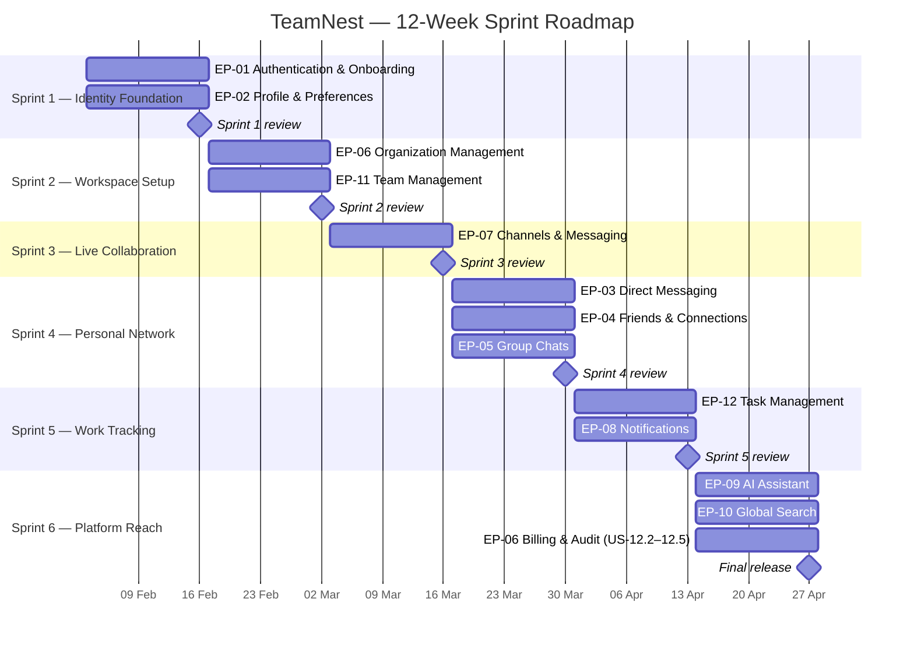

# TeamNest — Sprint Gantt Chart

A 12-week timeline of the six TeamNest sprints, broken down by the epics delivered in each. Each sprint runs for two weeks; epics inside the same sprint run in parallel.

## Sprint legend

| Sprint   | Title                                                                          | Window                  | Story points | User stories |
| -------- | ------------------------------------------------------------------------------ | ----------------------- | :----------: | :----------: |
| Sprint 1 | Identity Foundation — Authentication, Sessions & Profile                       | 2025-02-03 → 2025-02-16 | 37           | 12           |
| Sprint 2 | Workspace Setup — Organizations, Memberships & Team Structure                  | 2025-02-17 → 2025-03-02 | 41           | 14           |
| Sprint 3 | Live Collaboration — Channels, Real-time Messaging & File Sharing              | 2025-03-03 → 2025-03-16 | 45           | 12           |
| Sprint 4 | Personal Network — Direct Messages, Group Chats & Friends                      | 2025-03-17 → 2025-03-30 | 35           | 11           |
| Sprint 5 | Work Tracking — Tasks, Subtasks, Approvals & Real-time Notifications           | 2025-03-31 → 2025-04-13 | 30           | 9            |
| Sprint 6 | Platform Reach — AI Assistant, Global Search, Audit Log & Stripe Billing       | 2025-04-14 → 2025-04-27 | 39           | 8            |
