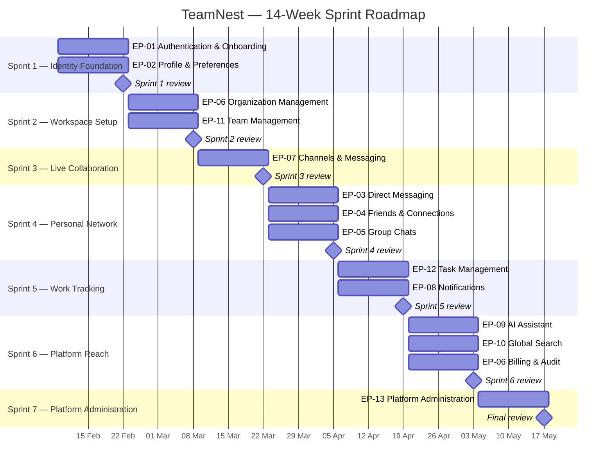

```mermaid
gantt
    title TeamNest — 14-Week Sprint Roadmap
    dateFormat YYYY-MM-DD
    axisFormat %d %b

    section Sprint 1 — Identity Foundation
    EP-01 Authentication & Onboarding   :s1a, 2026-02-09, 14d
    EP-02 Profile & Preferences         :s1b, 2026-02-09, 14d
    Sprint 1 review                     :milestone, m1, 2026-02-22, 0d

    section Sprint 2 — Workspace Setup
    EP-06 Organization Management       :s2a, 2026-02-23, 14d
    EP-11 Team Management               :s2b, 2026-02-23, 14d
    Sprint 2 review                     :milestone, m2, 2026-03-08, 0d

    section Sprint 3 — Live Collaboration
    EP-07 Channels & Messaging          :s3a, 2026-03-09, 14d
    Sprint 3 review                     :milestone, m3, 2026-03-22, 0d

    section Sprint 4 — Personal Network
    EP-03 Direct Messaging              :s4a, 2026-03-23, 14d
    EP-04 Friends & Connections         :s4b, 2026-03-23, 14d
    EP-05 Group Chats                   :s4c, 2026-03-23, 14d
    Sprint 4 review                     :milestone, m4, 2026-04-05, 0d

    section Sprint 5 — Work Tracking
    EP-12 Task Management               :s5a, 2026-04-06, 14d
    EP-08 Notifications                 :s5b, 2026-04-06, 14d
    Sprint 5 review                     :milestone, m5, 2026-04-19, 0d

    section Sprint 6 — Platform Reach
    EP-09 AI Assistant                  :s6a, 2026-04-20, 14d
    EP-10 Global Search                 :s6b, 2026-04-20, 14d
    EP-06 Billing & Audit               :s6c, 2026-04-20, 14d
    Sprint 6 review                     :milestone, m6, 2026-05-03, 0d

    section Sprint 7 — Platform Administration
    EP-13 Platform Administration       :s7a, 2026-05-04, 14d
    Final review                        :milestone, m7, 2026-05-17, 0d
```
