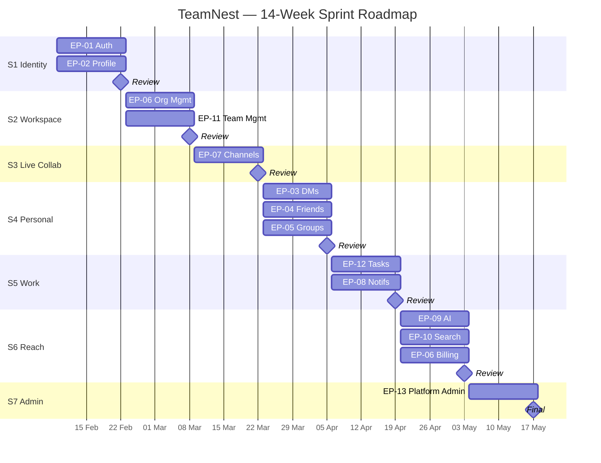

# Implementation

## Demo

**TeamNest**

- Multi-tenant team collaboration platform for chat, files, tasks, and org management
- Real-time channels, direct messages, and group chats with file sharing and search
- AI-assisted workspace support for organization context and productivity
- Role-based access across organizations, teams, tasks, and platform administration

**URL:** http://localhost:3000

**API:** http://localhost:8000/docs
