# TeamNest — Revisited Product Backlog

This backlog consolidates every user story from Sprints 1–6 into **12 product epics**. Each story is rated with **MoSCoW** priority (**Must** > **Should** > **Could** > **Won't**), estimated in **story points** (Fibonacci scale: 1, 2, 3, 5, 8, 13) and assigned to the role it serves. Within each epic, stories are sorted from highest to lowest priority.

**MoSCoW legend**

| Code | Meaning | Definition |
| ---- | ------- | ---------- |
| **M** | Must have | Non-negotiable, the product is unusable without it. |
| **S** | Should have | Important; ship if at all possible. |
| **C** | Could have | Desirable; ship if time/budget allows. |
| **W** | Won't have (this release) | Out of scope for v1; tracked for later. |

**Actors**

The user stories below are written from ten distinct actor perspectives. Roles are cumulative — a *Team Lead* is also a *Member* and a *User*; an *Org Owner* is also an *Org Admin*.

**Visitor** — Anyone browsing TeamNest without an account.
- Browse the landing page
- Register a new account
- Initiate email verification

**User** — Authenticated person with a verified account, not yet tied to any organization.
- Manage profile (avatar, name, country, phone)
- Sign in, sign out and reset/change password
- Set presence and theme preferences
- Send direct messages and create group chats
- Manage friends and block unwanted contacts

**Member** — A user who belongs to at least one organization.
- Create or join organizations
- View the member directory and team list
- Chat in org channels with edits, threads, pins and `@mentions`
- Search messages and share files
- Receive real-time notifications
- Ask the AI assistant about org context

**Team Member** — A member assigned to a specific team.
- Access the team's channels and files
- View teammates' profiles
- Read and act on team tasks
- Add or remove task attachments

**Team Lead** — A team member with elevated permissions over their team.
- Update or delete the team
- Add or kick team members
- Grant or revoke team permissions
- Create team channels
- Create, edit and break down tasks into subtasks
- Approve or reject submitted tasks

**Assignee** — User assigned to one or multiple tasks.
- View assigned tasks
- Update task progress
- Upload task attachments
- Track deadlines and statuses

**Org Admin** — A member with administrative rights over the organization.
- Invite members by email
- Accept or reject join requests
- Update organization settings
- Create teams within the org
- View the activity log

**Org Owner** — The member who created (or inherited) the organization.
- All Org Admin capabilities
- Subscribe to or cancel the Pro plan
- Delete the organization
- Undo reversible logged actions

**Owner / Admin** — Shorthand used when a story applies to either an Org Owner or an Org Admin.
- View the organization activity log
- Audit org-wide actions

**Site Admin** — Platform-level operator not bound to any single organization.
- View platform-wide stats (users, orgs, channels, messages)
- List and audit every user account
- Ban or unban users and revoke their sessions
- Inspect and delete abusive organizations

---

## EP-01 — Authentication & Onboarding

Covers everything that turns a visitor into an authenticated, activated user: landing page, registration, email verification, sessions, password lifecycle and the first-run guided tour.

| ID      | User Story                                                                                          | Role    | Story Points | Priority |
| ------- | --------------------------------------------------------------------------------------------------- | ------- | :----------: | :------: |
| US-1.1  | As a **visitor**, I want to browse the landing page, so that I can learn what TeamNest offers.      | Visitor | 3            | **M**    |
| US-1.2  | As a **visitor**, I want to register, so that I can create an account.                              | Visitor | 3            | **M**    |
| US-2.1  | As a **user**, I want to verify my email, so that my account is activated.                          | User    | 3            | **M**    |
| US-2.2  | As a **user**, I want to resend the verification code, so that I'm not blocked.                     | User    | 2            | **M**    |
| US-2.3  | As a **user**, I want to stay signed in, so that I don't log in every visit.                        | User    | 5            | **M**    |
| US-2.4  | As a **user**, I want to log out from one or all devices, so that I can secure my account.          | User    | 3            | **M**    |
| US-2.5  | As a **user**, I want to reset my password by email, so that I can recover access.                  | User    | 5            | **M**    |
| US-2.6  | As a **user**, I want to change my password, so that I can rotate it.                               | User    | 2            | **S**    |
| US-2.10 | As a **user**, I want a guided tour, so that I learn the basics quickly.                            | User    | 3            | **C**    |

**Epic totals:** 9 stories • 29 story points

---

## EP-02 — Profile & Preferences

Personal account customization: profile fields, presence status and UI theming.

| ID     | User Story                                                                                          | Role | Story Points | Priority |
| ------ | --------------------------------------------------------------------------------------------------- | ---- | :----------: | :------: |
| US-2.7 | As a **user**, I want to edit my profile (avatar, name, country, phone), so that it stays current.  | User | 3            | **S**    |
| US-2.8 | As a **user**, I want to set my presence, so that others know my availability.                      | User | 3            | **C**    |
| US-2.9 | As a **user**, I want light/dark theme, so that the look matches my preference.                     | User | 2            | **C**    |

**Epic totals:** 3 stories • 8 story points

---

## EP-03 — Direct Messaging

One-to-one private conversations: sending, editing, attaching, searching, typing indicators and the DM inbox.

| ID     | User Story                                                                                          | Role | Story Points | Priority |
| ------ | --------------------------------------------------------------------------------------------------- | ---- | :----------: | :------: |
| US-3.1 | As a **user**, I want to send a direct message, so that we can talk privately.                      | User | 5            | **M**    |
| US-3.2 | As a **user**, I want to edit, delete and attach files in my DMs, so that I control my chats.       | User | 3            | **S**    |
| US-3.3 | As a **user**, I want to search a DM thread, so that I can find a past message.                     | User | 3            | **S**    |
| US-3.4 | As a **user**, I want typing indicators in DMs, so that I know when someone's typing.               | User | 2            | **S**    |
| US-3.5 | As a **user**, I want a list of my DM conversations, so that I can resume them.                     | User | 3            | **S**    |

**Epic totals:** 5 stories • 16 story points

---

## EP-04 — Friends & Connections

Social graph features: friend requests, accept/reject/remove, and blocking unwanted users.

| ID     | User Story                                                                                          | Role | Story Points | Priority |
| ------ | --------------------------------------------------------------------------------------------------- | ---- | :----------: | :------: |
| US-4.1 | As a **user**, I want to send a friend request, so that I can connect with someone.                 | User | 3            | **S**    |
| US-4.2 | As a **user**, I want to accept, reject or remove friends, so that I curate my contacts.            | User | 3            | **S**    |
| US-4.3 | As a **user**, I want to block or unblock users, so that I can stop unwanted contact.               | User | 2            | **C**    |

**Epic totals:** 3 stories • 8 story points

---

## EP-05 — Group Chats

Ad-hoc multi-user chats outside the org/team structure: creation, management and real-time messaging.

| ID     | User Story                                                                                          | Role | Story Points | Priority |
| ------ | --------------------------------------------------------------------------------------------------- | ---- | :----------: | :------: |
| US-5.1 | As a **user**, I want to create a group chat, so that small groups can talk.                        | User | 3            | **M**    |
| US-5.3 | As a **user**, I want to send, edit and delete group messages in real time, so that we can collaborate. | User | 5        | **M**    |
| US-5.2 | As a **user**, I want to add, edit or delete a group chat, so that I can manage it.                 | User | 3            | **S**    |

**Epic totals:** 3 stories • 11 story points

---

## EP-06 — Organization Management

Everything that lets an owner/admin run an organization: creating it, inviting members, the member directory, billing (Pro plan), deletion and the audit activity log.

| ID      | User Story                                                                                          | Role          | Story Points | Priority |
| ------- | --------------------------------------------------------------------------------------------------- | ------------- | :----------: | :------: |
| US-6.1  | As a **member**, I want to create an organization, so that I can host my workspace.                 | Member        | 5            | **M**    |
| US-6.2  | As a **member**, I want to join an org with an invite, so that I can collaborate.                   | Member        | 3            | **M**    |
| US-6.3  | As a **member**, I want to see all org members, so that I have an overview.                         | Member        | 3            | **M**    |
| US-6.4  | As a **member**, I want to see the teams in my org, so that I can navigate to one.                  | Member        | 2            | **M**    |
| US-11.1 | As an **org admin**, I want to invite members by email, so that they can join.                      | Org Admin     | 5            | **M**    |
| US-11.2 | As an **org admin**, I want to accept or reject join requests, so that I control who gets in.       | Org Admin     | 3            | **M**    |
| US-12.2 | As an **org owner**, I want to subscribe to the Pro plan, so that I can unlock plan limits.         | Org Owner     | 5            | **M**    |
| US-12.3 | As an **org owner**, I want to cancel the Pro subscription, so that I can downgrade.                | Org Owner     | 3            | **M**    |
| US-11.3 | As an **org admin**, I want to update the organization, so that I can keep it accurate.             | Org Admin     | 2            | **S**    |
| US-12.1 | As an **org owner**, I want to delete my organization, so that I can decommission it.               | Org Owner     | 3            | **S**    |
| US-12.4 | As an **owner or admin**, I want to view the activity log, so that I have an audit trail.           | Owner / Admin | 3            | **S**    |
| US-12.5 | As an **org owner**, I want to undo a reversible logged action, so that I can recover from a mistake. | Org Owner   | 5            | **C**    |
| US-15.1 | As a **team member**, I want to view a teammate's profile, so that I know their role.               | Team Member   | 2            | **C**    |

**Epic totals:** 13 stories • 44 story points

---

## EP-07 — Channels & Messaging

Org and team channels: creation, real-time chat, history loading, edits, threads, pins, search, file sharing and `@mentions`.

| ID      | User Story                                                                                          | Role        | Story Points | Priority |
| ------- | --------------------------------------------------------------------------------------------------- | ----------- | :----------: | :------: |
| US-7.1  | As a **member**, I want to create org channels (general or announcement), so that topics stay organized. | Member  | 3            | **M**    |
| US-7.2  | As a **member**, I want to chat in channels in real time, so that conversations feel instant.       | Member      | 8            | **M**    |
| US-7.3  | As a **member**, I want to edit or delete my own messages, so that I can fix mistakes.              | Member      | 3            | **M**    |
| US-7.4  | As a **member**, I want to load older messages on scroll, so that history loads smoothly.           | Member      | 3            | **M**    |
| US-15.2 | As a **team member**, I want to chat in my team's channels, so that I can collaborate with my team. | Team Member | 3            | **M**    |
| US-7.5  | As a **member**, I want to reply to a message, so that threads stay readable.                       | Member      | 3            | **S**    |
| US-7.6  | As a **member**, I want to pin and unpin messages, so that important info is easy to find.          | Member      | 2            | **S**    |
| US-7.7  | As a **member**, I want to search messages in a channel, so that I can find past discussions.       | Member      | 5            | **S**    |
| US-7.8  | As a **member**, I want to share files in channels, so that documents stay with the conversation.   | Member      | 5            | **S**    |
| US-7.9  | As a **member**, I want to mention teammates with `@tag`, so that they get notified.                | Member      | 3            | **S**    |
| US-13.5 | As a **team lead**, I want to create channels in my team, so that the team has its own spaces.      | Team Lead   | 2            | **S**    |
| US-15.3 | As a **team member**, I want a file list per team channel with inline PDF viewing, so that I can find and read attachments easily. | Team Member | 5 | **C** |

**Epic totals:** 12 stories • 45 story points

---

## EP-08 — Notifications

Real-time notifications for mentions, DMs, friend events and tasks, plus the notification inbox.

| ID     | User Story                                                                                          | Role   | Story Points | Priority |
| ------ | --------------------------------------------------------------------------------------------------- | ------ | :----------: | :------: |
| US-8.1 | As a **member**, I want real-time notifications for mentions, DMs, friends and tasks, so that I don't miss anything. | Member | 5 | **M** |
| US-8.2 | As a **member**, I want to view notifications and mark them as seen, so that I stay organized.      | Member | 2            | **S**    |

**Epic totals:** 2 stories • 7 story points

---

## EP-09 — AI Assistant

Retrieval-augmented assistant that answers questions about the org and uploaded documents.

| ID     | User Story                                                                                          | Role   | Story Points | Priority |
| ------ | --------------------------------------------------------------------------------------------------- | ------ | :----------: | :------: |
| US-9.1 | As a **member**, I want to ask the AI about my org, so that I get quick answers.                    | Member | 8            | **S**    |
| US-9.2 | As a **member**, I want the AI to use our uploaded documents, so that answers come from our files.  | Member | 5            | **C**    |
| US-9.3 | As a **member**, I want to open a PDF inline and ask the AI about it, so that I can extract answers from long files. | Member | 5 | **C** |

**Epic totals:** 3 stories • 18 story points

---

## EP-10 — Global Search

Cross-channel, org-wide message search.

| ID      | User Story                                                                                          | Role   | Story Points | Priority |
| ------- | --------------------------------------------------------------------------------------------------- | ------ | :----------: | :------: |
| US-10.1 | As a **member**, I want to search across org messages, so that I find info fast.                    | Member | 5            | **M**    |

**Epic totals:** 1 story • 5 story points

---

## EP-11 — Team Management

Creating teams, adding/removing team members, granting permissions and team settings.

| ID      | User Story                                                                                          | Role      | Story Points | Priority |
| ------- | --------------------------------------------------------------------------------------------------- | --------- | :----------: | :------: |
| US-11.4 | As an **org admin**, I want to create teams, so that I can group members by project.                | Org Admin | 3            | **M**    |
| US-13.2 | As a **team lead**, I want to add members to my team, so that they get access.                      | Team Lead | 2            | **M**    |
| US-13.1 | As a **team lead**, I want to update or delete my team, so that I can keep it accurate or wind it down. | Team Lead | 3        | **S**    |
| US-13.3 | As a **team lead**, I want to grant or revoke a member's permissions, so that responsibilities are clear. | Team Lead | 3      | **S**    |
| US-13.4 | As a **team lead**, I want to kick a member, so that I can remove unwanted people.                  | Team Lead | 2            | **S**    |

**Epic totals:** 5 stories • 13 story points

---

## EP-12 — Task Management

Task lifecycle from creation to approval: assignees, due dates, subtasks, status updates, approval and file attachments.

| ID      | User Story                                                                                          | Role        | Story Points | Priority |
| ------- | --------------------------------------------------------------------------------------------------- | ----------- | :----------: | :------: |
| US-14.1 | As a **team lead**, I want to create tasks with assignees and a due date, so that work is tracked.  | Team Lead   | 5            | **M**    |
| US-14.2 | As a **team lead**, I want to edit or delete a task, so that I can adjust scope.                    | Team Lead   | 3            | **M**    |
| US-16.1 | As an **assignee**, I want to see my tasks, so that I know what's on my plate.                      | Assignee    | 3            | **M**    |
| US-16.2 | As an **assignee**, I want to update my task status (and submit for review), so that the team sees progress. | Assignee | 3       | **M**    |
| US-14.3 | As a **team lead**, I want to break a task into subtasks, so that I can split large work.           | Team Lead   | 3            | **S**    |
| US-14.4 | As a **team lead**, I want to approve or reject a submitted task, so that quality is checked.       | Team Lead   | 3            | **S**    |
| US-15.4 | As a **team member**, I want to add or remove task attachments, so that files travel with the work. | Team Member | 3            | **S**    |

**Epic totals:** 7 stories • 23 story points

---

## EP-13 — Platform Administration

Site-wide admin tools: a platform overview dashboard, user moderation (ban/unban with session revocation) and organization oversight.

| ID      | User Story                                                                                          | Role  | Story Points | Priority |
| ------- | --------------------------------------------------------------------------------------------------- | ----- | :----------: | :------: |
| US-17.1 | As a **site admin**, I want a dashboard with user, org, channel and message counts, so that I can monitor platform health. | Site Admin | 3 | **M** |
| US-17.2 | As a **site admin**, I want to list every user with their status and role, so that I can audit accounts. | Site Admin | 2 | **M** |
| US-17.3 | As a **site admin**, I want to ban or unban users and revoke their sessions, so that I can enforce platform rules. | Site Admin | 3 | **M** |
| US-17.4 | As a **site admin**, I want to inspect and delete organizations, so that I can remove abusive workspaces. | Site Admin | 5 | **S** |

**Epic totals:** 4 stories • 13 story points

---

## Backlog Summary

| Priority bucket | Stories | Story points |
| --------------- | :-----: | :----------: |
| **Must (M)**    | 34      | 123          |
| **Should (S)**  | 27      | 85           |
| **Could (C)**   | 9       | 32           |
| **Total**       | **70**  | **240**      |

### Per-epic breakdown

| Epic | Title                        | Stories | Story points |
| ---- | ---------------------------- | :-----: | :----------: |
| EP-01 | Authentication & Onboarding | 9       | 29           |
| EP-02 | Profile & Preferences       | 3       | 8            |
| EP-03 | Direct Messaging            | 5       | 16           |
| EP-04 | Friends & Connections       | 3       | 8            |
| EP-05 | Group Chats                 | 3       | 11           |
| EP-06 | Organization Management     | 13      | 44           |
| EP-07 | Channels & Messaging        | 12      | 45           |
| EP-08 | Notifications               | 2       | 7            |
| EP-09 | AI Assistant                | 3       | 18           |
| EP-10 | Global Search               | 1       | 5            |
| EP-11 | Team Management             | 5       | 13           |
| EP-12 | Task Management             | 7       | 23           |
| EP-13 | Platform Administration     | 4       | 13           |
| **Total** |                         | **70**  | **240**      |

### Per-sprint breakdown

| Sprint   | Title                                                                          | Date        | Story points | User stories |
| -------- | ------------------------------------------------------------------------------ | ----------- | :----------: | :----------: |
| Sprint 1 | Identity Foundation — Authentication, Sessions & Profile                       | Weeks 1–2   | 37           | 12           |
| Sprint 2 | Workspace Setup — Organizations, Memberships & Team Structure                  | Weeks 3–4   | 41           | 14           |
| Sprint 3 | Live Collaboration — Channels, Real-time Messaging & File Sharing              | Weeks 5–6   | 45           | 12           |
| Sprint 4 | Personal Network — Direct Messages, Group Chats & Friends                      | Weeks 7–8   | 35           | 11           |
| Sprint 5 | Work Tracking — Tasks, Subtasks, Approvals & Real-time Notifications           | Weeks 9–10  | 30           | 9            |
| Sprint 6 | Platform Reach — AI Assistant, Global Search, Audit Log & Stripe Billing       | Weeks 11–12 | 39           | 8            |
| Sprint 7 | Platform Administration — Admin Dashboard, User Moderation & Org Oversight     | Weeks 13–14 | 13           | 4            |
| **Total** |                                                                               |             | **240**      | **70**       |

---

## User Stories by Sprint

The same 66 stories, regrouped by the sprint that delivers them. Within each sprint, stories are grouped by epic and sorted from highest to lowest priority.

### Sprint 1 — Identity Foundation (Weeks 1–2)

Authentication, sessions and profile.

**Sprint goal:** _Anyone can create a verified account and manage their profile._

| ID | User Story | Epic | Role | Story Points | Priority | Subtasks |
| -- | ---------- | ---- | ---- | :----------: | :------: | -------- |
| US-1.1 | As a **visitor**, I want to browse the landing page, so that I can learn what TeamNest offers. | EP-01 | Visitor | 3 | **M** | 1. Build the responsive landing layout (hero, features, footer) 2. Add navigation with CTAs routing to register/login 3. Add SEO metadata and Open Graph tags |
| US-1.2 | As a **visitor**, I want to register, so that I can create an account. | EP-01 | Visitor | 3 | **M** | 1. Build the registration form with client-side validation 2. Implement `POST /auth/register` with bcrypt password hashing 3. Persist the user record and trigger the verification email |
| US-2.1 | As a **user**, I want to verify my email, so that my account is activated. | EP-01 | User | 3 | **M** | 1. Generate and email a hashed, time-limited verification code 2. Build the code-entry screen 3. Implement `POST /auth/verify` to activate the account |
| US-2.2 | As a **user**, I want to resend the verification code, so that I'm not blocked. | EP-01 | User | 2 | **M** | 1. Add a resend endpoint with rate limiting 2. Invalidate the previous code on resend 3. Wire the resend button with a cooldown timer |
| US-2.3 | As a **user**, I want to stay signed in, so that I don't log in every visit. | EP-01 | User | 5 | **M** | 1. Issue a rotating refresh token in an HTTP-only cookie 2. Implement `POST /auth/refresh` with `jti` rotation 3. Add silent token refresh on the frontend |
| US-2.4 | As a **user**, I want to log out from one or all devices, so that I can secure my account. | EP-01 | User | 3 | **M** | 1. Implement single-device logout (revoke current `jti`) 2. Implement logout-all (revoke every refresh token for the user) 3. Add the logout controls to account settings |
| US-2.5 | As a **user**, I want to reset my password by email, so that I can recover access. | EP-01 | User | 5 | **M** | 1. Build the request-reset and verify-code flow with a hashed code 2. Implement `POST /auth/reset-password` with code validation 3. Build the forgot- and reset-password screens |
| US-2.6 | As a **user**, I want to change my password, so that I can rotate it. | EP-01 | User | 2 | **S** | 1. Add `PUT /auth/password` requiring the current password 2. Build the change-password form 3. Re-hash the password and revoke other sessions |
| US-2.10 | As a **user**, I want a guided tour, so that I learn the basics quickly. | EP-01 | User | 3 | **C** | 1. Integrate a product-tour component 2. Define the step sequence covering the main features 3. Persist a "tour completed" flag per user |
| US-2.7 | As a **user**, I want to edit my profile (avatar, name, country, phone), so that it stays current. | EP-02 | User | 3 | **S** | 1. Build the profile edit form (avatar, name, country, phone) 2. Wire avatar upload to Cloudinary 3. Implement the `PUT /users/me` endpoint |
| US-2.8 | As a **user**, I want to set my presence, so that others know my availability. | EP-02 | User | 3 | **C** | 1. Add the presence field and status enum to the user model 2. Broadcast presence changes over WebSocket 3. Add the presence picker to the UI |
| US-2.9 | As a **user**, I want light/dark theme, so that the look matches my preference. | EP-02 | User | 2 | **C** | 1. Add a theme provider/context 2. Persist the theme preference 3. Add the light/dark toggle control |

**Sprint totals:** 12 stories • 37 story points

#### Related diagrams

_Source: [docs/sprints/SPRINT_1.md](docs/sprints/SPRINT_1.md)._

##### C4 — Auth domain (component view)

- Shows the **auth slice** of the backend: `auth_router.py` delegates to `auth_service.py`, which owns credentials, JWTs and email codes.
- The web app reaches it over REST and WebSocket; persistence goes through SQLAlchemy to PostgreSQL.
- Two external services hang off it — **Resend** for verification/reset emails and **Cloudinary** for avatar uploads.

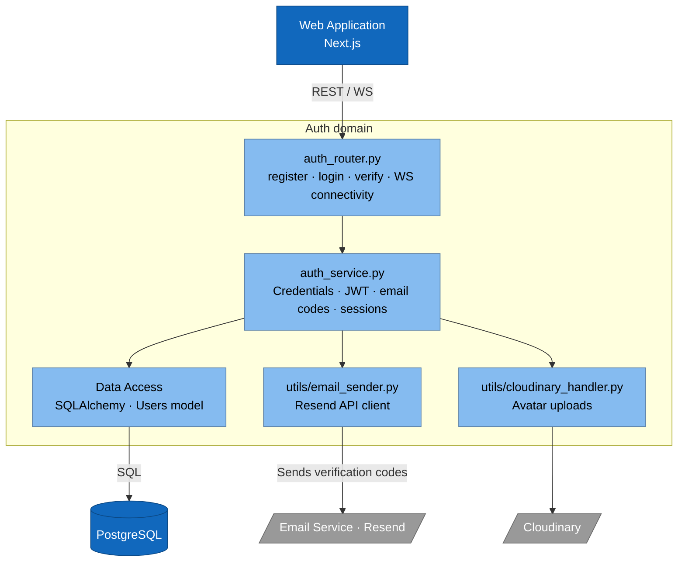
```mermaid
flowchart TB
    web[Web Application<br/>Next.js]
    db[(PostgreSQL)]
    emailSvc[/Email Service · Resend/]
    cloud[/Cloudinary/]

    subgraph auth [Auth domain]
        authRouter[auth_router.py<br/>register · login · verify · WS connectivity]
        authSvc[auth_service.py<br/>Credentials · JWT · email codes · sessions]
        authData[Data Access<br/>SQLAlchemy · Users model]
        emailUtil[utils/email_sender.py<br/>Resend API client]
        cloudUtil[utils/cloudinary_handler.py<br/>Avatar uploads]
    end

    web -- "REST / WS" --> authRouter
    authRouter --> authSvc
    authSvc --> authData
    authSvc --> emailUtil
    authSvc --> cloudUtil
    authData -- "SQL" --> db
    emailUtil -- "Sends verification codes" --> emailSvc
    cloudUtil --> cloud

    classDef container fill:#1168bd,stroke:#0b4884,color:#fff
    classDef component fill:#85bbf0,stroke:#5d82a8,color:#000
    classDef ext fill:#999999,stroke:#6b6b6b,color:#fff
    class web,db container
    class authRouter,authSvc,authData,emailUtil,cloudUtil component
    class emailSvc,cloud ext
```

##### Class diagram — Identity & Access

- Models the two persisted entities behind sign-in: `User` and `RefreshToken`.
- `User` carries verification state and the auth operations (register, login, verify, reset).
- A user **owns many refresh tokens** — one per active session — each of which can be rotated or revoked.

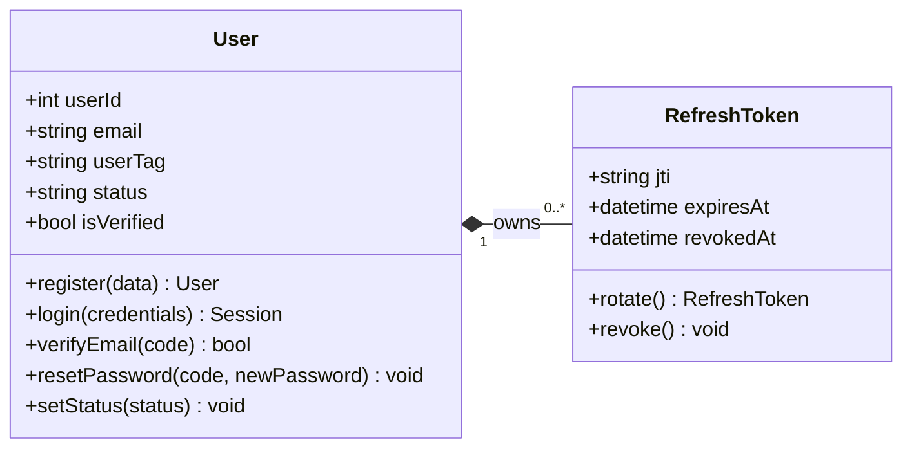
```mermaid
classDiagram
    direction LR

    class User {
        +int userId
        +string email
        +string userTag
        +string status
        +bool isVerified
        +register(data) User
        +login(credentials) Session
        +verifyEmail(code) bool
        +resetPassword(code, newPassword) void
        +setStatus(status) void
    }

    class RefreshToken {
        +string jti
        +datetime expiresAt
        +datetime revokedAt
        +rotate() RefreshToken
        +revoke() void
    }

    User "1" *-- "0..*" RefreshToken : owns
```

##### Sequence — Signup & Email Verification (US-1.2, US-2.1, US-2.2)

- Walks the visitor → verified-user path: create account, request a code, confirm it.
- The code is generated server-side, stored, and emailed via the email service.
- The `alt` branch shows the verified vs. invalid-code outcomes; verification gates every later action.

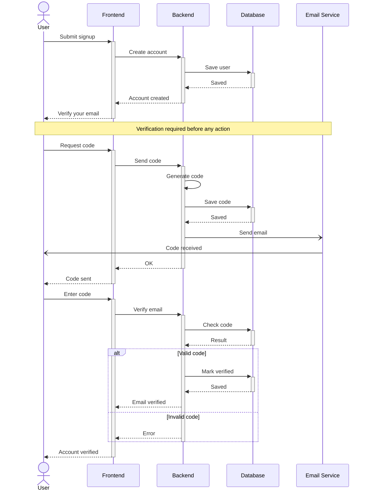
```mermaid
sequenceDiagram
    actor User
    participant FE as Frontend
    participant API as Backend
    participant DB as Database
    participant Mail as Email Service

    User->>+FE: Submit signup
    FE->>+API: Create account
    API->>+DB: Save user
    DB-->>-API: Saved
    API-->>-FE: Account created
    FE-->>-User: Verify your email

    Note over User,Mail: Verification required before any action

    User->>+FE: Request code
    FE->>+API: Send code
    API->>API: Generate code
    API->>+DB: Save code
    DB-->>-API: Saved
    API-)Mail: Send email
    Mail-)User: Code received
    API-->>-FE: OK
    FE-->>-User: Code sent

    User->>+FE: Enter code
    FE->>+API: Verify email
    API->>+DB: Check code
    DB-->>-API: Result
    alt Valid code
        API->>+DB: Mark verified
        DB-->>-API: Saved
        API-->>FE: Email verified
    else Invalid code
        API-->>FE: Error
    end
    deactivate API
    FE-->>-User: Account verified
```

##### Sequence — Login & Refresh Token Rotation (US-2.3, US-2.4)

- Top half: credentials are checked, tokens issued, and the session saved.
- Bottom half: once the access token expires, the refresh token is exchanged for a fresh pair.
- The `alt` branches cover invalid credentials and invalid/expired tokens (forcing a re-login).

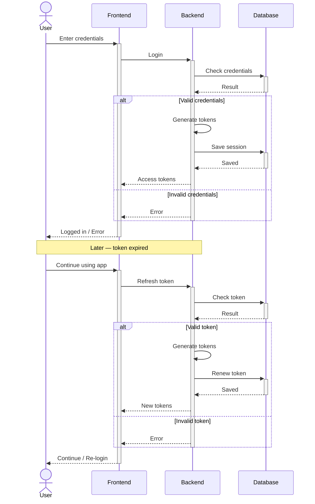
```mermaid
sequenceDiagram
    actor User
    participant FE as Frontend
    participant API as Backend
    participant DB as Database

    User->>+FE: Enter credentials
    FE->>+API: Login
    API->>+DB: Check credentials
    DB-->>-API: Result
    alt Valid credentials
        API->>API: Generate tokens
        API->>+DB: Save session
        DB-->>-API: Saved
        API-->>FE: Access tokens
    else Invalid credentials
        API-->>FE: Error
    end
    deactivate API
    FE-->>-User: Logged in / Error

    Note over User,API: Later — token expired

    User->>+FE: Continue using app
    FE->>+API: Refresh token
    API->>+DB: Check token
    DB-->>-API: Result
    alt Valid token
        API->>API: Generate tokens
        API->>+DB: Renew token
        DB-->>-API: Saved
        API-->>FE: New tokens
    else Invalid token
        API-->>FE: Error
    end
    deactivate API
    FE-->>-User: Continue / Re-login
```

##### Sequence — Password Reset (US-2.5, US-2.6)

- Three steps: request a reset, verify the emailed code, then set a new password.
- The `opt User exists` block hides whether an account exists (anti-enumeration).
- The new password is hashed before it is persisted.

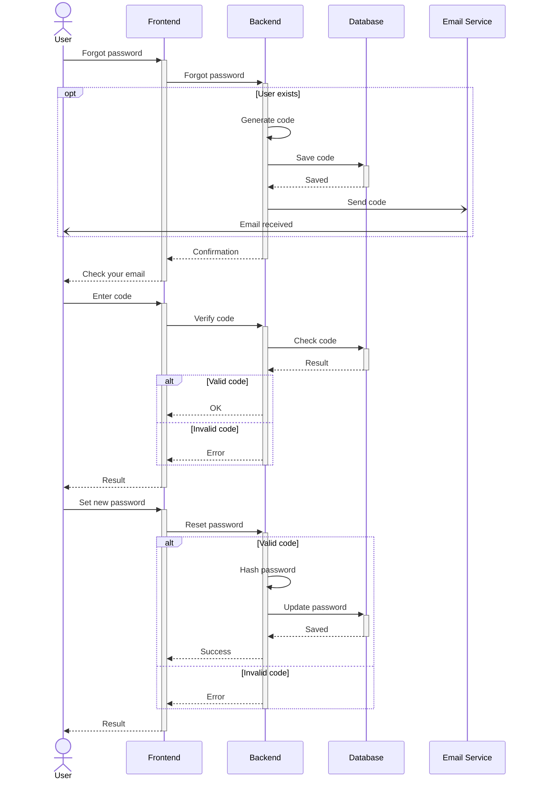
```mermaid
sequenceDiagram
    actor User
    participant FE as Frontend
    participant API as Backend
    participant DB as Database
    participant Mail as Email Service

    User->>+FE: Forgot password
    FE->>+API: Forgot password
    opt User exists
        API->>API: Generate code
        API->>+DB: Save code
        DB-->>-API: Saved
        API-)Mail: Send code
        Mail-)User: Email received
    end
    API-->>-FE: Confirmation
    FE-->>-User: Check your email

    User->>+FE: Enter code
    FE->>+API: Verify code
    API->>+DB: Check code
    DB-->>-API: Result
    alt Valid code
        API-->>FE: OK
    else Invalid code
        API-->>FE: Error
    end
    deactivate API
    FE-->>-User: Result

    User->>+FE: Set new password
    FE->>+API: Reset password
    alt Valid code
        API->>API: Hash password
        API->>+DB: Update password
        DB-->>-API: Saved
        API-->>FE: Success
    else Invalid code
        API-->>FE: Error
    end
    deactivate API
    FE-->>-User: Result
```

#### Sprint review & retrospective

| Topic | Outcome |
| ----- | ------- |
| **Review** | Demoed the full signup → verify → login → profile flow; all 12 stories met their Definition of Done. |
| 👍 **Went well** | JWT + refresh-token rotation landed cleanly and is reused by every later sprint. |
| 👎 **To improve** | Email-code rate limiting was added late — fold security edge cases into estimates earlier. |

#### Sprint summary

This sprint delivers the full account lifecycle — registration, email verification, login with refresh-token rotation, logout, and password reset.
It establishes the JWT + bcrypt + refresh-token security model that every later sprint reuses.
On top of that, it adds profile customization (avatar, contact fields), presence status, and light/dark theming.

### Sprint 2 — Workspace Setup (Weeks 3–4)

Organizations, memberships and team structure.

**Sprint goal:** _An admin can create an organization, onboard members and structure them into teams._

| ID | User Story | Epic | Role | Story Points | Priority | Subtasks |
| -- | ---------- | ---- | ---- | :----------: | :------: | -------- |
| US-6.1 | As a **member**, I want to create an organization, so that I can host my workspace. | EP-06 | Member | 5 | **M** | 1. Build the organization creation form 2. Implement `POST /orgs` setting the creator as owner 3. Seed a default organization channel |
| US-6.2 | As a **member**, I want to join an org with an invite, so that I can collaborate. | EP-06 | Member | 3 | **M** | 1. Validate the invite token server-side 2. Build the join flow opened from the email link 3. Create the membership record |
| US-6.3 | As a **member**, I want to see all org members, so that I have an overview. | EP-06 | Member | 3 | **M** | 1. Implement `GET /orgs/{id}/members` 2. Build the member directory UI 3. Add member search and filtering |
| US-6.4 | As a **member**, I want to see the teams in my org, so that I can navigate to one. | EP-06 | Member | 2 | **M** | 1. Implement `GET /orgs/{id}/teams` 2. Build the team list UI 3. Add navigation into a team view |
| US-11.1 | As an **org admin**, I want to invite members by email, so that they can join. | EP-06 | Org Admin | 5 | **M** | 1. Generate a signed invite token 2. Send the invitation email 3. Build the admin invite UI |
| US-11.2 | As an **org admin**, I want to accept or reject join requests, so that I control who gets in. | EP-06 | Org Admin | 3 | **M** | 1. Implement the pending-requests list endpoint 2. Implement the accept and reject endpoints 3. Build the admin requests panel |
| US-11.3 | As an **org admin**, I want to update the organization, so that I can keep it accurate. | EP-06 | Org Admin | 2 | **S** | 1. Implement `PUT /orgs/{id}` (name, logo, description) 2. Wire logo upload to Cloudinary 3. Build the org settings form |
| US-12.1 | As an **org owner**, I want to delete my organization, so that I can decommission it. | EP-06 | Org Owner | 3 | **S** | 1. Implement owner-only `DELETE /orgs/{id}` with cascade 2. Add a confirmation modal 3. Write the deletion to the audit log |
| US-15.1 | As a **team member**, I want to view a teammate's profile, so that I know their role. | EP-06 | Team Member | 2 | **C** | 1. Implement `GET /users/{id}` scoped to the org 2. Build the profile modal/page 3. Show the teammate's role badges |
| US-11.4 | As an **org admin**, I want to create teams, so that I can group members by project. | EP-11 | Org Admin | 3 | **M** | 1. Implement `POST /orgs/{id}/teams` 2. Build the team creation form 3. Assign the initial team lead |
| US-13.2 | As a **team lead**, I want to add members to my team, so that they get access. | EP-11 | Team Lead | 2 | **M** | 1. Implement `POST /teams/{id}/members` from the org pool 2. Build the member picker UI 3. Notify the added member |
| US-13.1 | As a **team lead**, I want to update or delete my team, so that I can keep it accurate or wind it down. | EP-11 | Team Lead | 3 | **S** | 1. Implement `PUT` and `DELETE /teams/{id}` 2. Build the team settings form 3. Add a confirmation modal and audit log entry |
| US-13.3 | As a **team lead**, I want to grant or revoke a member's permissions, so that responsibilities are clear. | EP-11 | Team Lead | 3 | **S** | 1. Add the `Team_roles` management endpoints 2. Build the permission toggle UI 3. Enforce the permissions in route guards |
| US-13.4 | As a **team lead**, I want to kick a member, so that I can remove unwanted people. | EP-11 | Team Lead | 2 | **S** | 1. Implement `DELETE /teams/{id}/members/{uid}` 2. Remove the member from team channels 3. Add a confirmation modal |

**Sprint totals:** 14 stories • 41 story points

#### Related diagrams

_Source: [docs/sprints/SPRINT_2.md](docs/sprints/SPRINT_2.md)._

##### C4 — Organization domain (component view)

- Covers the **workspace slice**: `org_router.py` and `team_router.py` over `org_service.py` / `team_service.py`.
- All org, member, team and payment data shares one SQLAlchemy data-access layer into PostgreSQL.
- The **Stripe** arrows belong to Sprint 6 — shown here only because billing lives in this same domain.

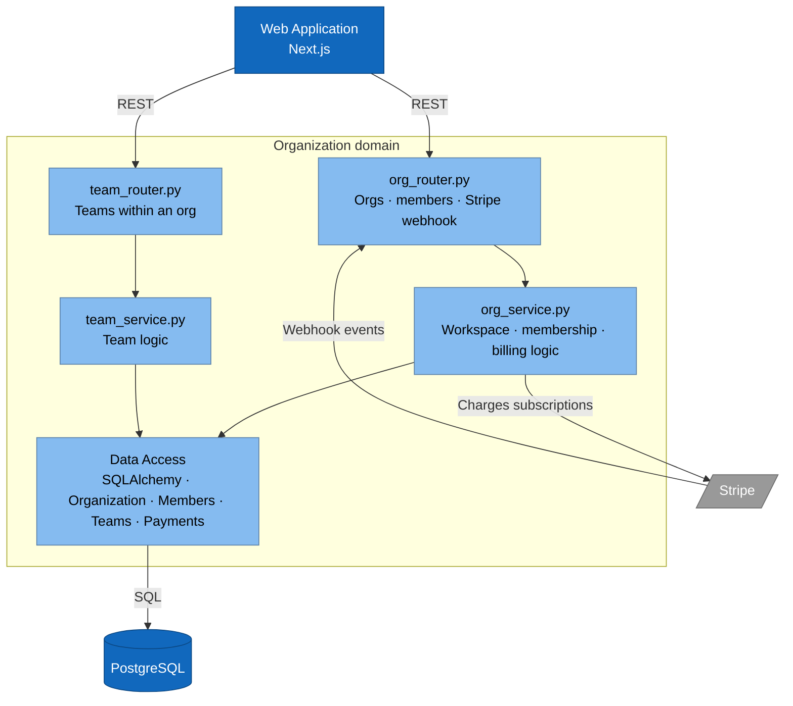
```mermaid
flowchart TB
    web[Web Application<br/>Next.js]
    db[(PostgreSQL)]
    stripe[/Stripe/]

    subgraph org [Organization domain]
        orgRouter[org_router.py<br/>Orgs · members · Stripe webhook]
        teamRouter[team_router.py<br/>Teams within an org]
        orgSvc[org_service.py<br/>Workspace · membership · billing logic]
        teamSvc[team_service.py<br/>Team logic]
        orgData[Data Access<br/>SQLAlchemy · Organization · Members · Teams · Payments]
    end

    web -- "REST" --> orgRouter
    web -- "REST" --> teamRouter
    stripe -- "Webhook events" --> orgRouter

    orgRouter --> orgSvc
    teamRouter --> teamSvc

    orgSvc --> orgData
    teamSvc --> orgData
    orgData -- "SQL" --> db

    orgSvc -- "Charges subscriptions" --> stripe

    classDef container fill:#1168bd,stroke:#0b4884,color:#fff
    classDef component fill:#85bbf0,stroke:#5d82a8,color:#000
    classDef ext fill:#999999,stroke:#6b6b6b,color:#fff
    class web,db container
    class orgRouter,teamRouter,orgSvc,teamSvc,orgData component
    class stripe ext
```

> Stripe-related arrows belong to Sprint 6 (Billing). They appear here only because they live in the same domain component; the create-org part is what's in scope for Sprint 2.

##### Class diagram — Organizations, Membership & Teams

- Models the multi-tenant core: `Organization`, its `OrganizationMember`s and `PendingMember`s, and nested `Team`s.
- `TeamRole` holds the fine-grained per-team permission flags (`canManageRoles`, `canManageTasks`).
- `OrganizationPayment` is shown for completeness; the billing flow itself is exercised in Sprint 6.

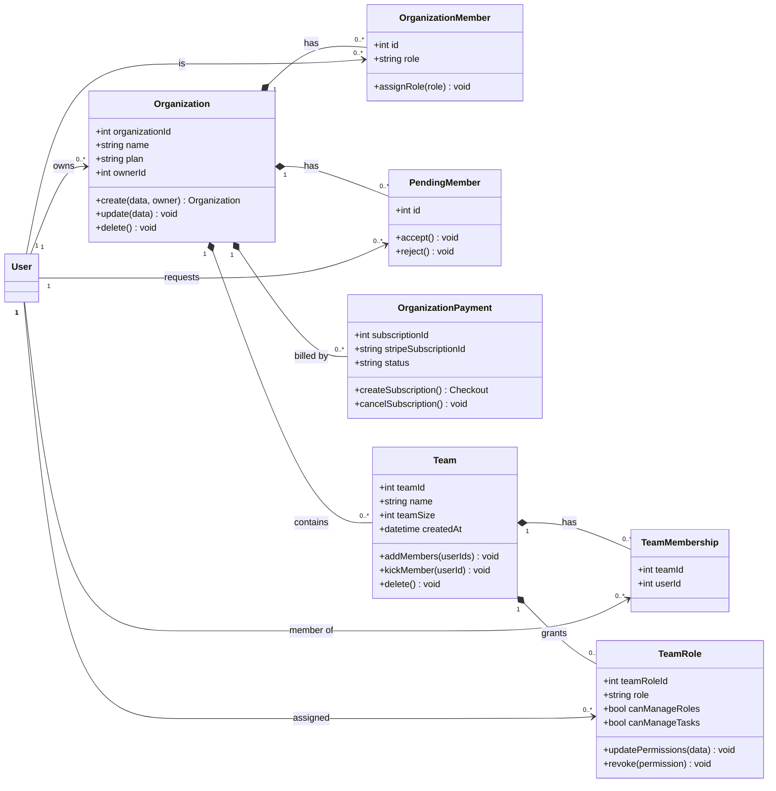
```mermaid
classDiagram
    direction LR

    class Organization {
        +int organizationId
        +string name
        +string plan
        +int ownerId
        +create(data, owner) Organization
        +update(data) void
        +delete() void
    }

    class OrganizationMember {
        +int id
        +string role
        +assignRole(role) void
    }

    class PendingMember {
        +int id
        +accept() void
        +reject() void
    }

    class OrganizationPayment {
        +int subscriptionId
        +string stripeSubscriptionId
        +string status
        +createSubscription() Checkout
        +cancelSubscription() void
    }

    class Team {
        +int teamId
        +string name
        +int teamSize
        +datetime createdAt
        +addMembers(userIds) void
        +kickMember(userId) void
        +delete() void
    }

    class TeamMembership {
        +int teamId
        +int userId
    }

    class TeamRole {
        +int teamRoleId
        +string role
        +bool canManageRoles
        +bool canManageTasks
        +updatePermissions(data) void
        +revoke(permission) void
    }

    User "1" --> "0..*" Organization : owns
    Organization "1" *-- "0..*" OrganizationMember : has
    User "1" --> "0..*" OrganizationMember : is
    Organization "1" *-- "0..*" PendingMember : has
    User "1" --> "0..*" PendingMember : requests
    Organization "1" *-- "0..*" OrganizationPayment : billed by
    Organization "1" *-- "0..*" Team : contains
    Team "1" *-- "0..*" TeamMembership : has
    User  "1" --> "0..*" TeamMembership : member of
    Team "1" *-- "0..*" TeamRole : grants
    User "1" --> "0..*" TeamRole : assigned
```

##### Sequence — Create Organization (US-6.1, US-11.3)

- The actor must be a **verified** user — the `alt` block checks this first.
- An optional logo is uploaded to Cloudinary before the org row is saved.
- Ends with the creator becoming the org owner.

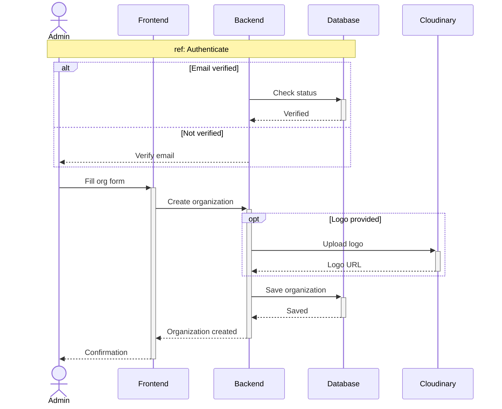
```mermaid
sequenceDiagram
    actor Admin
    participant FE as Frontend
    participant API as Backend
    participant DB as Database
    participant Cloud as Cloudinary

    Note over Admin,DB: ref: Authenticate

    alt Email verified
        API->>+DB: Check status
        DB-->>-API: Verified
    else Not verified
        API-->>Admin: Verify email
    end

    Admin->>+FE: Fill org form
    FE->>+API: Create organization
    opt Logo provided
        API->>+Cloud: Upload logo
        Cloud-->>-API: Logo URL
    end
    API->>+DB: Save organization
    DB-->>-API: Saved
    API-->>-FE: Organization created
    FE-->>-Admin: Confirmation
```

##### Sequence — Join Organization: request → review → decide (US-6.2, US-11.1, US-11.2)

- Split into three steps: **5a** a user requests to join, **5b** an admin lists pending requests, **5c** the admin decides.
- Every step re-checks authentication, and the admin steps also check permissions.
- Accepting creates the membership record; rejecting simply removes the request.

_5a. User sends join request_

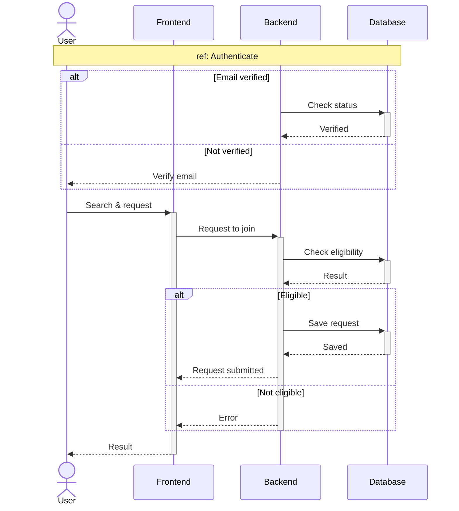
```mermaid
sequenceDiagram
    actor User
    participant FE as Frontend
    participant API as Backend
    participant DB as Database

    Note over User,DB: ref: Authenticate

    alt Email verified
        API->>+DB: Check status
        DB-->>-API: Verified
    else Not verified
        API-->>User: Verify email
    end

    User->>+FE: Search & request
    FE->>+API: Request to join
    API->>+DB: Check eligibility
    DB-->>-API: Result
    alt Eligible
        API->>+DB: Save request
        DB-->>-API: Saved
        API-->>FE: Request submitted
    else Not eligible
        API-->>FE: Error
    end
    deactivate API
    FE-->>-User: Result
```

_5b. Admin lists pending requests_

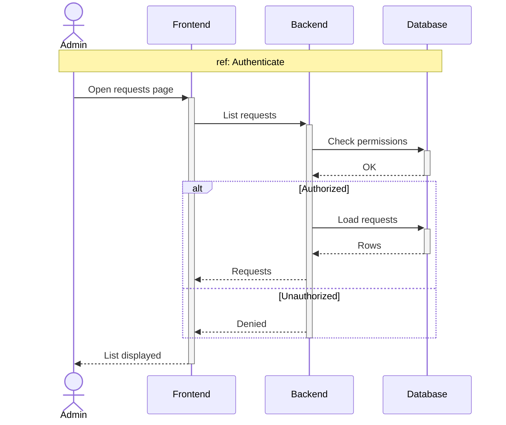
```mermaid
sequenceDiagram
    actor Admin
    participant FE as Frontend
    participant API as Backend
    participant DB as Database

    Note over Admin,DB: ref: Authenticate

    Admin->>+FE: Open requests page
    FE->>+API: List requests
    API->>+DB: Check permissions
    DB-->>-API: OK
    alt Authorized
        API->>+DB: Load requests
        DB-->>-API: Rows
        API-->>FE: Requests
    else Unauthorized
        API-->>FE: Denied
    end
    deactivate API
    FE-->>-Admin: List displayed
```

_5c. Admin accepts or rejects_

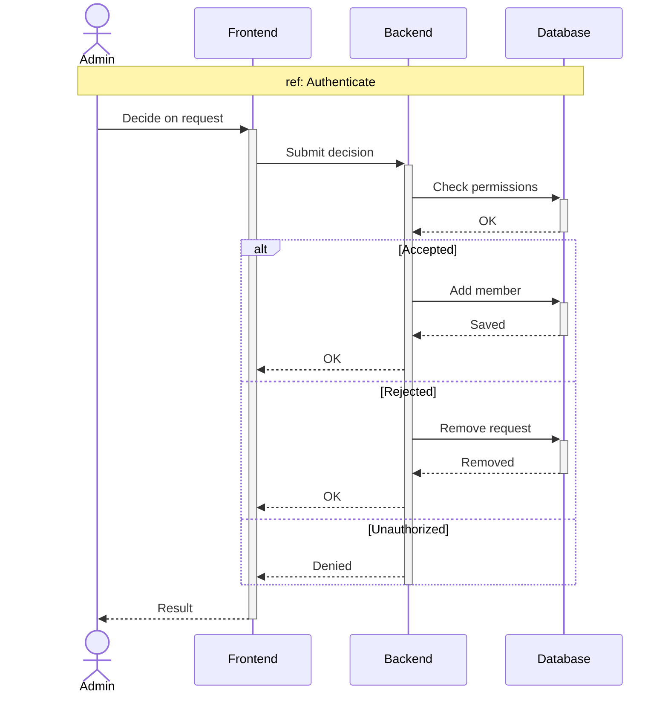
```mermaid
sequenceDiagram
    actor Admin
    participant FE as Frontend
    participant API as Backend
    participant DB as Database

    Note over Admin,DB: ref: Authenticate

    Admin->>+FE: Decide on request
    FE->>+API: Submit decision
    API->>+DB: Check permissions
    DB-->>-API: OK
    alt Accepted
        API->>+DB: Add member
        DB-->>-API: Saved
        API-->>FE: OK
    else Rejected
        API->>+DB: Remove request
        DB-->>-API: Removed
        API-->>FE: OK
    else Unauthorized
        API-->>FE: Denied
    end
    deactivate API
    FE-->>-Admin: Result
```

##### Sequence — Team + Member Management (US-11.4, US-13.1, US-13.2, US-13.3, US-13.4)

- One flow for two actors: an **admin** creates a team, then a **team lead** manages its members.
- Each action is gated by a permission check before any write happens.
- The `alt Authorized / Unauthorized` branches show the denial paths.

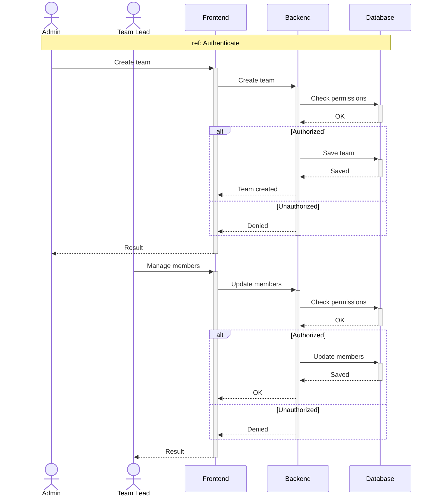
```mermaid
sequenceDiagram
    actor Admin
    actor Lead as Team Lead
    participant FE as Frontend
    participant API as Backend
    participant DB as Database

    Note over Admin,DB: ref: Authenticate

    Admin->>+FE: Create team
    FE->>+API: Create team
    API->>+DB: Check permissions
    DB-->>-API: OK
    alt Authorized
        API->>+DB: Save team
        DB-->>-API: Saved
        API-->>FE: Team created
    else Unauthorized
        API-->>FE: Denied
    end
    deactivate API
    FE-->>-Admin: Result

    Lead->>+FE: Manage members
    FE->>+API: Update members
    API->>+DB: Check permissions
    DB-->>-API: OK
    alt Authorized
        API->>+DB: Update members
        DB-->>-API: Saved
        API-->>FE: OK
    else Unauthorized
        API-->>FE: Denied
    end
    deactivate API
    FE-->>-Lead: Result
```

#### Sprint review & retrospective

| Topic | Outcome |
| ----- | ------- |
| **Review** | Demoed creating an org, inviting/accepting members, and structuring teams with roles; 14 stories accepted. |
| 👍 **Went well** | The role/permission model proved flexible enough for every later team-scoped feature. |
| 👎 **To improve** | Cascade-delete of an org touched many tables — model data ownership up front next time. |

#### Sprint summary

This sprint builds the multi-tenant core — organization creation, email invitations, join-request review, and the member directory.
It introduces the team substructure and the role/permission model that governs every team-scoped action later on.
It also covers the full admin lifecycle — update, delete, and member management — including kicking and permission grants.

### Sprint 3 — Live Collaboration (Weeks 5–6)

Channels, real-time messaging and file sharing.

**Sprint goal:** _Members hold live conversations in channels with pinning, search and file sharing._

| ID | User Story | Epic | Role | Story Points | Priority | Subtasks |
| -- | ---------- | ---- | ---- | :----------: | :------: | -------- |
| US-7.1 | As a **member**, I want to create org channels (general or announcement), so that topics stay organized. | EP-07 | Member | 3 | **M** | 1. Implement `POST /channels` for general/announcement types 2. Build the channel creation form 3. Enforce a permission check on the channel type |
| US-7.2 | As a **member**, I want to chat in channels in real time, so that conversations feel instant. | EP-07 | Member | 8 | **M** | 1. Broadcast messages via the WebSocket manager 2. Persist every message to the database 3. Build the channel chat UI with live updates |
| US-7.3 | As a **member**, I want to edit or delete my own messages, so that I can fix mistakes. | EP-07 | Member | 3 | **M** | 1. Add edit/delete endpoints with an ownership check 2. Broadcast the updates over WebSocket 3. Add inline edit/delete controls |
| US-7.4 | As a **member**, I want to load older messages on scroll, so that history loads smoothly. | EP-07 | Member | 3 | **M** | 1. Implement a cursor-paginated history endpoint 2. Add the infinite-scroll handler 3. Preserve scroll position when prepending messages |
| US-15.2 | As a **team member**, I want to chat in my team's channels, so that I can collaborate with my team. | EP-07 | Team Member | 3 | **M** | 1. Scope channels to a `team_id` 2. Add the team-channel access guard 3. Surface team channels in the team view |
| US-7.5 | As a **member**, I want to reply to a message, so that threads stay readable. | EP-07 | Member | 3 | **S** | 1. Add a `parent_message_id` to the message model 2. Build the thread view UI 3. Show a reply-count indicator |
| US-7.6 | As a **member**, I want to pin and unpin messages, so that important info is easy to find. | EP-07 | Member | 2 | **S** | 1. Add pin/unpin endpoints 2. Build the pinned-messages panel 3. Enforce the pin permission check |
| US-7.7 | As a **member**, I want to search messages in a channel, so that I can find past discussions. | EP-07 | Member | 5 | **S** | 1. Implement the channel message search endpoint 2. Build the channel search bar 3. Highlight and jump to the matched result |
| US-7.8 | As a **member**, I want to share files in channels, so that documents stay with the conversation. | EP-07 | Member | 5 | **S** | 1. Upload attachments to Cloudinary on send 2. Persist the attachment metadata 3. Render attachment previews in the chat |
| US-7.9 | As a **member**, I want to mention teammates with `@tag`, so that they get notified. | EP-07 | Member | 3 | **S** | 1. Build the mention parser and autocomplete 2. Resolve mentioned users server-side 3. Trigger the mention notification |
| US-13.5 | As a **team lead**, I want to create channels in my team, so that the team has its own spaces. | EP-07 | Team Lead | 2 | **S** | 1. Add the team-scoped channel creation endpoint 2. Enforce the team-lead-only permission check 3. Add the creation UI in the team view |
| US-15.3 | As a **team member**, I want a file list per team channel with inline PDF viewing, so that I can find and read attachments easily. | EP-07 | Team Member | 5 | **C** | 1. Implement the per-channel file list endpoint 2. Build the file list UI 3. Add the inline PDF viewer |

**Sprint totals:** 12 stories • 45 story points

#### Related diagrams

_Source: [docs/sprints/SPRINT_3.md](docs/sprints/SPRINT_3.md)._

##### C4 — Messaging domain (component view)

- The full real-time domain: channel, DM and group-chat routers, all sharing one **WebSocket manager**.
- Each router has its own service, but they reuse the same data-access layer and Cloudinary handler for attachments.
- Messages persist to PostgreSQL; attachments live on Cloudinary.

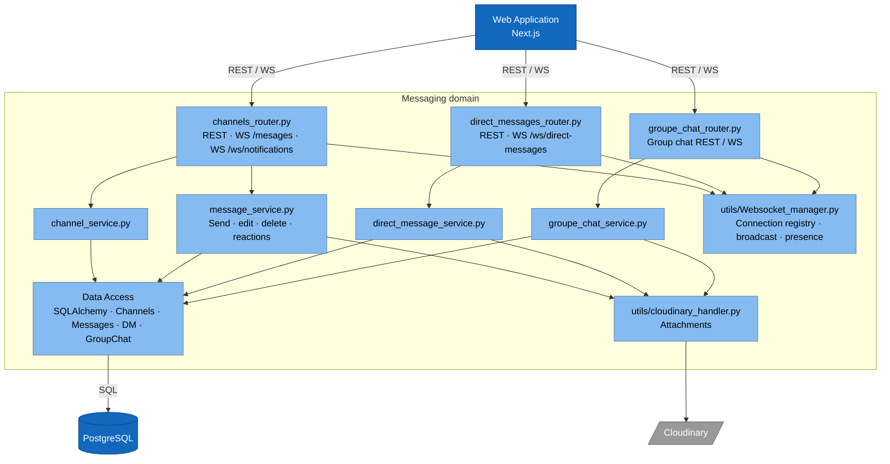
```mermaid
flowchart TB
    web[Web Application<br/>Next.js]
    db[(PostgreSQL)]
    cloud[/Cloudinary/]

    subgraph msg [Messaging domain]
        chRouter[channels_router.py<br/>REST · WS /mesages · WS /ws/notifications]
        dmRouter[direct_messages_router.py<br/>REST · WS /ws/direct-messages]
        gcRouter[groupe_chat_router.py<br/>Group chat REST / WS]

        chSvc[channel_service.py]
        msgSvc[message_service.py<br/>Send · edit · delete · reactions]
        dmSvc[direct_message_service.py]
        gcSvc[groupe_chat_service.py]

        wsMgr[utils/Websocket_manager.py<br/>Connection registry · broadcast · presence]
        cloudUtil[utils/cloudinary_handler.py<br/>Attachments]
        msgData[Data Access<br/>SQLAlchemy · Channels · Messages · DM · GroupChat]
    end

    web -- "REST / WS" --> chRouter
    web -- "REST / WS" --> dmRouter
    web -- "REST / WS" --> gcRouter

    chRouter --> chSvc
    chRouter --> msgSvc
    chRouter --> wsMgr
    dmRouter --> dmSvc
    dmRouter --> wsMgr
    gcRouter --> gcSvc
    gcRouter --> wsMgr

    msgSvc --> cloudUtil
    dmSvc --> cloudUtil
    gcSvc --> cloudUtil
    cloudUtil --> cloud

    chSvc --> msgData
    msgSvc --> msgData
    dmSvc --> msgData
    gcSvc --> msgData
    msgData -- "SQL" --> db

    classDef container fill:#1168bd,stroke:#0b4884,color:#fff
    classDef component fill:#85bbf0,stroke:#5d82a8,color:#000
    classDef ext fill:#999999,stroke:#6b6b6b,color:#fff
    class web,db container
    class chRouter,dmRouter,gcRouter,chSvc,msgSvc,dmSvc,gcSvc,wsMgr,cloudUtil,msgData component
    class cloud ext
```

##### Class diagram — Channels & Messaging

- Models `Channel`, its `Message`s, `PinnedMessage`s and attached `File`s.
- A channel belongs to a team and holds many messages; users send messages and upload files.
- `Message` carries soft-delete (`isDeleted`) and edit support.

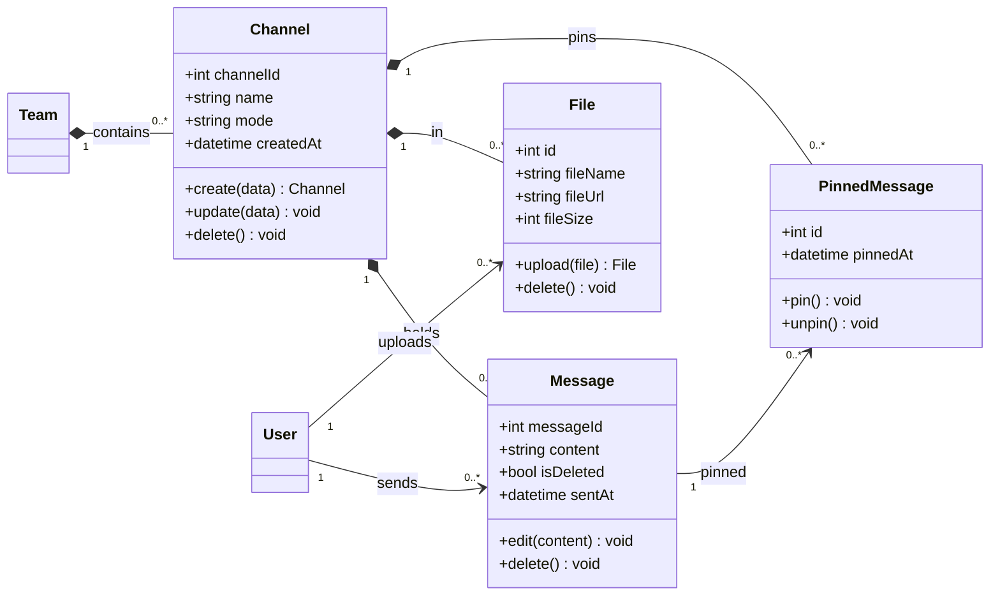
```mermaid
classDiagram
    direction LR

    class Channel {
        +int channelId
        +string name
        +string mode
        +datetime createdAt
        +create(data) Channel
        +update(data) void
        +delete() void
    }

    class Message {
        +int messageId
        +string content
        +bool isDeleted
        +datetime sentAt
        +edit(content) void
        +delete() void
    }

    class PinnedMessage {
        +int id
        +datetime pinnedAt
        +pin() void
        +unpin() void
    }

    class File {
        +int id
        +string fileName
        +string fileUrl
        +int fileSize
        +upload(file) File
        +delete() void
    }

    Team "1" *-- "0..*" Channel : contains
    Channel "1" *-- "0..*" Message : holds
    User "1" --> "0..*" Message : sends
    Channel "1" *-- "0..*" PinnedMessage : pins
    Message "1" --> "0..*" PinnedMessage : pinned
    Channel "1" *-- "0..*" File : in
    User "1" --> "0..*" File : uploads
```

##### Sequence — Channel Messaging over WebSocket (US-7.2, US-7.3, US-7.4, US-7.9, US-15.2)

- Two users open the channel and hold a persistent WebSocket connection.
- Inside the `loop`, each message is permission-checked, persisted, indexed in Pinecone, then broadcast to subscribers.
- Closing the channel disconnects the socket.

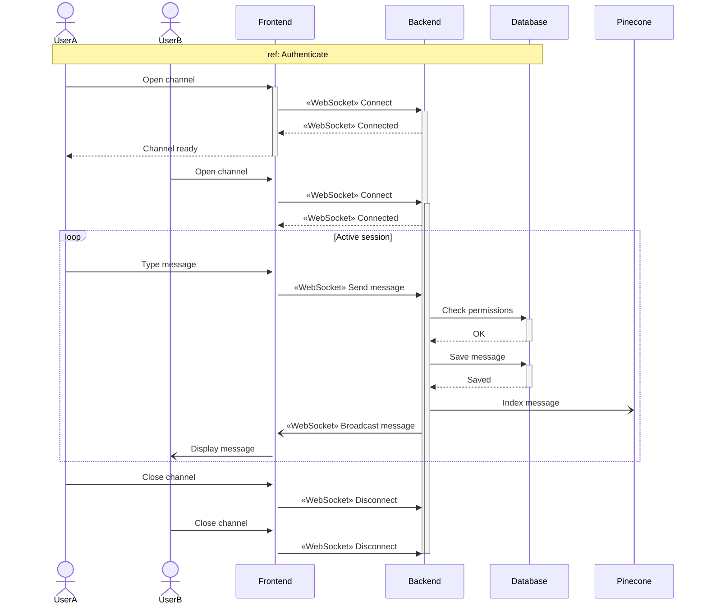
```mermaid
sequenceDiagram
    actor UserA
    actor UserB
    participant FE as Frontend
    participant API as Backend
    participant DB as Database
    participant Vec as Pinecone

    Note over UserA,DB: ref: Authenticate

    UserA->>+FE: Open channel
    FE->>+API: «WebSocket» Connect
    API-->>FE: «WebSocket» Connected
    FE-->>-UserA: Channel ready

    UserB->>+FE: Open channel
    FE->>+API: «WebSocket» Connect
    API-->>FE: «WebSocket» Connected

    loop Active session
        UserA->>FE: Type message
        FE->>API: «WebSocket» Send message
        API->>+DB: Check permissions
        DB-->>-API: OK
        API->>+DB: Save message
        DB-->>-API: Saved
        API-)Vec: Index message
        API-)FE: «WebSocket» Broadcast message
        FE-)UserB: Display message
    end

    UserA->>FE: Close channel
    FE->>API: «WebSocket» Disconnect
    UserB->>FE: Close channel
    FE->>API: «WebSocket» Disconnect
    deactivate API
    deactivate API
```

##### Sequence — File Upload & Indexing (US-7.8, US-15.3)

- Upload path: validate → store on Cloudinary → save metadata → optionally index the content in Pinecone.
- Download path: permission-check, load the row, then fetch the bytes back from Cloudinary.
- Indexing is what later lets the AI assistant retrieve file content.

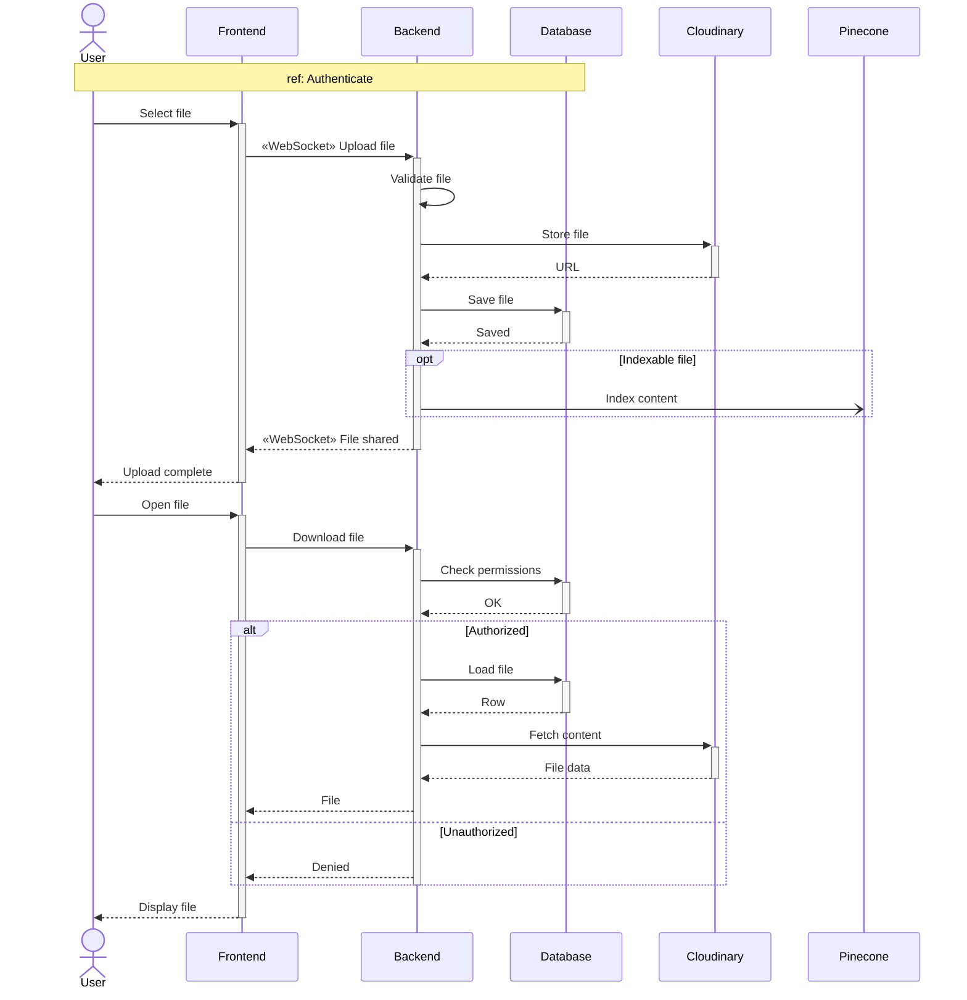
```mermaid
sequenceDiagram
    actor User
    participant FE as Frontend
    participant API as Backend
    participant DB as Database
    participant Cloud as Cloudinary
    participant Vec as Pinecone

    Note over User,DB: ref: Authenticate

    User->>+FE: Select file
    FE->>+API: «WebSocket» Upload file
    API->>API: Validate file
    API->>+Cloud: Store file
    Cloud-->>-API: URL
    API->>+DB: Save file
    DB-->>-API: Saved
    opt Indexable file
        API-)Vec: Index content
    end
    API-->>-FE: «WebSocket» File shared
    FE-->>-User: Upload complete

    User->>+FE: Open file
    FE->>+API: Download file
    API->>+DB: Check permissions
    DB-->>-API: OK
    alt Authorized
        API->>+DB: Load file
        DB-->>-API: Row
        API->>+Cloud: Fetch content
        Cloud-->>-API: File data
        API-->>FE: File
    else Unauthorized
        API-->>FE: Denied
    end
    deactivate API
    FE-->>-User: Display file
```

#### Sprint review & retrospective

| Topic | Outcome |
| ----- | ------- |
| **Review** | Demoed real-time channel chat with edit, pin, search, threads and file sharing; 12 stories accepted. |
| 👍 **Went well** | The WebSocket manager and Cloudinary pipeline were built once and reused everywhere after. |
| 👎 **To improve** | Channel search was underestimated — Postgres full-text tuning spilled past the sprint. |

#### Sprint summary

This sprint brings the product alive with real-time org and team channels — sending, editing, deleting, threads, pins, and `@mentions`.
It stands up the WebSocket manager and the Cloudinary upload pipeline that every later real-time and file feature reuses.
It also adds channel search, paginated history loading, and inline PDF viewing for shared documents.

### Sprint 4 — Personal Network (Weeks 7–8)

Direct messages, group chats and friends.

**Sprint goal:** _Users have 1:1 and small-group conversations and manage their personal network._

| ID | User Story | Epic | Role | Story Points | Priority | Subtasks |
| -- | ---------- | ---- | ---- | :----------: | :------: | -------- |
| US-3.1 | As a **user**, I want to send a direct message, so that we can talk privately. | EP-03 | User | 5 | **M** | 1. Add the DM conversation and message models 2. Deliver DMs over WebSocket 3. Build the DM thread UI |
| US-3.2 | As a **user**, I want to edit, delete and attach files in my DMs, so that I control my chats. | EP-03 | User | 3 | **S** | 1. Add the DM edit and delete endpoints 2. Wire Cloudinary attachments into DMs 3. Add the edit/delete/attach UI controls |
| US-3.3 | As a **user**, I want to search a DM thread, so that I can find a past message. | EP-03 | User | 3 | **S** | 1. Implement the DM search endpoint 2. Build the in-thread search UI 3. Highlight the matched results |
| US-3.4 | As a **user**, I want typing indicators in DMs, so that I know when someone's typing. | EP-03 | User | 2 | **S** | 1. Emit a typing event over WebSocket 2. Debounce the typing emit on the client 3. Render the typing indicator |
| US-3.5 | As a **user**, I want a list of my DM conversations, so that I can resume them. | EP-03 | User | 3 | **S** | 1. Implement the user DM conversations endpoint 2. Build the DM inbox list UI 3. Show the last message and unread badge |
| US-5.1 | As a **user**, I want to create a group chat, so that small groups can talk. | EP-05 | User | 3 | **M** | 1. Add the group chat model with participants 2. Implement the create-group endpoint 3. Build the group creation UI |
| US-5.3 | As a **user**, I want to send, edit and delete group messages in real time, so that we can collaborate. | EP-05 | User | 5 | **M** | 1. Broadcast group messages over WebSocket 2. Add the group message edit/delete endpoints 3. Build the group chat UI |
| US-5.2 | As a **user**, I want to add, edit or delete a group chat, so that I can manage it. | EP-05 | User | 3 | **S** | 1. Add endpoints to add/remove participants and rename 2. Implement the delete-group endpoint 3. Build the group settings UI |
| US-4.1 | As a **user**, I want to send a friend request, so that I can connect with someone. | EP-04 | User | 3 | **S** | 1. Add the friend request model and endpoint 2. Build the send-request UI 3. Trigger the friend-request notification |
| US-4.2 | As a **user**, I want to accept, reject or remove friends, so that I curate my contacts. | EP-04 | User | 3 | **S** | 1. Add the accept/reject/remove endpoints 2. Build the friends list and requests UI 3. Update the friendship state on each action |
| US-4.3 | As a **user**, I want to block or unblock users, so that I can stop unwanted contact. | EP-04 | User | 2 | **C** | 1. Add the block model and block/unblock endpoints 2. Filter blocked users out of DMs and requests 3. Add the block/unblock UI controls |

**Sprint totals:** 11 stories • 35 story points

#### Related diagrams

_Source: [docs/sprints/SPRINT_4.md](docs/sprints/SPRINT_4.md)._

##### C4 — Messaging domain (component view)

- The full real-time domain: channel, DM and group-chat routers, all sharing one **WebSocket manager**.
- Each router has its own service, but they reuse the same data-access layer and Cloudinary handler for attachments.
- Messages persist to PostgreSQL; attachments live on Cloudinary.

```mermaid
flowchart TB
    web[Web Application<br/>Next.js]
    db[(PostgreSQL)]
    cloud[/Cloudinary/]

    subgraph msg [Messaging domain]
        chRouter[channels_router.py<br/>REST · WS /mesages · WS /ws/notifications]
        dmRouter[direct_messages_router.py<br/>REST · WS /ws/direct-messages]
        gcRouter[groupe_chat_router.py<br/>Group chat REST / WS]

        chSvc[channel_service.py]
        msgSvc[message_service.py<br/>Send · edit · delete · reactions]
        dmSvc[direct_message_service.py]
        gcSvc[groupe_chat_service.py]

        wsMgr[utils/Websocket_manager.py<br/>Connection registry · broadcast · presence]
        cloudUtil[utils/cloudinary_handler.py<br/>Attachments]
        msgData[Data Access<br/>SQLAlchemy · Channels · Messages · DM · GroupChat]
    end

    web -- "REST / WS" --> chRouter
    web -- "REST / WS" --> dmRouter
    web -- "REST / WS" --> gcRouter

    chRouter --> chSvc
    chRouter --> msgSvc
    chRouter --> wsMgr
    dmRouter --> dmSvc
    dmRouter --> wsMgr
    gcRouter --> gcSvc
    gcRouter --> wsMgr

    msgSvc --> cloudUtil
    dmSvc --> cloudUtil
    gcSvc --> cloudUtil
    cloudUtil --> cloud

    chSvc --> msgData
    msgSvc --> msgData
    dmSvc --> msgData
    gcSvc --> msgData
    msgData -- "SQL" --> db

    classDef container fill:#1168bd,stroke:#0b4884,color:#fff
    classDef component fill:#85bbf0,stroke:#5d82a8,color:#000
    classDef ext fill:#999999,stroke:#6b6b6b,color:#fff
    class web,db container
    class chRouter,dmRouter,gcRouter,chSvc,msgSvc,dmSvc,gcSvc,wsMgr,cloudUtil,msgData component
    class cloud ext
```

##### Class diagram — Direct Messages, Group Chat & Social Graph

- Covers everything outside channels: `DirectMessage`, `GroupChat` (with members and messages), and the social graph.
- The social graph is three entities — `Friendship`, `FriendRequest` and `BlockedUser`.
- All conversation entities support edit and soft-delete.

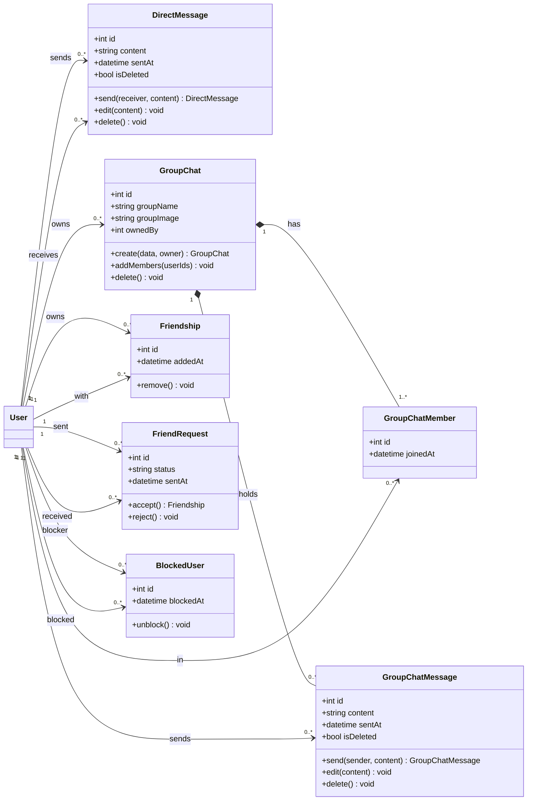
```mermaid
classDiagram
    direction LR

    class DirectMessage {
        +int id
        +string content
        +datetime sentAt
        +bool isDeleted
        +send(receiver, content) DirectMessage
        +edit(content) void
        +delete() void
    }

    class GroupChat {
        +int id
        +string groupName
        +string groupImage
        +int ownedBy
        +create(data, owner) GroupChat
        +addMembers(userIds) void
        +delete() void
    }

    class GroupChatMember {
        +int id
        +datetime joinedAt
    }

    class GroupChatMessage {
        +int id
        +string content
        +datetime sentAt
        +bool isDeleted
        +send(sender, content) GroupChatMessage
        +edit(content) void
        +delete() void
    }

    class Friendship {
        +int id
        +datetime addedAt
        +remove() void
    }

    class FriendRequest {
        +int id
        +string status
        +datetime sentAt
        +accept() Friendship
        +reject() void
    }

    class BlockedUser {
        +int id
        +datetime blockedAt
        +unblock() void
    }

    User "1" --> "0..*" DirectMessage : sends
    User "1" --> "0..*" DirectMessage : receives

    User "1" --> "0..*" GroupChat : owns
    GroupChat "1" *-- "1..*" GroupChatMember : has
    User "1" --> "0..*" GroupChatMember : in
    GroupChat "1" *-- "0..*" GroupChatMessage : holds
    User "1" --> "0..*" GroupChatMessage : sends

    User "1" --> "0..*" Friendship : owns
    User "1" --> "0..*" Friendship : with
    User "1" --> "0..*" FriendRequest : sent
    User "1" --> "0..*" FriendRequest : received
    User "1" --> "0..*" BlockedUser : blocker
    User "1" --> "0..*" BlockedUser : blocked
```

##### Sequence — Direct Messages (US-3.1 → US-3.5, US-4.3, US-5.3)

- Two users connect; inside the `loop` each message is **block-checked**, saved, and delivered only if the recipient is online.
- A separate step loads the conversation inbox.
- Mirrors the channel flow, but scoped to a 1:1 thread.

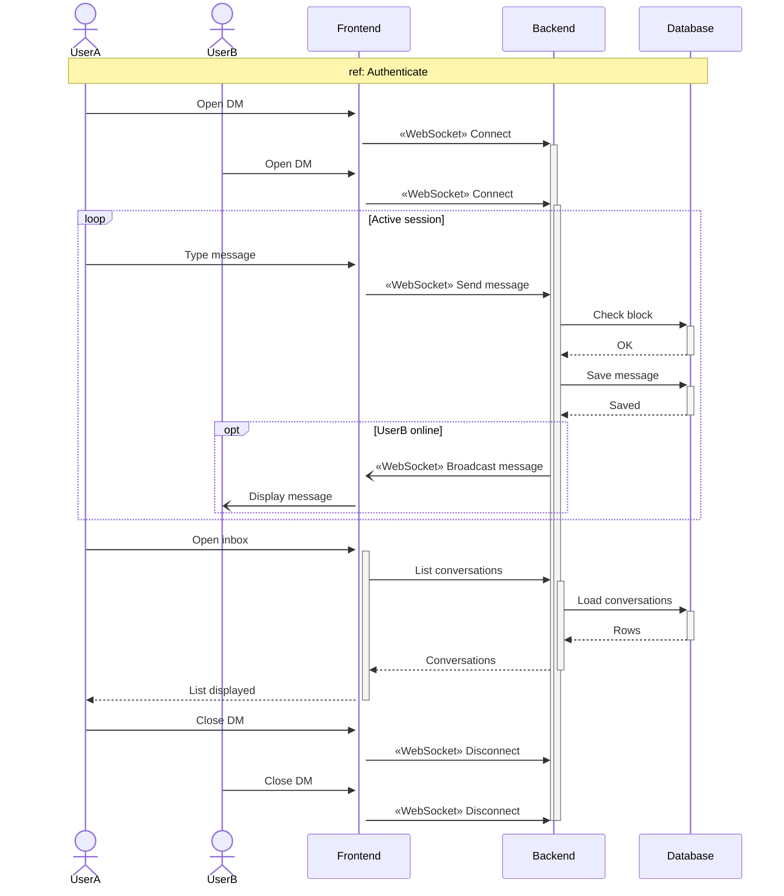
```mermaid
sequenceDiagram
    actor UserA
    actor UserB
    participant FE as Frontend
    participant API as Backend
    participant DB as Database

    Note over UserA,DB: ref: Authenticate

    UserA->>+FE: Open DM
    FE->>+API: «WebSocket» Connect
    UserB->>+FE: Open DM
    FE->>+API: «WebSocket» Connect

    loop Active session
        UserA->>FE: Type message
        FE->>API: «WebSocket» Send message
        API->>+DB: Check block
        DB-->>-API: OK
        API->>+DB: Save message
        DB-->>-API: Saved
        opt UserB online
            API-)FE: «WebSocket» Broadcast message
            FE-)UserB: Display message
        end
    end

    UserA->>+FE: Open inbox
    FE->>+API: List conversations
    API->>+DB: Load conversations
    DB-->>-API: Rows
    API-->>-FE: Conversations
    FE-->>-UserA: List displayed

    UserA->>FE: Close DM
    FE->>API: «WebSocket» Disconnect
    UserB->>FE: Close DM
    FE->>API: «WebSocket» Disconnect
    deactivate API
    deactivate API
```

##### Sequence — Presence WebSocket (US-3.4 typing/presence, US-4.1, US-4.2)

- On connect the user is marked online and friends are notified; the online-friends list is pushed back.
- A `loop` heartbeat (ping/pong) keeps the connection alive; status changes are broadcast.
- On disconnect, the last session marks the user offline.

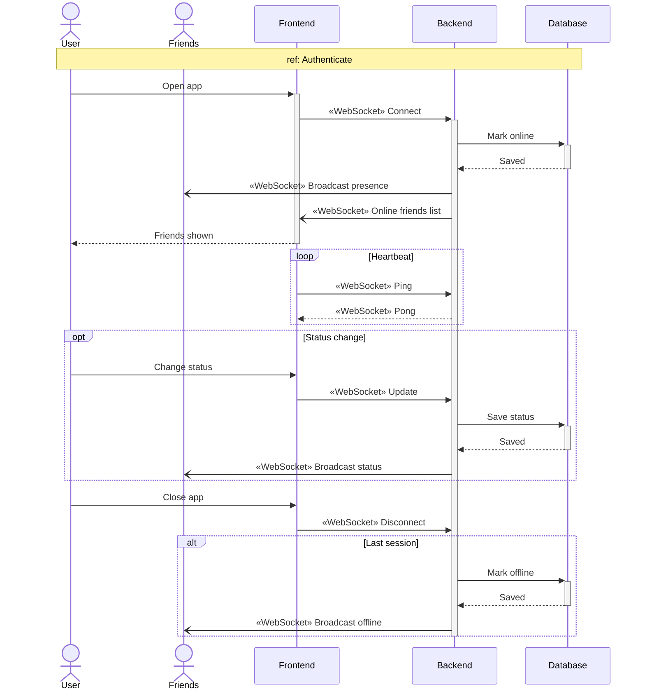
```mermaid
sequenceDiagram
    actor User
    actor Friends
    participant FE as Frontend
    participant API as Backend
    participant DB as Database

    Note over User,DB: ref: Authenticate

    User->>+FE: Open app
    FE->>+API: «WebSocket» Connect
    API->>+DB: Mark online
    DB-->>-API: Saved
    API-)Friends: «WebSocket» Broadcast presence
    API-)FE: «WebSocket» Online friends list
    FE-->>-User: Friends shown

    loop Heartbeat
        FE->>API: «WebSocket» Ping
        API-->>FE: «WebSocket» Pong
    end

    opt Status change
        User->>FE: Change status
        FE->>API: «WebSocket» Update
        API->>+DB: Save status
        DB-->>-API: Saved
        API-)Friends: «WebSocket» Broadcast status
    end

    User->>FE: Close app
    FE->>API: «WebSocket» Disconnect
    alt Last session
        API->>+DB: Mark offline
        DB-->>-API: Saved
        API-)Friends: «WebSocket» Broadcast offline
    end
    deactivate API
```

#### Sprint review & retrospective

| Topic | Outcome |
| ----- | ------- |
| **Review** | Demoed 1:1 DMs, group chats and the friends/block graph; 11 stories accepted. |
| 👍 **Went well** | Reusing Sprint 3's transport meant almost no new infrastructure was needed. |
| 👎 **To improve** | Presence/typing events were chatty — debouncing should have been planned, not patched. |

#### Sprint summary

This sprint adds 1:1 direct messaging with edit, delete, attachments, search, and a conversations inbox, all on top of Sprint 3's transport.
It introduces ad-hoc group chats with real-time messaging and full member/settings management.
It also builds the social graph — friend requests, accept/reject/remove, and blocking — plus typing indicators and presence broadcasts.

### Sprint 5 — Work Tracking (Weeks 9–10)

Tasks, subtasks, approvals and real-time notifications.

**Sprint goal:** _Teams plan and track work and stay informed via real-time notifications._

| ID | User Story | Epic | Role | Story Points | Priority | Subtasks |
| -- | ---------- | ---- | ---- | :----------: | :------: | -------- |
| US-14.1 | As a **team lead**, I want to create tasks with assignees and a due date, so that work is tracked. | EP-12 | Team Lead | 5 | **M** | 1. Add the task model (assignee, due date, status) 2. Implement the `POST /tasks` endpoint 3. Build the task creation form |
| US-14.2 | As a **team lead**, I want to edit or delete a task, so that I can adjust scope. | EP-12 | Team Lead | 3 | **M** | 1. Add the edit/delete endpoints with a permission check 2. Build the task edit form 3. Add a delete confirmation modal |
| US-16.1 | As an **assignee**, I want to see my tasks, so that I know what's on my plate. | EP-12 | Assignee | 3 | **M** | 1. Implement `GET /tasks` filtered by the current assignee 2. Build the "My Tasks" view 3. Add filtering and sorting by status and due date |
| US-16.2 | As an **assignee**, I want to update my task status (and submit for review), so that the team sees progress. | EP-12 | Assignee | 3 | **M** | 1. Add the status update endpoint 2. Implement the submit-for-review transition 3. Build the status control UI |
| US-8.1 | As a **member**, I want real-time notifications for mentions, DMs, friends and tasks, so that I don't miss anything. | EP-08 | Member | 5 | **M** | 1. Add the notification model and creation hooks 2. Push notifications over WebSocket 3. Build the notification toast and bell UI |
| US-14.3 | As a **team lead**, I want to break a task into subtasks, so that I can split large work. | EP-12 | Team Lead | 3 | **S** | 1. Add a `parent_task_id` to the task model 2. Implement the subtask creation endpoint 3. Build the subtask list UI under the parent |
| US-14.4 | As a **team lead**, I want to approve or reject a submitted task, so that quality is checked. | EP-12 | Team Lead | 3 | **S** | 1. Add the approve/reject endpoints (team-lead-only) 2. Build the review queue UI 3. Notify the assignee of the outcome |
| US-15.4 | As a **team member**, I want to add or remove task attachments, so that files travel with the work. | EP-12 | Team Member | 3 | **S** | 1. Add the add/remove attachment endpoints 2. Wire attachment upload to Cloudinary 3. Build the attachment list on the task view |
| US-8.2 | As a **member**, I want to view notifications and mark them as seen, so that I stay organized. | EP-08 | Member | 2 | **S** | 1. Implement the notification feed endpoint 2. Add the mark-as-seen endpoint 3. Build the notification inbox UI |

**Sprint totals:** 9 stories • 30 story points

#### Related diagrams

_Source: [docs/sprints/SPRINT_5.md](docs/sprints/SPRINT_5.md)._

##### C4 — Task domain (component view)

- A small slice: `tasks_router.py` over `task_service.py`, which owns the task lifecycle.
- Attachments go through the Cloudinary handler; assignee notifications reuse the WebSocket manager.
- Tasks persist to PostgreSQL.

```mermaid
flowchart TB
    web[Web Application<br/>Next.js]
    db[(PostgreSQL)]
    cloud[/Cloudinary/]

    subgraph task [Task domain]
        taskRouter[tasks_router.py<br/>Task endpoints]
        taskSvc[task_service.py<br/>Lifecycle · assignments · attachments]
        cloudUtil[utils/cloudinary_handler.py<br/>Task attachments]
        wsMgr[utils/Websocket_manager.py<br/>Notifies assignees in real time]
        taskData[Data Access<br/>SQLAlchemy · Tasks model]
    end

    web -- "REST" --> taskRouter
    taskRouter --> taskSvc
    taskSvc --> taskData
    taskSvc --> cloudUtil
    taskSvc --> wsMgr
    taskData -- "SQL" --> db
    cloudUtil --> cloud

    classDef container fill:#1168bd,stroke:#0b4884,color:#fff
    classDef component fill:#85bbf0,stroke:#5d82a8,color:#000
    classDef ext fill:#999999,stroke:#6b6b6b,color:#fff
    class web,db container
    class taskRouter,taskSvc,cloudUtil,wsMgr,taskData component
    class cloud ext
```

##### Class diagram — Tasks & Notifications

- Models `Task`, its `TaskAssignee`s and `TaskAttachment`s, plus the cross-cutting `Notification`.
- A task belongs to a team, is created by a user, and can have several assignees.
- `Notification` references the message or DM it is about.

```mermaid
classDiagram
    direction LR

    class Task {
        +int id
        +string title
        +string priority
        +string status
        +datetime dueDate
        +updateStatus(status) void
        +review(action) void
        +delete() void
    }

    class TaskAssignee {
        +int id
        +datetime assignedAt
    }

    class TaskAttachment {
        +int id
        +string fileName
        +string fileUrl
        +upload(file) TaskAttachment
        +delete() void
    }

    class Notification {
        +int id
        +string type
        +bool isSeen
        +datetime createdAt
        +markSeen() void
    }

    Team "1" *-- "0..*" Task : owns
    User "1" --> "0..*" Task : creates
    Task "1" *-- "0..*" TaskAssignee : has
    User "1" --> "0..*" TaskAssignee : assigned
    Task "1" *-- "0..*" TaskAttachment : has

    User "1" *-- "0..*" Notification : receives
    Message "1" *-- "0..*" Notification : about
    DirectMessage "1" *-- "0..*" Notification : about
```

##### Sequence — Task Lifecycle (US-14.x, US-15.4, US-16.x, US-8.1, US-8.2)

- Three stages: **9a** a manager creates a task and the assignee is notified, **9b** the assignee submits for review, **9c** the manager approves or rejects.
- Each stage validates permissions or the status transition before writing.
- Every stage fans a notification out to the other party.

_9a. Manager creates a task → assignee is notified (US-14.1, US-8.1)_

```mermaid
sequenceDiagram
    actor Manager
    actor Assignee
    participant FE as Frontend
    participant API as Backend
    participant DB as Database
    participant Notif as Notifications

    Note over Manager,DB: ref: Authenticate

    Manager->>+FE: Fill task form
    FE->>+API: Create task
    API->>+DB: Check permissions
    DB-->>-API: OK
    alt Authorized
        API->>+DB: Save task
        DB-->>-API: Saved
        API->>+Notif: Notify assignee
        Notif-)Assignee: Task assigned
        deactivate Notif
        API-->>FE: Task created
    else Unauthorized
        API-->>FE: Denied
    end
    deactivate API
    FE-->>-Manager: Result
```

_9b. Assignee submits for review (US-16.1, US-16.2)_

```mermaid
sequenceDiagram
    actor Manager
    actor Assignee
    participant FE as Frontend
    participant API as Backend
    participant DB as Database
    participant Notif as Notifications

    Note over Assignee,DB: ref: Authenticate

    Assignee->>+FE: Mark as done
    FE->>+API: Submit task
    API->>API: Validate transition
    alt Valid transition
        API->>+DB: Update status
        DB-->>-API: Saved
        API->>+Notif: Notify manager
        Notif-)Manager: Task submitted
        deactivate Notif
        API-->>FE: OK
    else Invalid transition
        API-->>FE: Error
    end
    deactivate API
    FE-->>-Assignee: Result
```

_9c. Manager approves or rejects (US-14.4)_

```mermaid
sequenceDiagram
    actor Manager
    actor Assignee
    participant FE as Frontend
    participant API as Backend
    participant DB as Database
    participant Notif as Notifications

    Note over Manager,DB: ref: Authenticate

    Manager->>+FE: Review task
    FE->>+API: Submit decision
    API->>+DB: Check permissions
    DB-->>-API: OK
    alt Approved
        API->>+DB: Update task
        DB-->>-API: Saved
        API->>+Notif: Notify assignee
        Notif-)Assignee: Task approved
        deactivate Notif
        API-->>FE: OK
    else Rejected
        API->>+DB: Update task
        DB-->>-API: Saved
        API->>+Notif: Notify assignee
        Notif-)Assignee: Task rejected
        deactivate Notif
        API-->>FE: OK
    end
    deactivate API
    FE-->>-Manager: Result
```

#### Sprint review & retrospective

| Topic | Outcome |
| ----- | ------- |
| **Review** | Demoed task creation, subtasks, the review workflow and the unified real-time notification inbox; 9 stories accepted. |
| 👍 **Went well** | The task state machine kept status transitions predictable and easy to test. |
| 👎 **To improve** | Notification fan-out logic grew complex — it needs a clearer central dispatch. |

#### Sprint summary

This sprint implements the task lifecycle — creation with assignees and due dates, edit/delete, subtasks, status updates, submission, and approval/rejection.
It adds a unified real-time notification feed covering mentions, DMs, friends, and tasks, with a viewable inbox and mark-as-seen.
It also wires task attachments into the existing Cloudinary pipeline so files travel with the work.

### Sprint 6 — Platform Reach (Weeks 11–12)

AI assistant, global search, audit log and Stripe billing.

**Sprint goal:** _Add cross-cutting capabilities — AI help, global search, audit trail and paid plans._

| ID | User Story | Epic | Role | Story Points | Priority | Subtasks |
| -- | ---------- | ---- | ---- | :----------: | :------: | -------- |
| US-10.1 | As a **member**, I want to search across org messages, so that I find info fast. | EP-10 | Member | 5 | **M** | 1. Implement the cross-channel search endpoint 2. Build the global search bar 3. Group the results by channel |
| US-12.2 | As an **org owner**, I want to subscribe to the Pro plan, so that I can unlock plan limits. | EP-06 | Org Owner | 5 | **M** | 1. Create the Stripe Checkout session endpoint 2. Handle the webhook that flips the plan to Pro 3. Build the upgrade UI and pricing page |
| US-12.3 | As an **org owner**, I want to cancel the Pro subscription, so that I can downgrade. | EP-06 | Org Owner | 3 | **M** | 1. Add the cancel-subscription endpoint 2. Handle the webhook that downgrades the plan 3. Build the manage-subscription UI |
| US-9.1 | As a **member**, I want to ask the AI about my org, so that I get quick answers. | EP-09 | Member | 8 | **S** | 1. Build the RAG pipeline with LlamaIndex 2. Implement `POST /ai/ask` grounded in org context 3. Build the AI chat UI |
| US-12.4 | As an **owner or admin**, I want to view the activity log, so that I have an audit trail. | EP-06 | Owner / Admin | 3 | **S** | 1. Implement the `GET` logs endpoint (owner/admin only) 2. Build the activity log UI with filters 3. Render entries from the `Logs` audit table |
| US-9.2 | As a **member**, I want the AI to use our uploaded documents, so that answers come from our files. | EP-09 | Member | 5 | **C** | 1. Build document upload and embedding into Pinecone 2. Scope retrieval to the `team-{team_id}` namespace 3. Build the document management UI |
| US-9.3 | As a **member**, I want to open a PDF inline and ask the AI about it, so that I can extract answers from long files. | EP-09 | Member | 5 | **C** | 1. Add the inline PDF viewer 2. Implement the per-document AI query endpoint 3. Build the ask-about-PDF UI panel |
| US-12.5 | As an **org owner**, I want to undo a reversible logged action, so that I can recover from a mistake. | EP-06 | Org Owner | 5 | **C** | 1. Mark reversible actions in the `Logs` table 2. Implement the undo endpoint per action type 3. Add the undo control in the activity log |

**Sprint totals:** 8 stories • 39 story points

#### Related diagrams

_Source: [docs/sprints/SPRINT_6.md](docs/sprints/SPRINT_6.md)._

##### C4 — Assistant domain (RAG component view)

- The retrieval-augmented pipeline: `assistant_router.py` orchestrates the document, message and vector handlers.
- `vector_db_handler.py` talks to **Pinecone**; `assistant_handler.py` calls the **Groq** LLM.
- Documents and chat history are embedded into Pinecone, then retrieved as context at query time.

```mermaid
flowchart TB
    web[Web Application<br/>Next.js]
    db[(PostgreSQL)]
    groq[/Groq LLM/]
    pinecone[/Pinecone/]

    subgraph asst [Assistant domain]
        asstRouter[assistant_router.py<br/>Chat endpoints]
        asstHandler[utils/assistant_handler.py<br/>Groq client · llama-3.3-70b]
        vectorHandler[utils/vector_db_handler.py<br/>Pinecone client]
        docHandler[utils/document_handler.py<br/>LlamaIndex parsing · chunking]
        msgHandler[utils/messages_handler.py<br/>Embeds chat history]
    end

    web -- "REST" --> asstRouter
    asstRouter --> docHandler
    asstRouter --> msgHandler
    docHandler --> vectorHandler
    msgHandler --> vectorHandler
    asstRouter --> vectorHandler
    asstRouter --> asstHandler
    vectorHandler --> pinecone
    asstHandler --> groq
    asstRouter --> db

    classDef container fill:#1168bd,stroke:#0b4884,color:#fff
    classDef component fill:#85bbf0,stroke:#5d82a8,color:#000
    classDef ext fill:#999999,stroke:#6b6b6b,color:#fff
    class web,db container
    class asstRouter,asstHandler,vectorHandler,docHandler,msgHandler component
    class groq,pinecone ext
```

##### C4 — Organization domain (billing slice)

- The same org domain as Sprint 2, with the **Stripe** arrows now live.
- `org_service.py` creates Checkout sessions and `org_router.py` receives Stripe webhooks.
- Webhook events flip the organization's plan state (Free ↔ Pro).

```mermaid
flowchart TB
    web[Web Application<br/>Next.js]
    db[(PostgreSQL)]
    stripe[/Stripe/]

    subgraph org [Organization domain]
        orgRouter[org_router.py<br/>Orgs · members · Stripe webhook]
        teamRouter[team_router.py<br/>Teams within an org]
        orgSvc[org_service.py<br/>Workspace · membership · billing logic]
        teamSvc[team_service.py<br/>Team logic]
        orgData[Data Access<br/>SQLAlchemy · Organization · Members · Teams · Payments]
    end

    web -- "REST" --> orgRouter
    web -- "REST" --> teamRouter
    stripe -- "Webhook events" --> orgRouter

    orgRouter --> orgSvc
    teamRouter --> teamSvc

    orgSvc --> orgData
    teamSvc --> orgData
    orgData -- "SQL" --> db

    orgSvc -- "Charges subscriptions" --> stripe

    classDef container fill:#1168bd,stroke:#0b4884,color:#fff
    classDef component fill:#85bbf0,stroke:#5d82a8,color:#000
    classDef ext fill:#999999,stroke:#6b6b6b,color:#fff
    class web,db container
    class orgRouter,teamRouter,orgSvc,teamSvc,orgData component
    class stripe ext
```

##### Class diagram — Billing & Audit Log

- Two entities: `OrganizationPayment` (Stripe subscription state) and `AuditLog`.
- Each org has many payment records and many audit-log entries.
- Every audit entry records the action and the acting user.

```mermaid
classDiagram
    direction LR

    class OrganizationPayment {
        +int subscriptionId
        +string stripeSubscriptionId
        +string status
        +createSubscription() Checkout
        +cancelSubscription() void
    }

    class AuditLog {
        +int id
        +string action
        +string targetType
        +datetime createdAt
        +record(action, actor) AuditLog
    }

    Organization "1" *-- "0..*" OrganizationPayment : billed by
    Organization "1" *-- "0..*" AuditLog : records
    User "1" --> "0..*" AuditLog : actor
```

##### Sequence — AI Assistant (RAG) (US-9.1, US-9.2, US-9.3)

- Flow: permission-check → similarity search in Pinecone → build a prompt → call the LLM → return the answer with sources.
- The `alt` branch denies unauthorized requests.
- Answers are grounded in the org's own indexed content.

```mermaid
sequenceDiagram
    actor User
    participant FE as Frontend
    participant API as Backend
    participant DB as Database
    participant Vec as Pinecone
    participant LLM

    Note over User,DB: ref: Authenticate

    User->>+FE: Ask question
    FE->>+API: Ask question
    API->>+DB: Check permissions
    DB-->>-API: OK
    alt Authorized
        API->>+Vec: Search context
        Vec-->>-API: Results
        API->>API: Build prompt
        API->>+LLM: Ask for answer
        LLM-->>-API: Answer
        API-->>FE: Answer + sources
    else Unauthorized
        API-->>FE: Denied
    end
    deactivate API
    FE-->>-User: Display result
```

##### Sequence — Stripe Upgrade (US-12.2, US-12.3)

- The admin starts a subscription; the backend opens a Stripe Checkout session and redirects to it.
- Stripe later calls back with a payment notification; the **signature is verified** before the subscription is updated.
- The same path covers both subscribe and cancel.

```mermaid
sequenceDiagram
    actor Admin
    participant FE as Frontend
    participant API as Backend
    participant DB as Database
    participant Stripe

    Note over Admin,DB: ref: Authenticate

    Admin->>+FE: Choose plan
    FE->>+API: Subscribe to plan
    API->>+DB: Check permissions
    DB-->>-API: OK
    API->>+Stripe: Start payment
    Stripe-->>-API: Session URL
    API-->>-FE: Redirect to payment
    FE-->>-Admin: Payment page

    Stripe->>+API: Payment notification
    API->>API: Verify signature
    API->>+DB: Update subscription
    DB-->>-API: Saved
    API-->>-Stripe: OK
```

##### Sequence — Global Message Search (US-10.1)

- A member's query runs a **similarity search** against the Pinecone index populated in Sprints 3–4.
- Top matches are hydrated back into full message rows from PostgreSQL.
- Permission-checked, so results never cross org boundaries.

```mermaid
sequenceDiagram
    actor Member
    participant FE as Frontend
    participant API as Backend
    participant DB as Database
    participant Vec as Pinecone

    Note over Member,DB: ref: Authenticate

    Member->>+FE: Type query
    FE->>+API: Search org messages
    API->>+DB: Check permissions
    DB-->>-API: OK
    alt Authorized
        API->>+Vec: Similarity search
        Vec-->>-API: Top matches
        API->>+DB: Hydrate messages
        DB-->>-API: Rows
        API-->>FE: Results
    else Unauthorized
        API-->>FE: Denied
    end
    deactivate API
    FE-->>-Member: Display results
```

#### Sprint review & retrospective

| Topic | Outcome |
| ----- | ------- |
| **Review** | Demoed the RAG assistant, global search, the audit log with undo, and Stripe Pro billing; 8 stories accepted — the product is feature-complete. |
| 👍 **Went well** | Most features composed on existing infrastructure (Pinecone, Stripe stubs, audit logs). |
| 👎 **To improve** | Stripe webhook testing needed more lead time — integrate paid services into CI earlier. |

#### Sprint summary

This sprint delivers the AI assistant via a LlamaIndex + Pinecone + Groq RAG pipeline, grounded in org context, uploaded documents, and inline PDFs.
It adds org-wide global message search backed by the same vector index built across Sprints 3–4.
It also ships Stripe Pro plan subscription and cancellation, plus the activity audit log with a reversible-undo flow on logged actions.

### Sprint 7 — Platform Administration (Weeks 13–14)

Admin dashboard, user moderation and organization oversight.

**Sprint goal:** _A site admin can monitor platform health and moderate users and organizations from a single console._

| ID | User Story | Epic | Role | Story Points | Priority | Subtasks |
| -- | ---------- | ---- | ---- | :----------: | :------: | -------- |
| US-17.1 | As a **site admin**, I want a dashboard with user, org, channel and message counts, so that I can monitor platform health. | EP-13 | Site Admin | 3 | **M** | 1. Implement `GET /admin/overview` aggregating counts across users, orgs, channels and messages 2. Enforce the `role == "admin"` guard on every admin endpoint 3. Build the admin dashboard UI with stat cards |
| US-17.2 | As a **site admin**, I want to list every user with their status and role, so that I can audit accounts. | EP-13 | Site Admin | 2 | **M** | 1. Implement `GET /admin/users` returning verification, role and account status 2. Build the users table UI with sort and filter 3. Show the joined-at and last-login timestamps |
| US-17.3 | As a **site admin**, I want to ban or unban users and revoke their sessions, so that I can enforce platform rules. | EP-13 | Site Admin | 3 | **M** | 1. Implement `POST /admin/users/{id}/ban` flipping `account_status` and revoking refresh tokens 2. Implement `POST /admin/users/{id}/unban` restoring access 3. Block self-ban and admin-on-admin bans 4. Add ban/unban controls in the users table |
| US-17.4 | As a **site admin**, I want to inspect and delete organizations, so that I can remove abusive workspaces. | EP-13 | Site Admin | 5 | **S** | 1. Implement `GET /admin/organizations` returning a tree of orgs → teams → channels with members and owner 2. Implement `DELETE /admin/organizations/{id}` with cascade 3. Build the org explorer UI with the nested tree view 4. Add a delete confirmation modal |

**Sprint totals:** 4 stories • 13 story points

#### Related diagrams

##### C4 — Admin domain (component view)

- A thin slice: `admin_router.py` is permission-gated by the `role == "admin"` check and reads across every existing model.
- Bans reuse the `Refresh_tokens` table to revoke active sessions; deletes cascade through the org graph.
- No new external services — admin tooling reuses the existing database.

```mermaid
flowchart TB
    web[Web Application<br/>Next.js · /admin]
    db[(PostgreSQL)]

    subgraph admin [Admin domain]
        adminRouter[admin_router.py<br/>Overview · users · orgs · ban/unban · delete]
        adminGuard["_require_admin<br/>role == 'admin' check"]
        adminData[Data Access<br/>SQLAlchemy · Users · Orgs · Teams · Channels · Messages · Refresh_tokens]
    end

    web -- "REST" --> adminRouter
    adminRouter --> adminGuard
    adminGuard --> adminData
    adminData -- "SQL" --> db

    classDef container fill:#1168bd,stroke:#0b4884,color:#fff
    classDef component fill:#85bbf0,stroke:#5d82a8,color:#000
    class web,db container
    class adminRouter,adminGuard,adminData component
```

##### Class diagram — Site Administration

- Models the admin actor as a specialized `User` whose `role` is `"admin"`.
- `User` carries the moderation field `accountStatus` (`active` / `banned`) and the methods used by the admin endpoints.
- `Organization` exposes the cascade delete; `RefreshToken` is revoked on ban.

```mermaid
classDiagram
    direction LR

    class User {
        +int userId
        +string email
        +string role
        +string accountStatus
        +bool isVerified
        +ban() void
        +unban() void
    }

    class SiteAdmin {
        +overview() Stats
        +listUsers() User[]
        +listOrganizations() OrgTree[]
        +banUser(userId) void
        +unbanUser(userId) void
        +deleteOrganization(orgId) void
    }

    class Organization {
        +int organizationId
        +string name
        +delete() void
    }

    class RefreshToken {
        +string jti
        +datetime revokedAt
        +revoke() void
    }

    SiteAdmin --|> User : role = admin
    SiteAdmin "1" --> "0..*" User : moderates
    SiteAdmin "1" --> "0..*" Organization : oversees
    User "1" *-- "0..*" RefreshToken : owns
```

##### Sequence — Admin Overview Dashboard (US-17.1, US-17.2, US-17.4)

- Every admin call is gated by the role check before any read.
- The overview endpoint aggregates counts across users, orgs, channels and messages in one round-trip.
- The org explorer returns a nested tree (orgs → teams → channels → members).

```mermaid
sequenceDiagram
    actor Admin as Site Admin
    participant FE as Frontend
    participant API as Backend
    participant DB as Database

    Note over Admin,DB: ref: Authenticate

    Admin->>+FE: Open /admin
    FE->>+API: Get overview
    API->>API: Check role == admin
    alt Authorized
        API->>+DB: Aggregate counts
        DB-->>-API: Stats
        API-->>FE: Overview
    else Unauthorized
        API-->>FE: Denied
    end
    deactivate API
    FE-->>-Admin: Dashboard shown

    Admin->>+FE: Open users tab
    FE->>+API: List users
    API->>API: Check role == admin
    API->>+DB: Load users
    DB-->>-API: Rows
    API-->>-FE: Users
    FE-->>-Admin: Users table

    Admin->>+FE: Open orgs tab
    FE->>+API: List organizations
    API->>API: Check role == admin
    API->>+DB: Load orgs · teams · channels · members
    DB-->>-API: Tree
    API-->>-FE: Org tree
    FE-->>-Admin: Org explorer
```

##### Sequence — Ban User & Revoke Sessions (US-17.3)

- The role check runs first; self-ban and admin-on-admin bans are rejected before any write.
- A successful ban flips `account_status` to `banned` and bulk-revokes every active refresh token for that user.
- The banned user's next request fails to refresh and is forced to re-login (and will be blocked).

```mermaid
sequenceDiagram
    actor Admin as Site Admin
    actor Target
    participant FE as Frontend
    participant API as Backend
    participant DB as Database

    Note over Admin,DB: ref: Authenticate

    Admin->>+FE: Click ban
    FE->>+API: Ban user
    API->>API: Check role == admin
    alt Self-ban or admin target
        API-->>FE: Error
    else Valid target
        API->>+DB: Set status = banned
        DB-->>-API: Saved
        API->>+DB: Revoke refresh tokens
        DB-->>-API: Saved
        API-->>FE: Banned
    end
    deactivate API
    FE-->>-Admin: Result

    Note over Target,API: Target's next refresh fails

    Target->>+FE: Continue using app
    FE->>+API: Refresh token
    API->>+DB: Check token
    DB-->>-API: Revoked
    API-->>-FE: Denied
    FE-->>-Target: Force re-login
```

##### Sequence — Delete Organization (US-17.4)

- The admin reviews the org tree, then triggers a cascade delete.
- The role check is enforced before the delete, and the cascade removes teams, channels, members and messages.
- Members of the deleted org lose access on their next request.

```mermaid
sequenceDiagram
    actor Admin as Site Admin
    participant FE as Frontend
    participant API as Backend
    participant DB as Database

    Note over Admin,DB: ref: Authenticate

    Admin->>+FE: Open org details
    FE->>+API: Load organization
    API->>API: Check role == admin
    API->>+DB: Load org · teams · channels · members
    DB-->>-API: Tree
    API-->>-FE: Org tree
    FE-->>-Admin: Details shown

    Admin->>+FE: Confirm delete
    FE->>+API: Delete organization
    API->>API: Check role == admin
    alt Authorized
        API->>+DB: Cascade delete org
        DB-->>-API: Deleted
        API-->>FE: OK
    else Unauthorized
        API-->>FE: Denied
    end
    deactivate API
    FE-->>-Admin: Result
```

#### Sprint review & retrospective

| Topic | Outcome |
| ----- | ------- |
| **Review** | Demoed the admin dashboard, user list with ban/unban and the org explorer with cascade delete; 4 stories accepted. |
| 👍 **Went well** | Reusing the `Refresh_tokens` table for session revocation meant banning a user instantly logged them out everywhere. |
| 👎 **To improve** | All admin queries hit the live tables — for a busier deployment, the overview should be cached or moved to a read replica. |

#### Sprint summary

This sprint introduces the platform-administration console behind the `role == "admin"` guard.
It delivers a stats overview, a global users table with ban/unban (revoking active refresh tokens), and an organization explorer with cascade delete.
It reuses every existing model and the Sprint 1 refresh-token rotation, adding no new external service.
