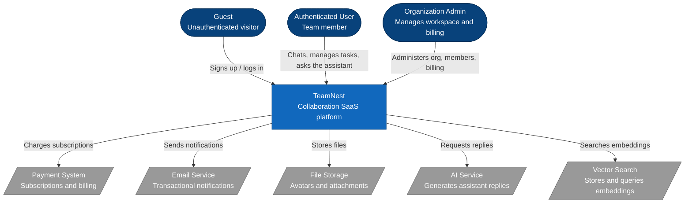
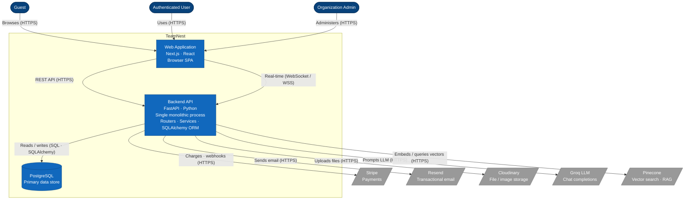
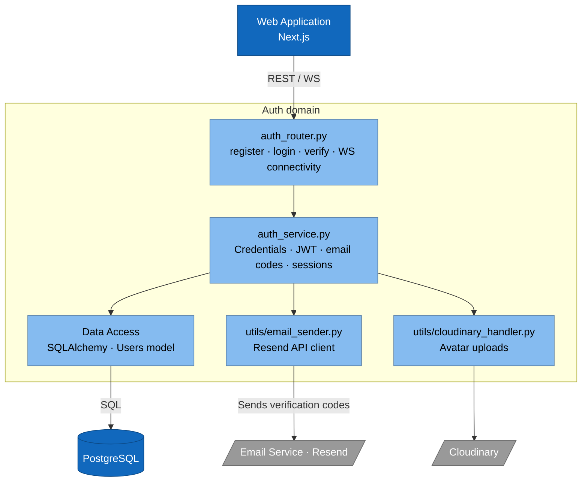
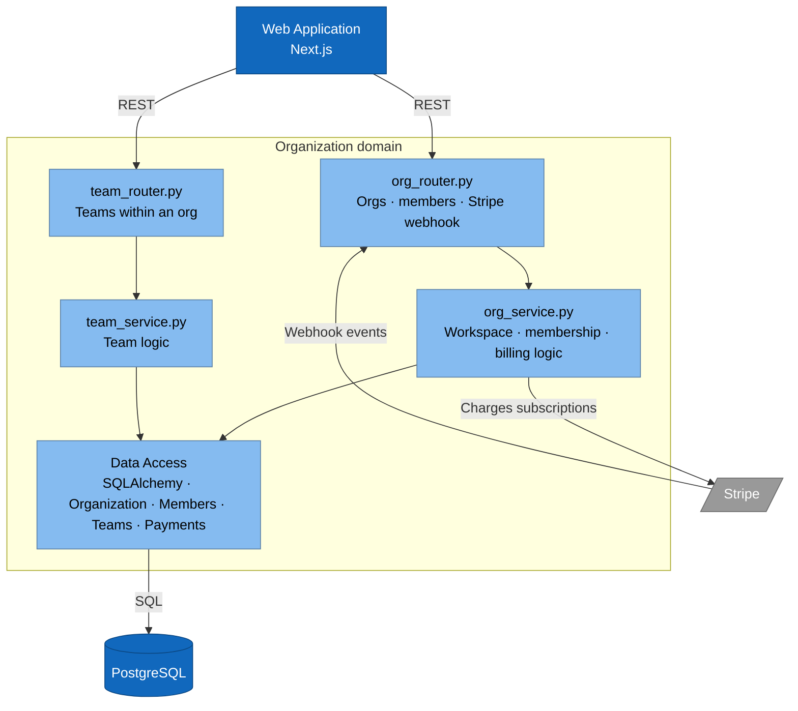
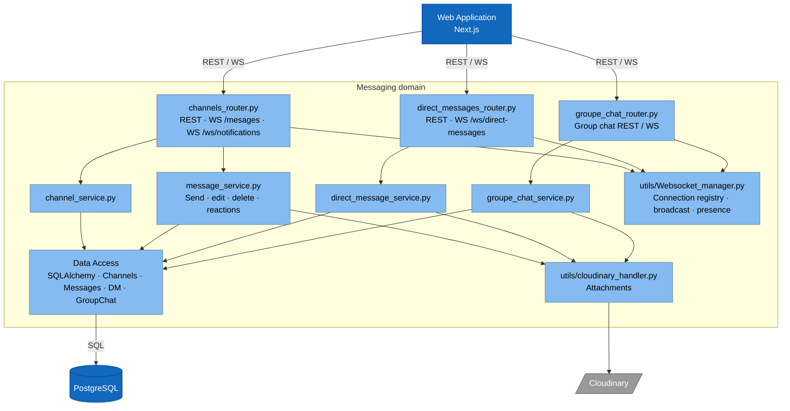
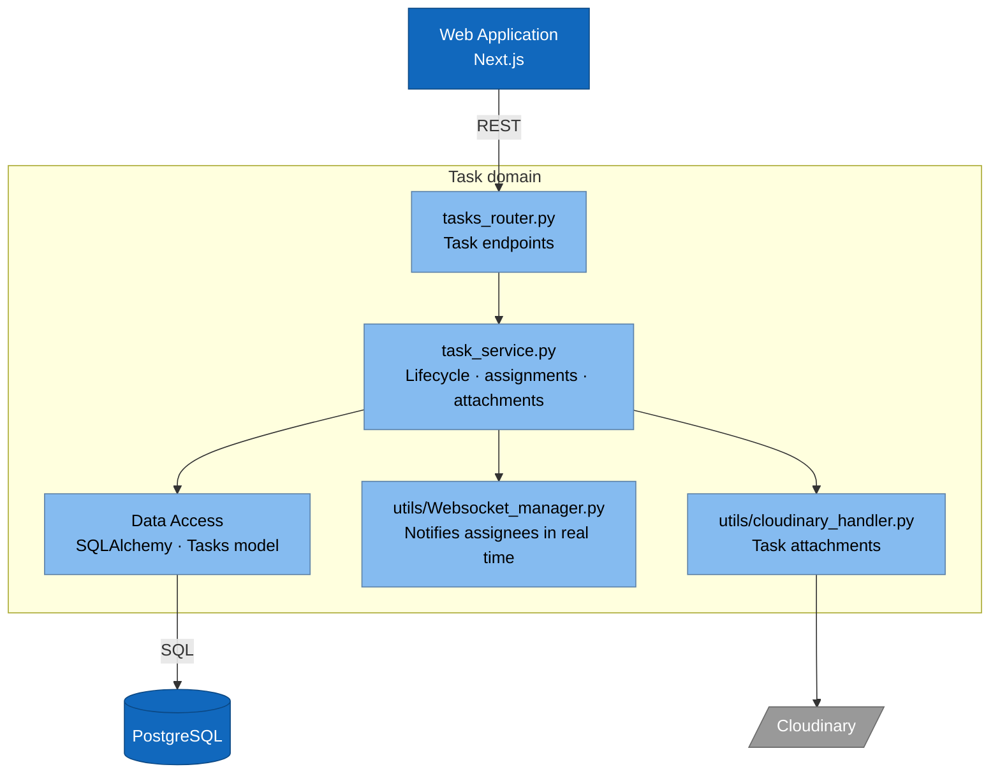
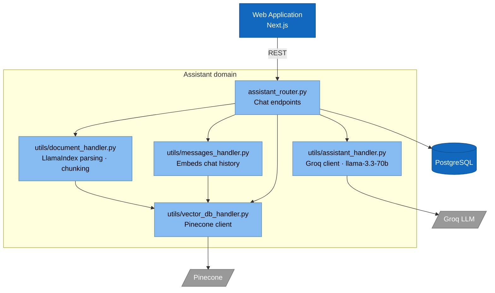

# TeamNest — C4 Architecture Diagrams

This document describes the architecture of TeamNest using the [C4 model](https://c4model.com/): **Context**, **Containers**, and **Components**. Each level zooms into the previous one. The Code level is intentionally omitted.

---

## Level 1 — System Context

Shows the actors using TeamNest and the external systems it depends on. Business-level view; no technologies or protocols.

---

## Level 2 — Containers

Zooms into TeamNest to show its deployable units. The backend is a **single FastAPI monolith** (one process) organised internally by routers — not multiple microservices.

---

## Level 3 — Components

> **Note.** The Backend API is a single container (one FastAPI process). The diagrams below split that container by **domain** purely for readability — together they describe the same container. Each domain follows a **Router → Service → Data Access (SQLAlchemy)** pattern. Data access is shown as one component per domain rather than per ORM model, to keep diagrams at the architectural level.

### 3.1 Auth domain

### 3.2 Organization domain

### 3.3 Messaging domain

Covers channels, direct messages, and group chat — all share the WebSocket manager.

### 3.4 Task domain

### 3.5 AI Assistant domain (RAG)

---

