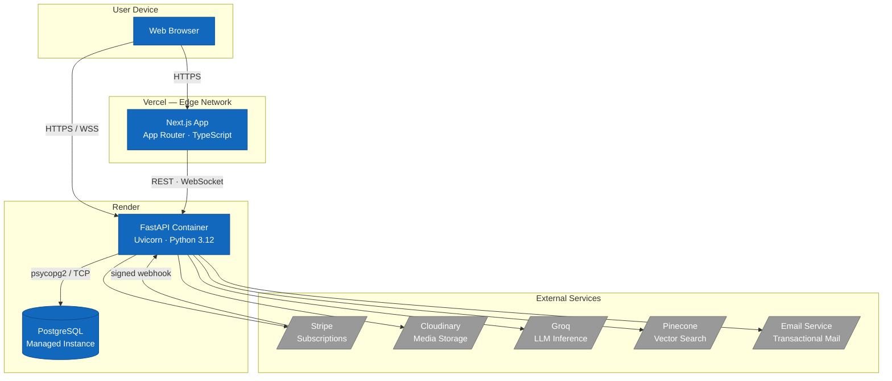
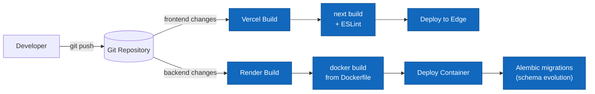

# Chapter 5 — Deployment, CI/CD and Testing

This chapter describes how **TeamNest** is packaged, deployed and verified. It
covers the deployment architecture, the containerisation strategy, the
continuous-deployment pipeline provided by the hosting platforms, and the
testing approach used to validate the backend and frontend.

---

## 5.1 Deployment Architecture

TeamNest is deployed as a small set of independently hosted services. The
Next.js frontend, the FastAPI backend and the PostgreSQL database each run on a
managed platform, and the backend additionally talks to a number of external
SaaS providers (Stripe, Cloudinary, Groq, Pinecone and an email service).

### 5.1.1 C4 Deployment Diagram

The diagram below shows the deployment nodes and the artefacts running on each
of them.



### 5.1.2 Infrastructure Overview

| Layer            | Technology                     | Hosting        | Notes |
|------------------|--------------------------------|----------------|-------|
| Frontend         | Next.js (App Router), React 19 | Vercel         | Static + server components, edge-cached, zero-config deploys |
| Backend API      | FastAPI + Uvicorn (Python 3.12)| Render         | Runs as a Docker container, exposes REST + WebSocket |
| Database         | PostgreSQL 16                  | Render (managed add-on) | Relational store for users, orgs, teams, channels, messages, tasks |
| Object storage   | Cloudinary                     | External SaaS  | Avatars, organisation logos, chat/task attachments (CDN-delivered) |
| Vector store     | Pinecone                       | External SaaS  | Team-scoped namespaces `team-{team_id}` for RAG retrieval |
| LLM inference    | Groq                           | External SaaS  | Generates AI-assistant replies |
| Payments         | Stripe                         | External SaaS  | Pro-plan checkout + signed subscription webhooks |
| Email            | Transactional email service    | External SaaS  | Verification codes, password resets, notifications |

Key properties of the topology:

- **Separation of concerns** — the frontend and backend are deployed and scaled
  independently, communicating only over HTTPS/WSS.
- **Stateless backend** — the FastAPI container holds no durable state; all
  persistence lives in PostgreSQL, Cloudinary and Pinecone, which makes the
  container safe to restart or replace.
- **Managed dependencies** — the database and every heavyweight capability
  (media, vectors, inference, billing, mail) are managed services, keeping the
  deployable surface small.

---

## 5.2 Containerisation and Orchestration

### 5.2.1 Docker Image Design

The backend ships as a Docker image defined by [backend/Dockerfile](../backend/Dockerfile).
It is a **single-stage image built on `python:3.12-slim`**, kept small and
reproducible through deliberate layer ordering and a minimal base.

```dockerfile
FROM python:3.12-slim

ENV PYTHONDONTWRITEBYTECODE=1 \
    PYTHONUNBUFFERED=1 \
    PIP_NO_CACHE_DIR=1

WORKDIR /backend

RUN apt-get update && apt-get install -y --no-install-recommends \
        ghostscript \
        libgl1 \
        libglib2.0-0 \
    && rm -rf /var/lib/apt/lists/*

COPY requirements.txt .
RUN pip install --no-cache-dir -r requirements.txt

COPY . .

RUN useradd --create-home --shell /bin/bash app && chown -R app:app /backend
USER app

EXPOSE 8000
CMD ["uvicorn", "main:app", "--host", "0.0.0.0", "--port", "8000"]
```

Design decisions:

- **Slim base image** — `python:3.12-slim` avoids the bulk of the full Python
  image while still providing a standard runtime.
- **Layer-cache-friendly ordering** — `requirements.txt` is copied and installed
  *before* the application code is copied. As long as dependencies do not
  change, code edits reuse the cached dependency layer and rebuild quickly.
- **Only the required system libraries** — `ghostscript`, `libgl1` and
  `libglib2.0-0` are installed because the document-processing pipeline
  (`camelot-py`) depends on them; the `apt` lists are deleted afterwards to
  reduce image size.
- **Non-root runtime** — a dedicated unprivileged `app` user owns `/backend`
  and runs the process, limiting the blast radius of a container compromise.
- **Deterministic build flags** — `PYTHONDONTWRITEBYTECODE`, `PYTHONUNBUFFERED`
  and `PIP_NO_CACHE_DIR` keep the image clean and make container logs stream
  immediately.
- **Build context trimmed** — [backend/.dockerignore](../backend/.dockerignore)
  excludes `__pycache__`, virtual environments, `.env*` files, the `tests`
  directory, Markdown docs and the `.git` folder, so secrets and dev artefacts
  never enter the image.

> **Note on the backend build.** The backend Dockerfile is single-stage. A
> multi-stage build (compiling wheels in a builder stage and copying only the
> installed packages into a slim runtime stage) is a viable future optimisation
> to further shrink the final image, but it is not yet applied.

**Frontend image.** The frontend is also containerised, via a **three-stage**
[frontend/Dockerfile](../frontend/Dockerfile) on `node:20-alpine`:

1. **`deps`** — runs `npm ci` from `package-lock.json` for a reproducible
   dependency install.
2. **`builder`** — runs `npm run build`. The `NEXT_PUBLIC_API_URL` and
   `NEXT_PUBLIC_WS_URL` values are passed as **build args**, because Next.js
   inlines `NEXT_PUBLIC_*` variables into the bundle at build time.
3. **`runner`** — copies only the Next.js **standalone** output
   (`output: "standalone"` in [next.config.ts](../frontend/next.config.ts))
   and runs it as a non-root `nextjs` user. The standalone bundle ships only
   the files needed at runtime, keeping the final image small.

**Both services are containerised.** The backend and the frontend each have a
Dockerfile, so the entire application can be built and run as containers and
orchestrated together with Docker Compose (§5.2.2) — giving every developer an
identical, reproducible environment regardless of host OS.

**Production frontend remains zero-config.** In production the frontend is
deployed by **Vercel** with a *zero-configuration* workflow: Vercel detects the
Next.js project automatically, runs `next build` and publishes to its edge
network without any Dockerfile, build script or pipeline definition. The
frontend Dockerfile and the Compose setup therefore serve **local development
and portable, self-hosted runs**, while production hosting stays effortless on
Vercel.

### 5.2.2 Docker Compose for Local Development

[docker-compose.yml](../docker-compose.yml) brings up the full stack
locally — PostgreSQL, the FastAPI backend and the Next.js frontend — with a
single command.

```yaml
services:
  db:
    image: postgres:16-alpine
    restart: unless-stopped
    environment:
      POSTGRES_USER: ${POSTGRES_USER:-teamnest}
      POSTGRES_PASSWORD: ${POSTGRES_PASSWORD:-teamnest}
      POSTGRES_DB: ${POSTGRES_DB:-teamnest}
    volumes:
      - db_data:/var/lib/postgresql/data
    ports:
      - "5432:5432"
    healthcheck:
      test: ["CMD-SHELL", "pg_isready -U ${POSTGRES_USER:-teamnest} -d ${POSTGRES_DB:-teamnest}"]
      interval: 5s
      timeout: 5s
      retries: 10

  backend:
    build:
      context: ./backend
    restart: unless-stopped
    env_file:
      - ./backend/.env
    environment:
      DATABASE_URL: postgresql+psycopg2://${POSTGRES_USER:-teamnest}:${POSTGRES_PASSWORD:-teamnest}@db:5432/${POSTGRES_DB:-teamnest}
    depends_on:
      db:
        condition: service_healthy
    ports:
      - "8000:8000"

  frontend:
    build:
      context: ./frontend
      args:
        NEXT_PUBLIC_API_URL: ${NEXT_PUBLIC_API_URL:-http://localhost:8000}
        NEXT_PUBLIC_WS_URL: ${NEXT_PUBLIC_WS_URL:-ws://localhost:8000}
    restart: unless-stopped
    depends_on:
      - backend
    ports:
      - "3000:3000"

volumes:
  db_data:
```

Notable points:

- **Healthcheck-gated startup** — the backend uses `depends_on … condition:
  service_healthy`, so it only starts after `pg_isready` confirms the database
  accepts connections. This eliminates the classic race where the API boots
  before Postgres is ready.
- **Named volume `db_data`** — database files survive `docker compose down`,
  so local data persists between runs.
- **Overridable credentials** — `${VAR:-default}` substitution lets developers
  override the user, password and database name from a `.env` file while
  keeping sensible defaults.
- **Injected `DATABASE_URL`** — Compose wires the backend to the `db` service
  by its service hostname, so no host-specific configuration is needed.
- **Frontend service** — the `frontend` service builds the Next.js image and
  starts only after the backend. Its `NEXT_PUBLIC_*` build args point at
  `http://localhost:8000` / `ws://localhost:8000`, because those values are
  consumed by the **browser**, which reaches the backend through the
  host-published port — not the internal `backend` hostname.
- **One command for the whole stack** — `docker compose up --build` builds and
  starts all three services together (database, backend, frontend). The
  developer needs only Docker installed; no local Python, Node.js or PostgreSQL
  setup is required.

The resulting local environment runs the **frontend on `:3000`** and the
**backend on `:8000`** in containers that mirror their production runtimes,
which removes "works on my machine" drift. Production then diverges only in one
intentional way: instead of the frontend container, Vercel hosts the frontend
through its zero-config deployment (§5.3.3).

### 5.2.3 Container Registry and Image Management

TeamNest does not publish images to a standalone registry such as Docker Hub.
Images are built where they are run:

- **Locally**, `docker compose build` builds both the backend and frontend
  images on the developer's machine from their respective Dockerfiles.
- **For the production backend**, **Render's integrated build pipeline** takes
  over:
  1. A commit is pushed to the branch connected to the Render service.
  2. Render checks out the repository and builds the backend image from
     [backend/Dockerfile](../backend/Dockerfile) using the build-context rules
     in `.dockerignore`.
  3. The resulting image is stored inside Render's own image store and used to
     start the new container revision.
  4. Each deploy is an immutable revision, so a previous image can be rolled
     back to from the Render dashboard if a release misbehaves.
- **For the production frontend**, no image is produced at all: Vercel builds
  the Next.js project directly from source as part of its zero-config
  deployment. The frontend Docker image exists purely for the local Compose
  stack and for self-hosted deployments.

This keeps image management lightweight: there is no registry to authenticate
against or to garbage-collect, at the cost of being tied to the hosting
platforms' build systems.

---

## 5.3 Continuous Integration and Deployment Pipeline

### 5.3.1 CI/CD Pipeline Architecture

TeamNest uses a **Git-driven, platform-native deployment model** rather than a
self-managed CI server. The Git repository is the single source of truth, and
both hosting platforms watch it for changes.



> **Current state.** There is no dedicated CI configuration file (e.g. a
> GitHub Actions workflow under `.github/workflows/`) in the repository at the
> time of writing. Build and deployment are performed by Vercel and Render on
> push. The automated test suite described in §5.4 is run locally / on demand
> with `pytest`; wiring it into a pre-deploy CI gate is a recommended next step
> and is discussed below.

### 5.3.2 Automated Build and Linting Stages

**Frontend (Vercel).** On every push, Vercel runs `next build`
([frontend/package.json](../frontend/package.json) → `build` script). The build
compiles and type-checks the TypeScript sources and fails the deploy if the
build does not succeed. ESLint is configured via
[frontend/eslint.config.mjs](../frontend/eslint.config.mjs) with
`eslint-config-next`, and is run with the `npm run lint` script; Next.js also
surfaces lint errors during the build.

**Backend (Render).** On every push, Render performs `docker build` against the
backend `Dockerfile`. The build fails if dependency installation
(`pip install -r requirements.txt`) or the image build itself fails, which
prevents a broken image from being deployed.

| Stage          | Frontend                         | Backend                           |
|----------------|----------------------------------|-----------------------------------|
| Trigger        | Push to connected branch         | Push to connected branch          |
| Build          | `next build`                     | `docker build` (Dockerfile)       |
| Static checks  | TypeScript compile, ESLint       | Dependency resolution at build    |
| Tests          | — (manual)                       | `pytest` (manual / recommended CI gate) |
| Artefact       | Optimised Next.js bundle         | Docker image                      |

**Recommended hardening.** Adding a GitHub Actions workflow that runs `pytest`
for the backend and `npm run lint` / `next build` for the frontend on every
pull request would turn the current build-only flow into a true CI gate,
blocking merges that break tests before they ever reach Vercel or Render.

### 5.3.3 Automated Deployment to Production

Deployment is **continuous and automatic**:

- **Frontend → Vercel (zero-config).** Vercel auto-detects the Next.js project
  and deploys it with **no configuration** — no Dockerfile, build script or
  pipeline file is needed. When the build succeeds, Vercel promotes the new
  bundle to its edge network. Pushes to non-production branches produce
  isolated preview deployments with their own URLs, useful for reviewing
  changes before they reach the production domain. (The frontend Dockerfile and
  Compose service from §5.2 are used only for local and self-hosted runs and
  are ignored by Vercel.)
- **Backend → Render.** When the Docker image builds successfully, Render
  starts the new container revision and switches traffic to it once it is
  healthy, then retires the old revision. Failed builds leave the previous
  revision serving traffic.
- **Database migrations.** Schema changes are managed with **Alembic**
  ([backend/alembic/](../backend/alembic/)). Migrations are versioned in the
  repository so the schema can be evolved reproducibly across environments;
  they are applied as part of the release process rather than by ad-hoc SQL.
- **Rollback.** Because each deploy is an immutable revision on both platforms,
  reverting to a previous known-good release is a dashboard action.
- **Configuration & secrets.** Runtime configuration (database URL, JWT secret,
  Stripe / Cloudinary / Groq / Pinecone keys) is supplied through environment
  variables on each platform and is never baked into the image or committed —
  `.env*` files are excluded by `.dockerignore` and `.gitignore`.

---

## 5.4 Testing Strategy

### 5.4.1 Testing Levels and Scope

TeamNest's quality strategy is organised into four levels. The table records
both what is **automated today** and what is currently **manual or planned**, so
the strategy is described honestly.

| Level                  | Scope                                                        | Status in TeamNest |
|------------------------|--------------------------------------------------------------|--------------------|
| Unit testing           | Individual functions/helpers (hashing, JWT, validators)      | Exercised indirectly through the backend test suite |
| Integration testing    | Routers + services + database working together over HTTP/WS | **Automated** with `pytest` (see §5.4.2) |
| End-to-end testing      | Full user journeys through the real frontend and backend     | **Manual** today; automation planned (see §5.4.3) |
| User acceptance (UAT)   | Stakeholder validation against the functional requirements   | **Manual**, sprint-based (see §5.4.3) |

The automated suite deliberately concentrates on the **backend**, because that
is where the business rules, authorisation logic and data integrity live.

### 5.4.2 Unit and Integration Tests

The backend test suite lives in [backend/tests/](../backend/tests/) and is run
with **pytest**. It contains **27 test functions across 5 test modules**.

| Test module | Tests | Focus |
|-------------|:-----:|-------|
| [test_auth.py](../backend/tests/test_auth.py) | 7 | Registration, login, password hashing (bcrypt), duplicate-email idempotency, weak-password/invalid-email rejection, wrong-password `401`, refresh-token rotation, protected-route enforcement |
| [test_crud.py](../backend/tests/test_crud.py) | 6 | Creating organisations and channels, sending channel messages over WebSocket, editing/deleting messages, task creation, assignment and completion |
| [test_friends_dm.py](../backend/tests/test_friends_dm.py) | 5 | Friend-request acceptance creating a mutual friendship, self-request rejection, duplicate-friend rejection, direct messaging between friends, blocking DMs to unrelated users |
| [test_permissions.py](../backend/tests/test_permissions.py) | 5 | Non-members cannot read org channels, non-owners cannot delete channels, non-team-members cannot post to team channels, users cannot edit/delete other users' messages |
| [test_presence_search.py](../backend/tests/test_presence_search.py) | 4 | Connectivity WebSocket token validation, status changes broadcast to friends, disconnect marking users offline, global message search |

**How the suite is built** (see [conftest.py](../backend/tests/conftest.py)):

- **Isolated database.** `sqlalchemy.create_engine` is patched so every test
  runs against an **in-memory SQLite** database with a `StaticPool`. The schema
  is created from the SQLAlchemy models, and an `autouse` fixture drops and
  recreates all tables before each test, giving every test a clean slate.
- **Real HTTP/WebSocket exercise.** Tests drive the API through FastAPI's
  `TestClient`, which routes through the actual routers, services and
  dependency-injection layer — making these genuine **integration tests**, not
  isolated unit tests.
- **External services stubbed.** An `autouse` fixture monkeypatches Cloudinary
  uploads, Pinecone upserts and message indexing so tests are deterministic,
  offline and free of network calls or API keys.
- **Reusable fixtures and factories.** Helpers such as `auth_user`,
  `second_user`, `org_factory`, `team_factory`, `channel_factory`,
  `message_factory` and `task_factory` build consistent test data and keep the
  test bodies focused on the behaviour under test.
- **Runtime state reset.** In-memory WebSocket connection managers (presence,
  notifications, channels, voice, DMs) are cleared between tests so state never
  leaks across cases.

Running the suite:

```bash
cd backend
pytest                  # run all 27 tests
pytest tests/test_auth.py -v   # run a single module, verbose
```

Because the suite uses an in-memory SQLite database and stubs every external
integration, it needs **no running container** — it can be executed directly on
the host as above, against the same source that is baked into the Docker image.
The backend `.dockerignore` deliberately excludes the `tests` directory from the
production image to keep it small; to run the suite inside a container instead,
the source can be mounted into the backend image (e.g.
`docker compose run --rm -v ${PWD}/backend:/backend backend pytest`), which is
the recommended form once the tests are wired into a CI gate (§5.3.2).

### 5.4.3 End-to-End Testing

End-to-end testing exercises a complete user journey through the deployed
frontend and backend together — for example: *register → verify email → create
an organisation → create a team and channel → send a message → assign and
complete a task*.

At present this is performed **manually** during sprint reviews and as part of
**User Acceptance Testing (UAT)**: features are validated against the
[functional requirements](FUNCTIONAL_REQUIREMENTS.md) and the
[user stories](../USER_STORIES.md) at the end of each sprint
([docs/sprints/](sprints/)). The integration suite in §5.4.2 already covers the
WebSocket message and presence flows end-to-end at the API level.

Automating browser-level E2E tests with a tool such as **Playwright** or
**Cypress** — driving the real Next.js UI against a disposable backend — is a
recommended extension once the core feature set is stable.

### 5.4.4 Performance and Load Testing

No automated performance or load tests are committed to the repository yet.
The architecture is, however, designed with performance in mind:

- FastAPI + Uvicorn handle requests and WebSocket connections **asynchronously**.
- The backend container is **stateless**, so it can be scaled horizontally
  behind a load balancer if demand grows.
- Heavy work is delegated to managed services (Groq for inference, Pinecone for
  vector search, Cloudinary for media), keeping the API's own request path
  light.

A recommended approach is to script representative scenarios — concurrent
WebSocket chat clients, bursts of REST requests, and AI-assistant queries — with
a tool such as **Locust** or **k6**, and measure latency percentiles and
throughput against the Render instance to establish a capacity baseline.

### 5.4.5 Security Testing

Security is addressed primarily through **design and verification**, with the
authorisation behaviour explicitly covered by automated tests:

- **Authentication.** Passwords are hashed with **bcrypt** (a slow, salted
  hash); `test_auth.py` asserts that stored hashes differ from the plaintext
  and use the bcrypt `$2` prefix.
- **Authorisation.** `test_permissions.py` verifies that non-members cannot
  read org channels, that users cannot delete channels or edit/delete messages
  they do not own, and that non-team-members cannot connect to team channels —
  i.e. tenant isolation is regression-tested.
- **Token handling.** JWT access tokens are short-lived; refresh tokens are
  rotated and revoked server-side, with `test_auth.py` confirming that a reused
  old refresh token is rejected with `401`.
- **Tenant data isolation.** Pinecone embeddings are stored under team-scoped
  namespaces (`team-{team_id}`) so retrieval cannot cross team boundaries.
- **Secret hygiene.** Credentials are injected via environment variables;
  `.env*` files are excluded from both the Git repository and the Docker build
  context.
- **Webhook integrity.** Stripe subscription updates are accepted only via
  **signed webhooks**, preventing forged billing events.

Recommended additions: dependency vulnerability scanning (`pip-audit`,
`npm audit`), static analysis (e.g. `bandit` for the Python code), and a
periodic review against the OWASP Top 10.

### 5.4.6 Test Results and Coverage Report

Executing `pytest` from the `backend/` directory runs all **27 backend tests**.
The expected result is a fully green suite, since the tests are deterministic —
they use an in-memory database and stub every external integration.

| Test module                | Tests | Area covered                         |
|-----------------------------|:-----:|--------------------------------------|
| test_auth.py                | 7     | Authentication & token lifecycle     |
| test_crud.py                | 6     | Core CRUD: orgs, channels, messages, tasks |
| test_friends_dm.py          | 5     | Friendships & direct messaging       |
| test_permissions.py         | 5     | Authorisation & access control       |
| test_presence_search.py     | 4     | Presence (WebSocket) & search        |
| **Total**                   | **27**| —                                    |

A line-coverage percentage is **not currently measured**. Coverage can be
generated with `pytest-cov`:

```bash
cd backend
pip install pytest-cov
pytest --cov=. --cov-report=term-missing --cov-report=html
```

This produces a per-module coverage summary in the terminal and a browsable
HTML report under `htmlcov/`. Coverage is concentrated on the routers, services
and utilities reached through the API; pure infrastructure code (migrations,
container entrypoint) is intentionally out of scope.

---

## 5.5 Chapter Summary

This chapter described how TeamNest moves from source code to a running
production system and how that system is verified.

- **Deployment architecture (§5.1)** — a cleanly separated topology: the
  Next.js frontend on Vercel, the FastAPI backend and PostgreSQL on Render, and
  five managed external services for media, vectors, inference, billing and
  email. The backend is stateless, which keeps it easy to restart and scale.
- **Containerisation (§5.2)** — both services are containerised: the backend as
  a single-stage non-root image on a slim Python base, and the frontend as a
  three-stage Next.js standalone image. Layer ordering is tuned for fast
  rebuilds and `.dockerignore` files keep secrets and dev artefacts out of every
  image. A single `docker compose up --build` brings the whole stack — database,
  backend and frontend — up locally with a healthcheck-gated startup, so a
  developer needs only Docker installed. In production the backend image is
  built by Render's integrated pipeline, while the frontend is deployed to
  Vercel with a **zero-configuration** workflow that requires no Dockerfile or
  build script.
- **CI/CD (§5.3)** — deployment is Git-driven and platform-native: Vercel and
  Render build and release automatically on push, with immutable revisions
  enabling one-click rollback and Alembic managing schema evolution. The chapter
  also flags the absence of a dedicated CI test gate and recommends adding one.
- **Testing strategy (§5.4)** — a deterministic `pytest` suite of **27
  integration tests** across authentication, CRUD, friends/DMs, authorisation
  and presence/search exercises the backend through real HTTP and WebSocket
  calls against an in-memory database with stubbed external services. E2E,
  performance, load and security testing are addressed through design and
  manual verification today, with concrete tooling recommendations for future
  automation.

In short, TeamNest already has a reproducible build, a continuous deployment
path and a meaningful automated test suite for its most critical layer; the
identified next steps — a CI test gate, browser-level E2E tests, load testing
and coverage measurement — would round the strategy out to production maturity.
