# TeamNest — Sequence Diagrams

End-to-end flows that cross service boundaries. Each diagram shows the *shape* of the interaction; per-step detail (validation rules, exact DB columns, error codes) lives in the code and OpenAPI spec.

## Contents

1. [Signup & Email Verification](#1-signup--email-verification)
2. [Login + Refresh Token Rotation](#2-login--refresh-token-rotation)
3. [Password Reset](#3-password-reset)
4. [Create Organization + Stripe Upgrade](#4-create-organization--stripe-upgrade)
5. [Join Organization (request → approve)](#5-join-organization-request--approve)
6. [Team + Member Management](#6-team--member-management)
7. [Channel Messaging (WebSocket)](#7-channel-messaging-websocket)
8. [File Upload + Indexing](#8-file-upload--indexing)
9. [Task Lifecycle](#9-task-lifecycle)
10. [AI Assistant (RAG)](#10-ai-assistant-rag)
11. [Direct Messages](#11-direct-messages)
12. [Presence WebSocket](#12-presence-websocket)

---

## 1. Signup & Email Verification

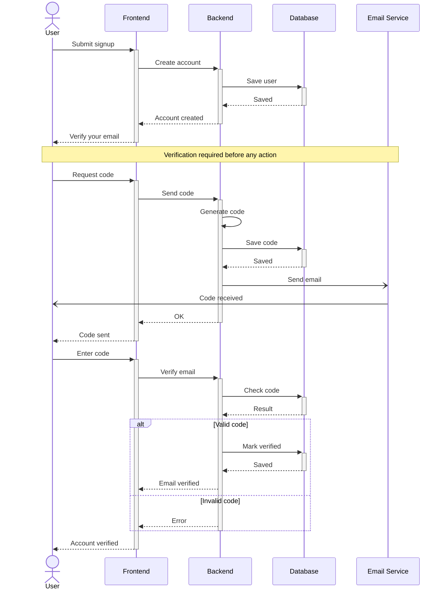
```mermaid
sequenceDiagram
    actor User
    participant FE as Frontend
    participant API as Backend
    participant DB as Database
    participant Mail as Email Service

    User->>+FE: Submit signup
    FE->>+API: Create account
    API->>+DB: Save user
    DB-->>-API: Saved
    API-->>-FE: Account created
    FE-->>-User: Verify your email

    Note over User,Mail: Verification required before any action

    User->>+FE: Request code
    FE->>+API: Send code
    API->>API: Generate code
    API->>+DB: Save code
    DB-->>-API: Saved
    API-)Mail: Send email
    Mail-)User: Code received
    API-->>-FE: OK
    FE-->>-User: Code sent

    User->>+FE: Enter code
    FE->>+API: Verify email
    API->>+DB: Check code
    DB-->>-API: Result
    alt Valid code
        API->>+DB: Mark verified
        DB-->>-API: Saved
        API-->>FE: Email verified
    else Invalid code
        API-->>FE: Error
    end
    deactivate API
    FE-->>-User: Account verified
```

---

## 2. Login + Refresh Token Rotation

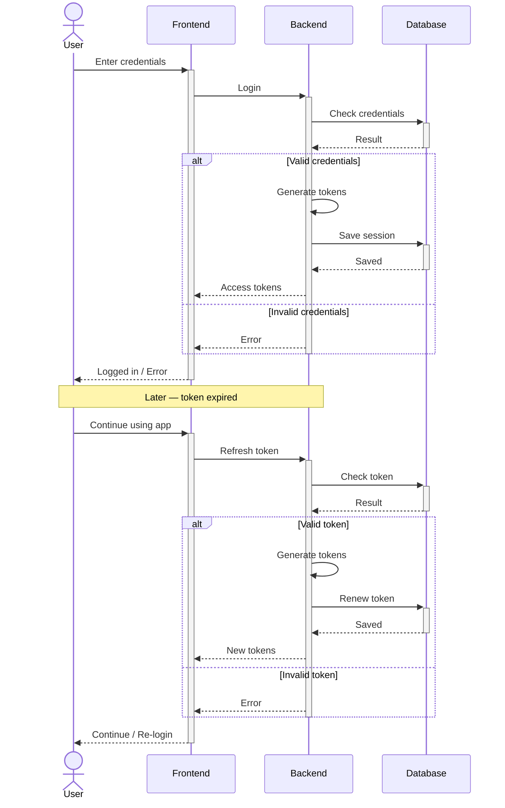
```mermaid
sequenceDiagram
    actor User
    participant FE as Frontend
    participant API as Backend
    participant DB as Database

    User->>+FE: Enter credentials
    FE->>+API: Login
    API->>+DB: Check credentials
    DB-->>-API: Result
    alt Valid credentials
        API->>API: Generate tokens
        API->>+DB: Save session
        DB-->>-API: Saved
        API-->>FE: Access tokens
    else Invalid credentials
        API-->>FE: Error
    end
    deactivate API
    FE-->>-User: Logged in / Error

    Note over User,API: Later — token expired

    User->>+FE: Continue using app
    FE->>+API: Refresh token
    API->>+DB: Check token
    DB-->>-API: Result
    alt Valid token
        API->>API: Generate tokens
        API->>+DB: Renew token
        DB-->>-API: Saved
        API-->>FE: New tokens
    else Invalid token
        API-->>FE: Error
    end
    deactivate API
    FE-->>-User: Continue / Re-login
```

---

## 3. Password Reset

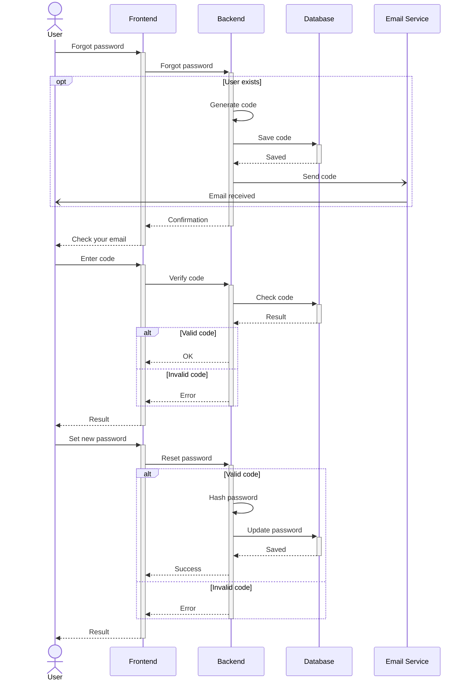
```mermaid
sequenceDiagram
    actor User
    participant FE as Frontend
    participant API as Backend
    participant DB as Database
    participant Mail as Email Service

    User->>+FE: Forgot password
    FE->>+API: Forgot password
    opt User exists
        API->>API: Generate code
        API->>+DB: Save code
        DB-->>-API: Saved
        API-)Mail: Send code
        Mail-)User: Email received
    end
    API-->>-FE: Confirmation
    FE-->>-User: Check your email

    User->>+FE: Enter code
    FE->>+API: Verify code
    API->>+DB: Check code
    DB-->>-API: Result
    alt Valid code
        API-->>FE: OK
    else Invalid code
        API-->>FE: Error
    end
    deactivate API
    FE-->>-User: Result

    User->>+FE: Set new password
    FE->>+API: Reset password
    alt Valid code
        API->>API: Hash password
        API->>+DB: Update password
        DB-->>-API: Saved
        API-->>FE: Success
    else Invalid code
        API-->>FE: Error
    end
    deactivate API
    FE-->>-User: Result
```

---

## 4. Create Organization + Stripe Upgrade

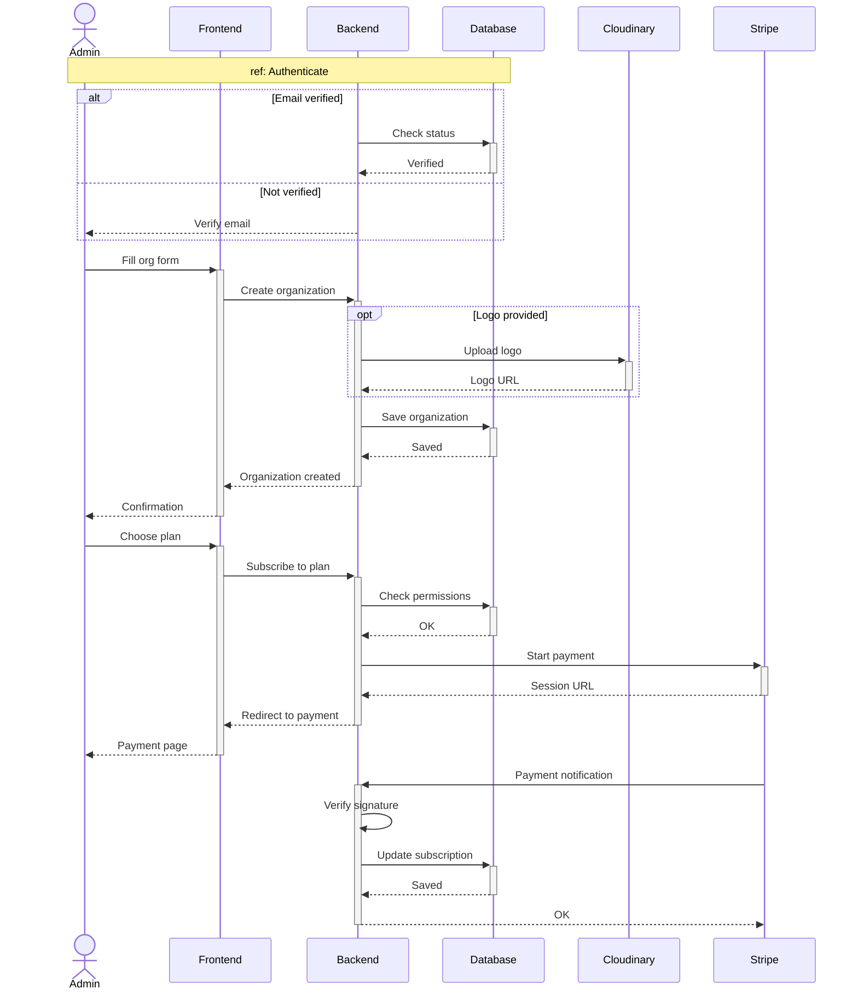
```mermaid
sequenceDiagram
    actor Admin
    participant FE as Frontend
    participant API as Backend
    participant DB as Database
    participant Cloud as Cloudinary
    participant Stripe

    Note over Admin,DB: ref: Authenticate

    alt Email verified
        API->>+DB: Check status
        DB-->>-API: Verified
    else Not verified
        API-->>Admin: Verify email
    end

    Admin->>+FE: Fill org form
    FE->>+API: Create organization
    opt Logo provided
        API->>+Cloud: Upload logo
        Cloud-->>-API: Logo URL
    end
    API->>+DB: Save organization
    DB-->>-API: Saved
    API-->>-FE: Organization created
    FE-->>-Admin: Confirmation

    Admin->>+FE: Choose plan
    FE->>+API: Subscribe to plan
    API->>+DB: Check permissions
    DB-->>-API: OK
    API->>+Stripe: Start payment
    Stripe-->>-API: Session URL
    API-->>-FE: Redirect to payment
    FE-->>-Admin: Payment page

    Stripe->>+API: Payment notification
    API->>API: Verify signature
    API->>+DB: Update subscription
    DB-->>-API: Saved
    API-->>-Stripe: OK
```

---

## 5. Join Organization (request → approve)

### 5a. User sends join request

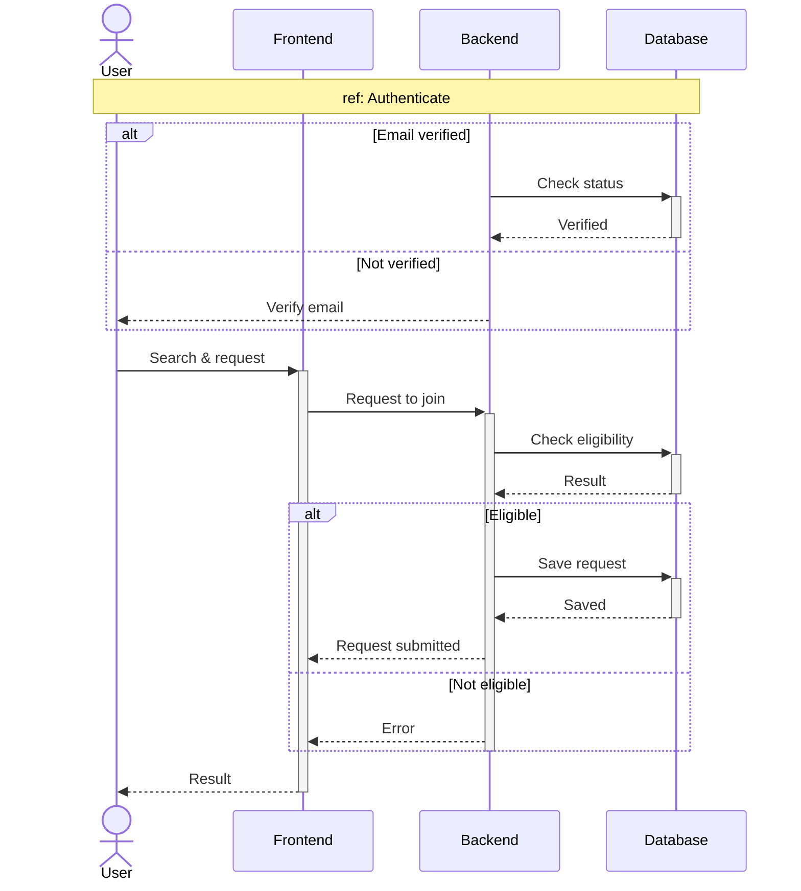
```mermaid
sequenceDiagram
    actor User
    participant FE as Frontend
    participant API as Backend
    participant DB as Database

    Note over User,DB: ref: Authenticate

    alt Email verified
        API->>+DB: Check status
        DB-->>-API: Verified
    else Not verified
        API-->>User: Verify email
    end

    User->>+FE: Search & request
    FE->>+API: Request to join
    API->>+DB: Check eligibility
    DB-->>-API: Result
    alt Eligible
        API->>+DB: Save request
        DB-->>-API: Saved
        API-->>FE: Request submitted
    else Not eligible
        API-->>FE: Error
    end
    deactivate API
    FE-->>-User: Result
```

### 5b. Admin lists pending requests

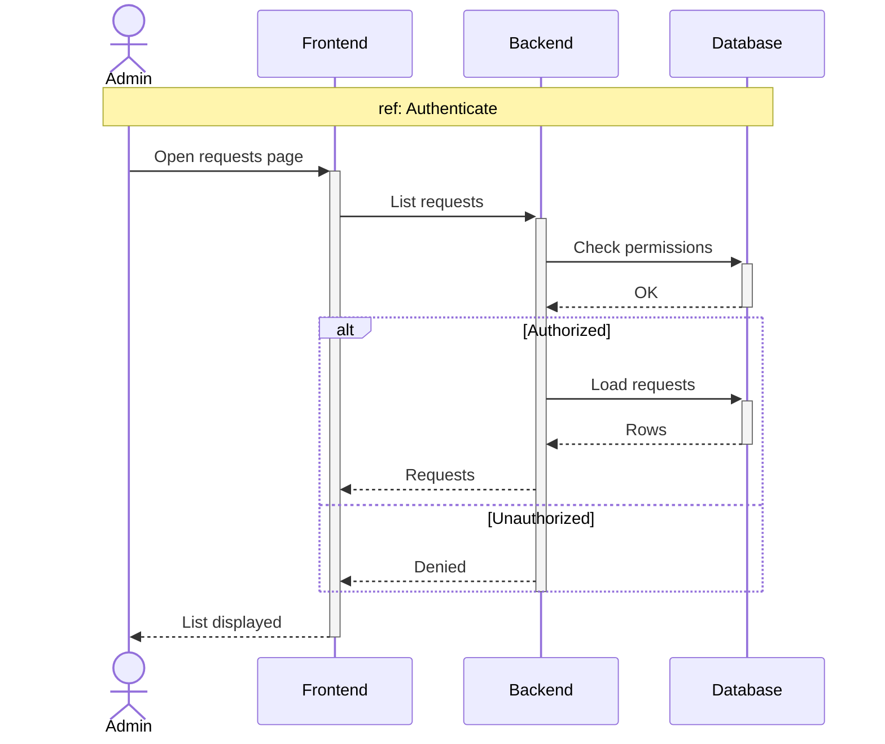
```mermaid
sequenceDiagram
    actor Admin
    participant FE as Frontend
    participant API as Backend
    participant DB as Database

    Note over Admin,DB: ref: Authenticate

    Admin->>+FE: Open requests page
    FE->>+API: List requests
    API->>+DB: Check permissions
    DB-->>-API: OK
    alt Authorized
        API->>+DB: Load requests
        DB-->>-API: Rows
        API-->>FE: Requests
    else Unauthorized
        API-->>FE: Denied
    end
    deactivate API
    FE-->>-Admin: List displayed
```

### 5c. Admin accepts or rejects

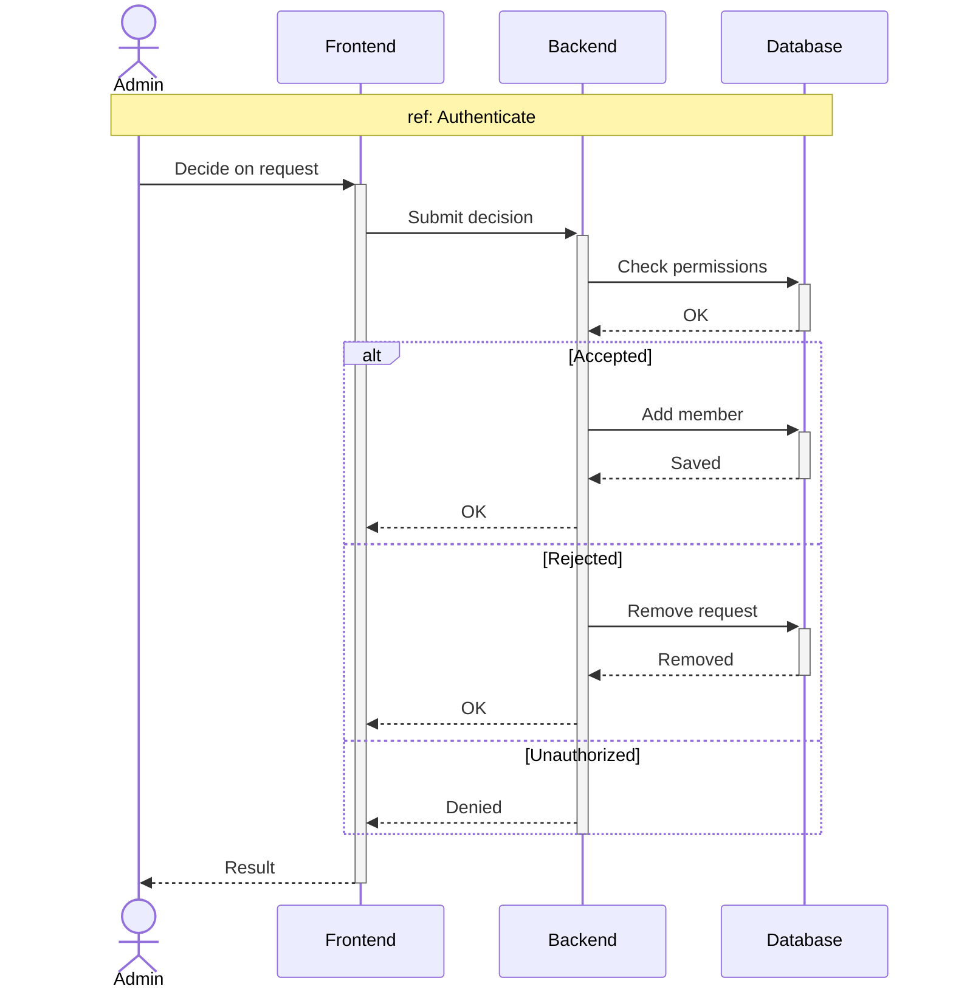
```mermaid
sequenceDiagram
    actor Admin
    participant FE as Frontend
    participant API as Backend
    participant DB as Database

    Note over Admin,DB: ref: Authenticate

    Admin->>+FE: Decide on request
    FE->>+API: Submit decision
    API->>+DB: Check permissions
    DB-->>-API: OK
    alt Accepted
        API->>+DB: Add member
        DB-->>-API: Saved
        API-->>FE: OK
    else Rejected
        API->>+DB: Remove request
        DB-->>-API: Removed
        API-->>FE: OK
    else Unauthorized
        API-->>FE: Denied
    end
    deactivate API
    FE-->>-Admin: Result
```

---

## 6. Team + Member Management

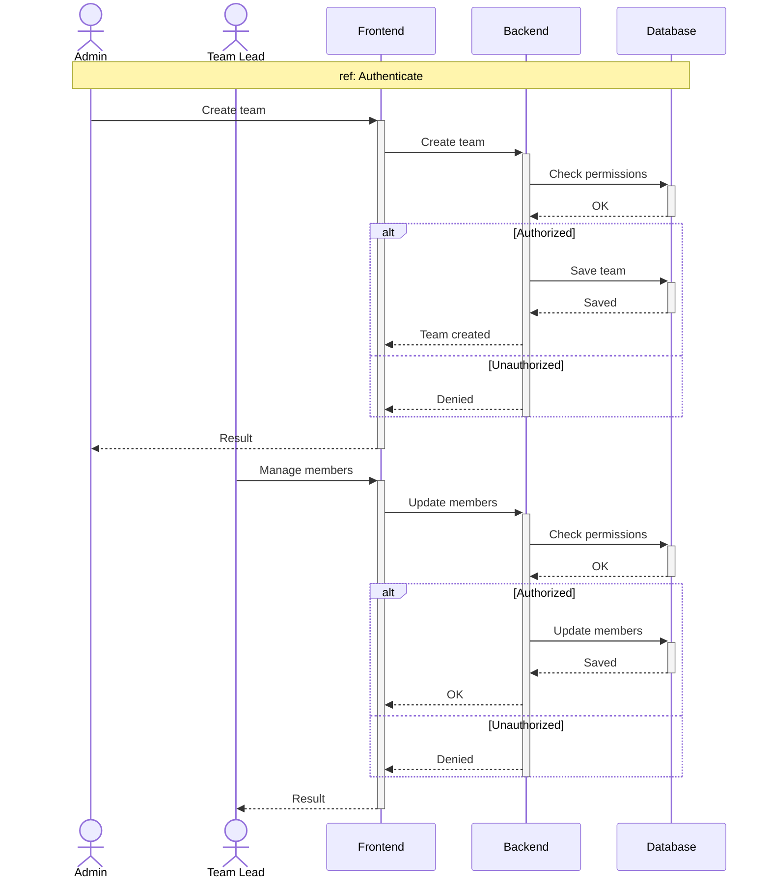
```mermaid
sequenceDiagram
    actor Admin
    actor Lead as Team Lead
    participant FE as Frontend
    participant API as Backend
    participant DB as Database

    Note over Admin,DB: ref: Authenticate

    Admin->>+FE: Create team
    FE->>+API: Create team
    API->>+DB: Check permissions
    DB-->>-API: OK
    alt Authorized
        API->>+DB: Save team
        DB-->>-API: Saved
        API-->>FE: Team created
    else Unauthorized
        API-->>FE: Denied
    end
    deactivate API
    FE-->>-Admin: Result

    Lead->>+FE: Manage members
    FE->>+API: Update members
    API->>+DB: Check permissions
    DB-->>-API: OK
    alt Authorized
        API->>+DB: Update members
        DB-->>-API: Saved
        API-->>FE: OK
    else Unauthorized
        API-->>FE: Denied
    end
    deactivate API
    FE-->>-Lead: Result
```

---

## 7. Channel Messaging (WebSocket)

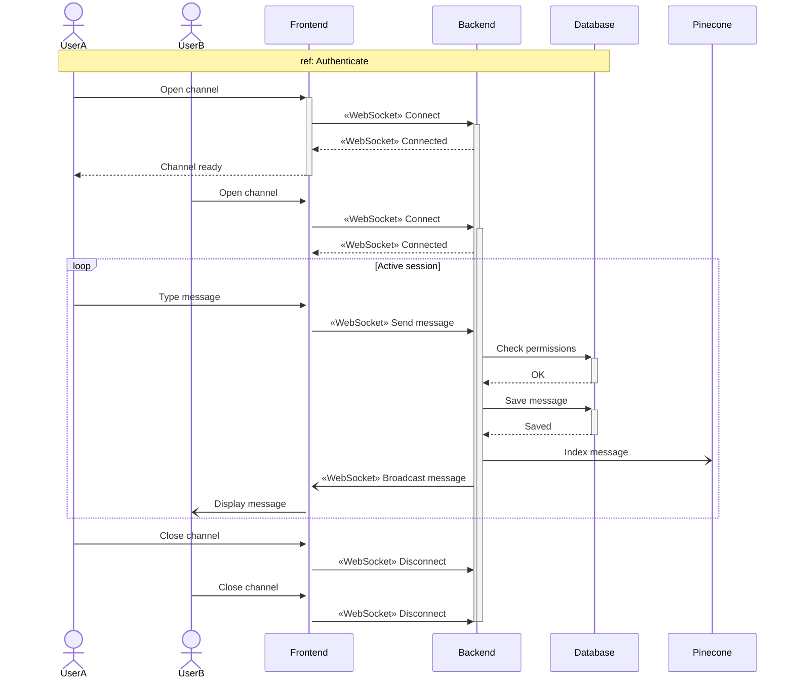
```mermaid
sequenceDiagram
    actor UserA
    actor UserB
    participant FE as Frontend
    participant API as Backend
    participant DB as Database
    participant Vec as Pinecone

    Note over UserA,DB: ref: Authenticate

    UserA->>+FE: Open channel
    FE->>+API: «WebSocket» Connect
    API-->>FE: «WebSocket» Connected
    FE-->>-UserA: Channel ready

    UserB->>+FE: Open channel
    FE->>+API: «WebSocket» Connect
    API-->>FE: «WebSocket» Connected

    loop Active session
        UserA->>FE: Type message
        FE->>API: «WebSocket» Send message
        API->>+DB: Check permissions
        DB-->>-API: OK
        API->>+DB: Save message
        DB-->>-API: Saved
        API-)Vec: Index message
        API-)FE: «WebSocket» Broadcast message
        FE-)UserB: Display message
    end

    UserA->>FE: Close channel
    FE->>API: «WebSocket» Disconnect
    UserB->>FE: Close channel
    FE->>API: «WebSocket» Disconnect
    deactivate API
    deactivate API
```

---

## 8. File Upload + Indexing

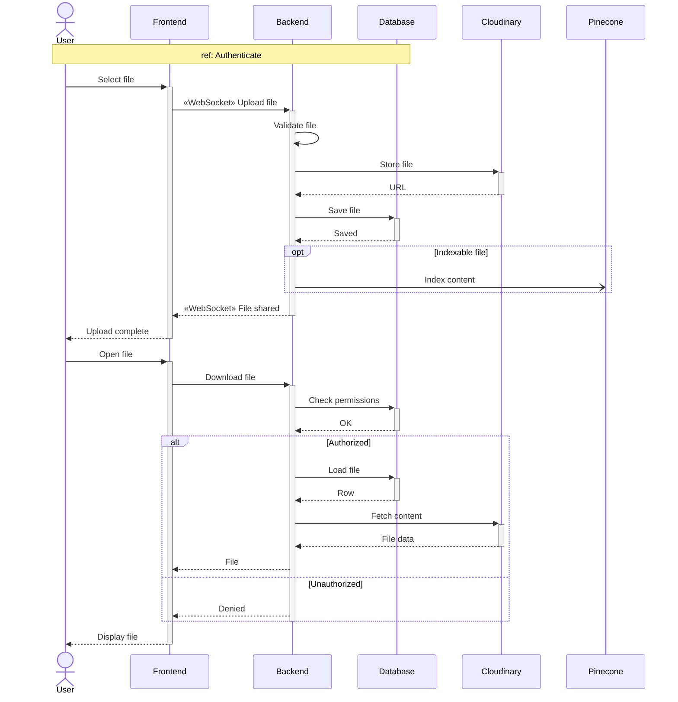
```mermaid
sequenceDiagram
    actor User
    participant FE as Frontend
    participant API as Backend
    participant DB as Database
    participant Cloud as Cloudinary
    participant Vec as Pinecone

    Note over User,DB: ref: Authenticate

    User->>+FE: Select file
    FE->>+API: «WebSocket» Upload file
    API->>API: Validate file
    API->>+Cloud: Store file
    Cloud-->>-API: URL
    API->>+DB: Save file
    DB-->>-API: Saved
    opt Indexable file
        API-)Vec: Index content
    end
    API-->>-FE: «WebSocket» File shared
    FE-->>-User: Upload complete

    User->>+FE: Open file
    FE->>+API: Download file
    API->>+DB: Check permissions
    DB-->>-API: OK
    alt Authorized
        API->>+DB: Load file
        DB-->>-API: Row
        API->>+Cloud: Fetch content
        Cloud-->>-API: File data
        API-->>FE: File
    else Unauthorized
        API-->>FE: Denied
    end
    deactivate API
    FE-->>-User: Display file
```

---

## 9. Task Lifecycle

### 9a. Manager creates task

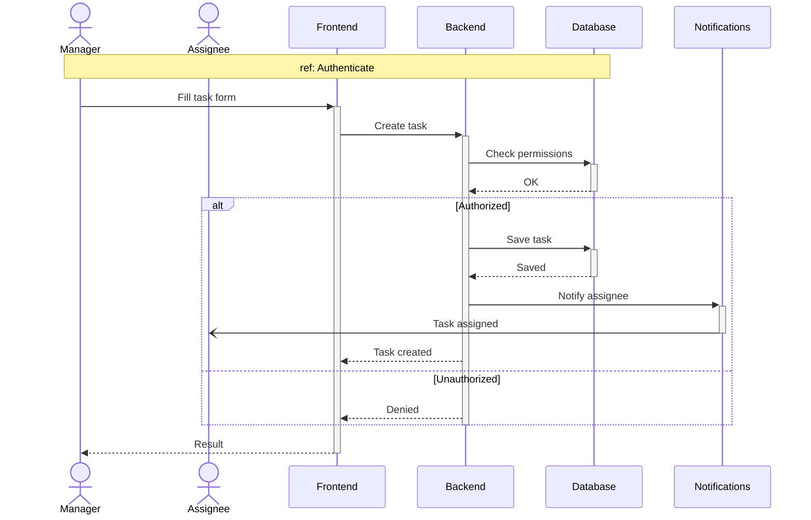
```mermaid
sequenceDiagram
    actor Manager
    actor Assignee
    participant FE as Frontend
    participant API as Backend
    participant DB as Database
    participant Notif as Notifications

    Note over Manager,DB: ref: Authenticate

    Manager->>+FE: Fill task form
    FE->>+API: Create task
    API->>+DB: Check permissions
    DB-->>-API: OK
    alt Authorized
        API->>+DB: Save task
        DB-->>-API: Saved
        API->>+Notif: Notify assignee
        Notif-)Assignee: Task assigned
        deactivate Notif
        API-->>FE: Task created
    else Unauthorized
        API-->>FE: Denied
    end
    deactivate API
    FE-->>-Manager: Result
```

### 9b. Assignee submits for review

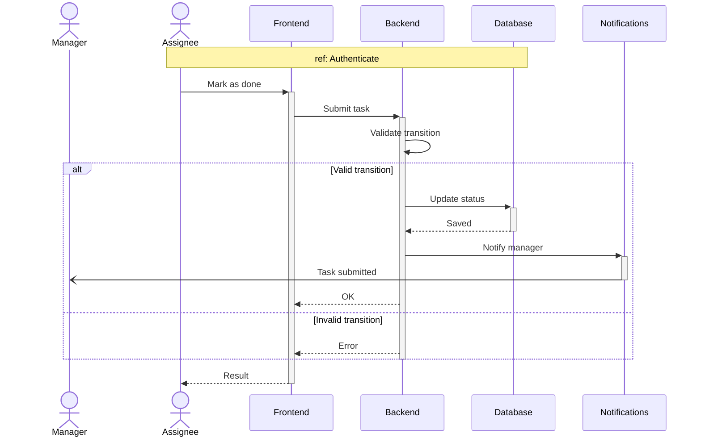
```mermaid
sequenceDiagram
    actor Manager
    actor Assignee
    participant FE as Frontend
    participant API as Backend
    participant DB as Database
    participant Notif as Notifications

    Note over Assignee,DB: ref: Authenticate

    Assignee->>+FE: Mark as done
    FE->>+API: Submit task
    API->>API: Validate transition
    alt Valid transition
        API->>+DB: Update status
        DB-->>-API: Saved
        API->>+Notif: Notify manager
        Notif-)Manager: Task submitted
        deactivate Notif
        API-->>FE: OK
    else Invalid transition
        API-->>FE: Error
    end
    deactivate API
    FE-->>-Assignee: Result
```

### 9c. Manager reviews (approve / reject)

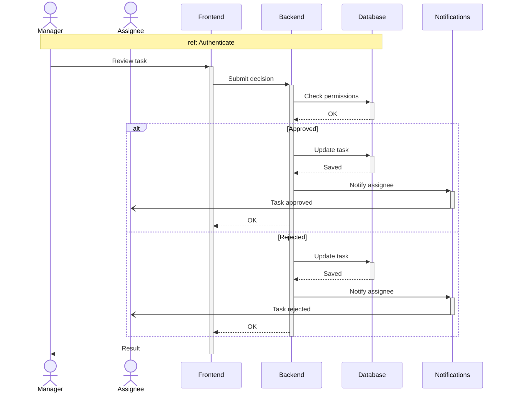
```mermaid
sequenceDiagram
    actor Manager
    actor Assignee
    participant FE as Frontend
    participant API as Backend
    participant DB as Database
    participant Notif as Notifications

    Note over Manager,DB: ref: Authenticate

    Manager->>+FE: Review task
    FE->>+API: Submit decision
    API->>+DB: Check permissions
    DB-->>-API: OK
    alt Approved
        API->>+DB: Update task
        DB-->>-API: Saved
        API->>+Notif: Notify assignee
        Notif-)Assignee: Task approved
        deactivate Notif
        API-->>FE: OK
    else Rejected
        API->>+DB: Update task
        DB-->>-API: Saved
        API->>+Notif: Notify assignee
        Notif-)Assignee: Task rejected
        deactivate Notif
        API-->>FE: OK
    end
    deactivate API
    FE-->>-Manager: Result
```

---

## 10. AI Assistant (RAG)

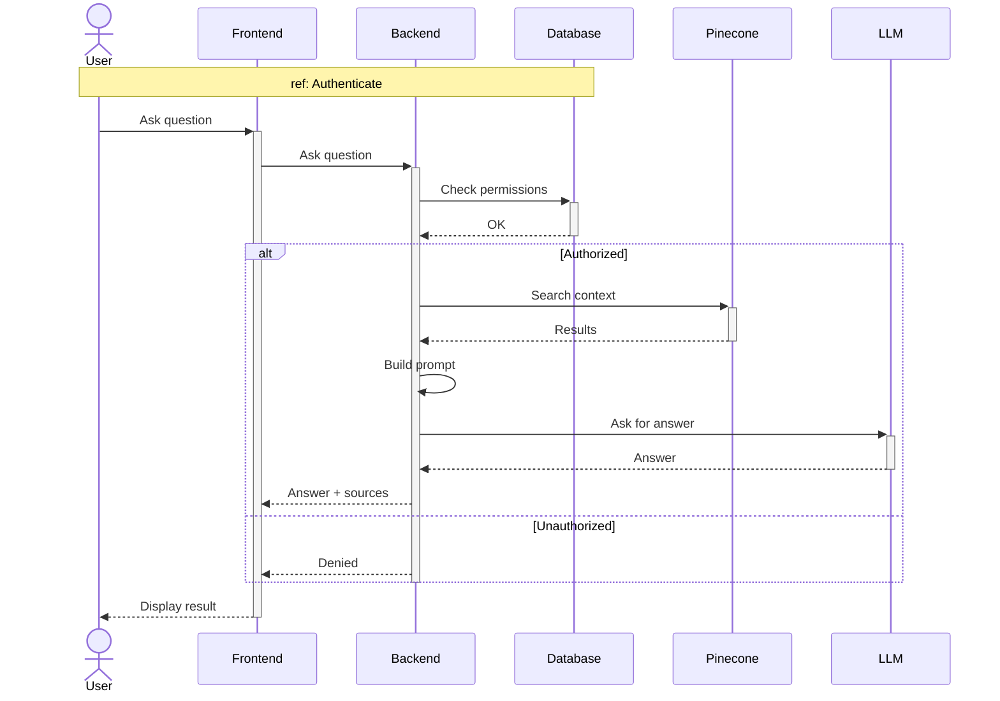
```mermaid
sequenceDiagram
    actor User
    participant FE as Frontend
    participant API as Backend
    participant DB as Database
    participant Vec as Pinecone
    participant LLM

    Note over User,DB: ref: Authenticate

    User->>+FE: Ask question
    FE->>+API: Ask question
    API->>+DB: Check permissions
    DB-->>-API: OK
    alt Authorized
        API->>+Vec: Search context
        Vec-->>-API: Results
        API->>API: Build prompt
        API->>+LLM: Ask for answer
        LLM-->>-API: Answer
        API-->>FE: Answer + sources
    else Unauthorized
        API-->>FE: Denied
    end
    deactivate API
    FE-->>-User: Display result
```

---

## 11. Direct Messages

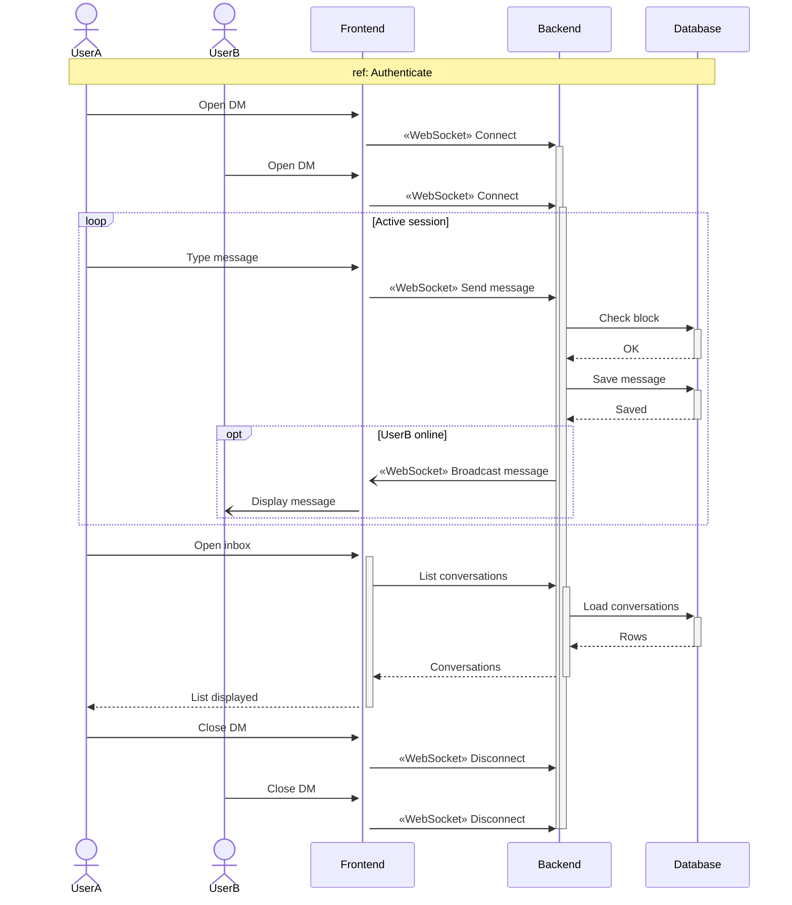
```mermaid
sequenceDiagram
    actor UserA
    actor UserB
    participant FE as Frontend
    participant API as Backend
    participant DB as Database

    Note over UserA,DB: ref: Authenticate

    UserA->>+FE: Open DM
    FE->>+API: «WebSocket» Connect
    UserB->>+FE: Open DM
    FE->>+API: «WebSocket» Connect

    loop Active session
        UserA->>FE: Type message
        FE->>API: «WebSocket» Send message
        API->>+DB: Check block
        DB-->>-API: OK
        API->>+DB: Save message
        DB-->>-API: Saved
        opt UserB online
            API-)FE: «WebSocket» Broadcast message
            FE-)UserB: Display message
        end
    end

    UserA->>+FE: Open inbox
    FE->>+API: List conversations
    API->>+DB: Load conversations
    DB-->>-API: Rows
    API-->>-FE: Conversations
    FE-->>-UserA: List displayed

    UserA->>FE: Close DM
    FE->>API: «WebSocket» Disconnect
    UserB->>FE: Close DM
    FE->>API: «WebSocket» Disconnect
    deactivate API
    deactivate API
```

---

## 12. Presence WebSocket

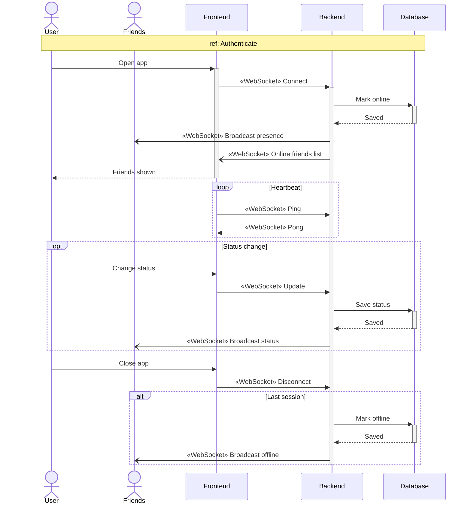
```mermaid
sequenceDiagram
    actor User
    actor Friends
    participant FE as Frontend
    participant API as Backend
    participant DB as Database

    Note over User,DB: ref: Authenticate

    User->>+FE: Open app
    FE->>+API: «WebSocket» Connect
    API->>+DB: Mark online
    DB-->>-API: Saved
    API-)Friends: «WebSocket» Broadcast presence
    API-)FE: «WebSocket» Online friends list
    FE-->>-User: Friends shown

    loop Heartbeat
        FE->>API: «WebSocket» Ping
        API-->>FE: «WebSocket» Pong
    end

    opt Status change
        User->>FE: Change status
        FE->>API: «WebSocket» Update
        API->>+DB: Save status
        DB-->>-API: Saved
        API-)Friends: «WebSocket» Broadcast status
    end

    User->>FE: Close app
    FE->>API: «WebSocket» Disconnect
    alt Last session
        API->>+DB: Mark offline
        DB-->>-API: Saved
        API-)Friends: «WebSocket» Broadcast offline
    end
    deactivate API
```
