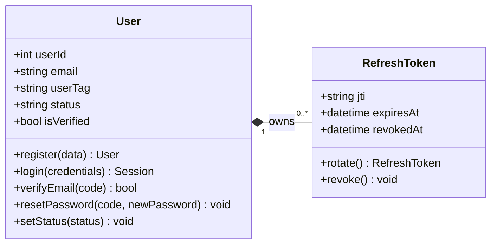
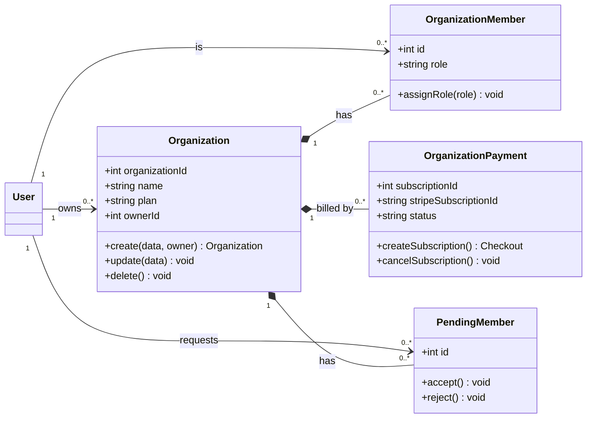
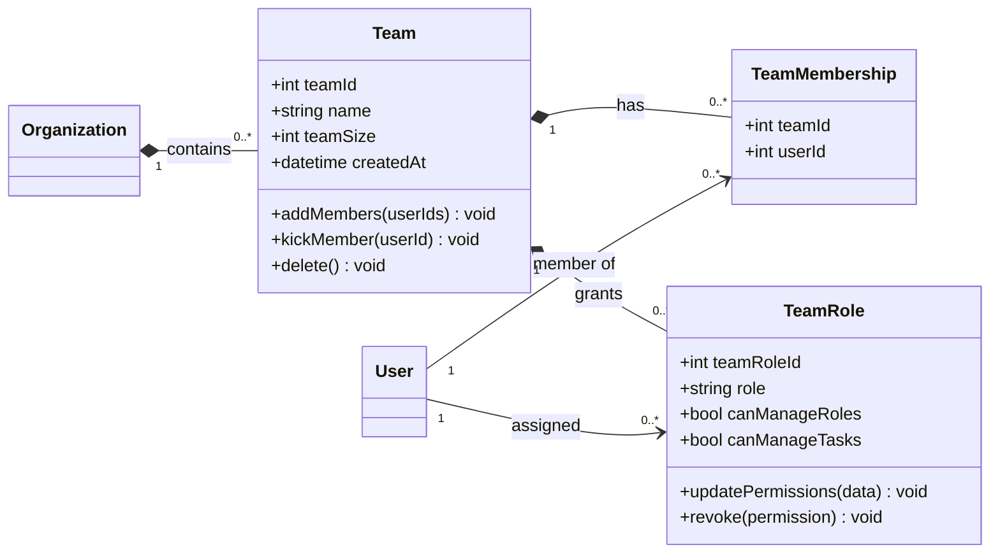
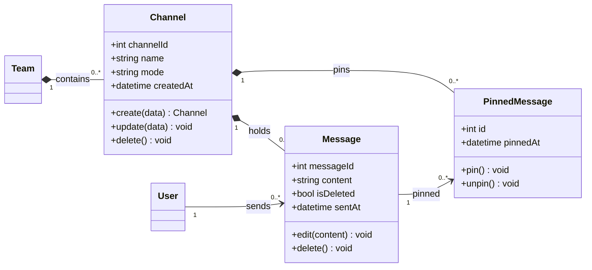
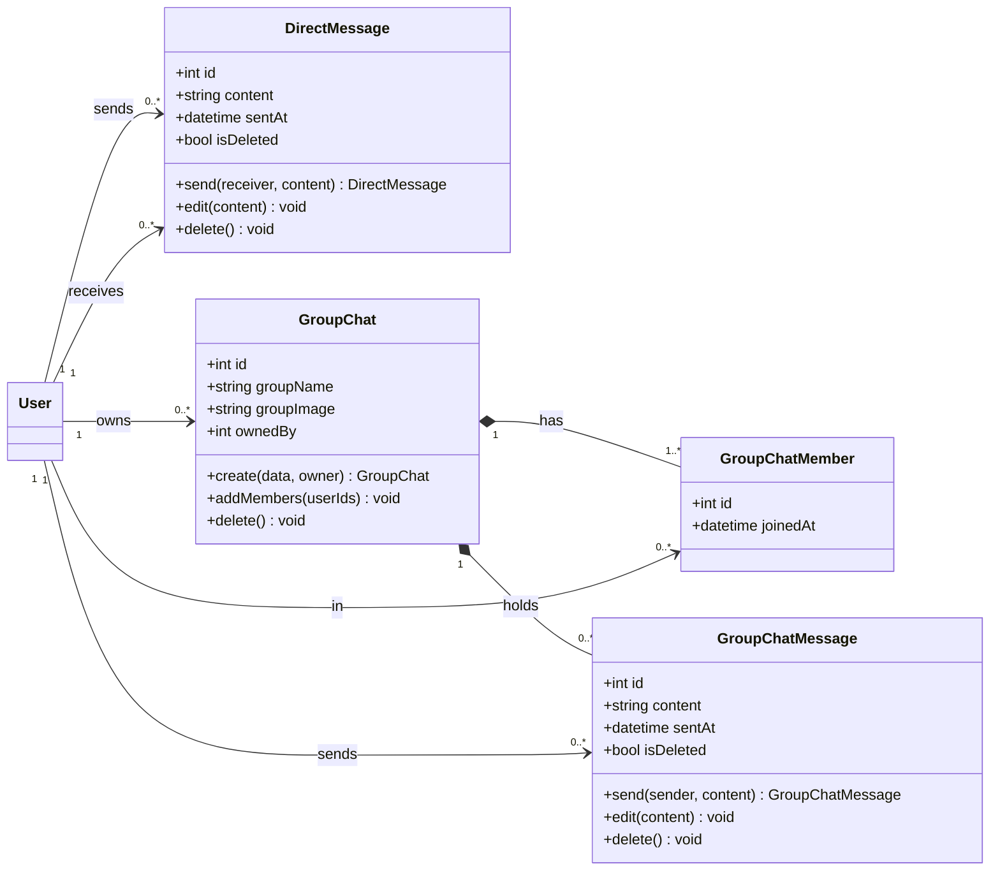
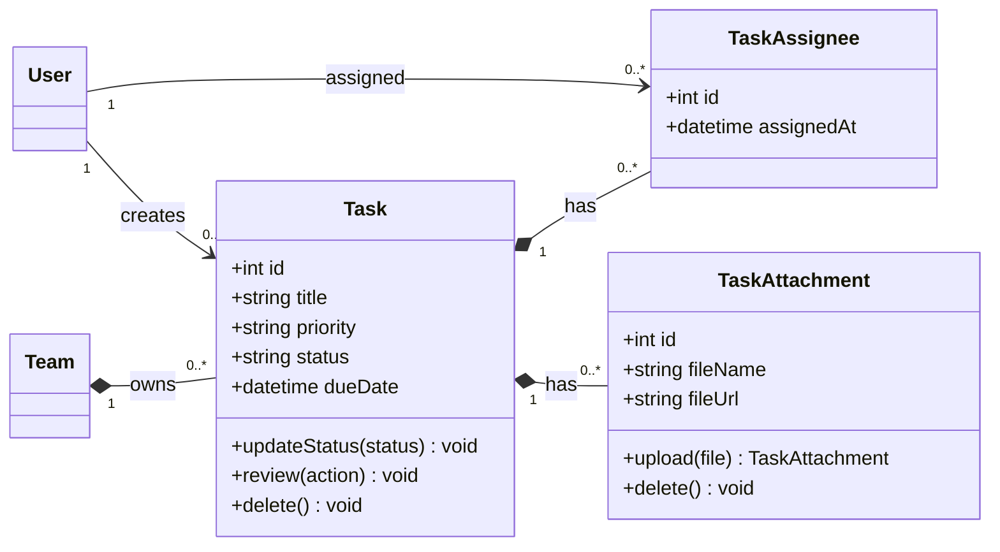
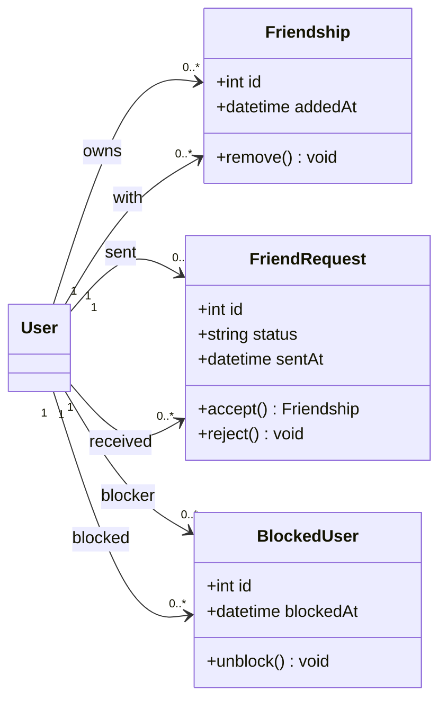
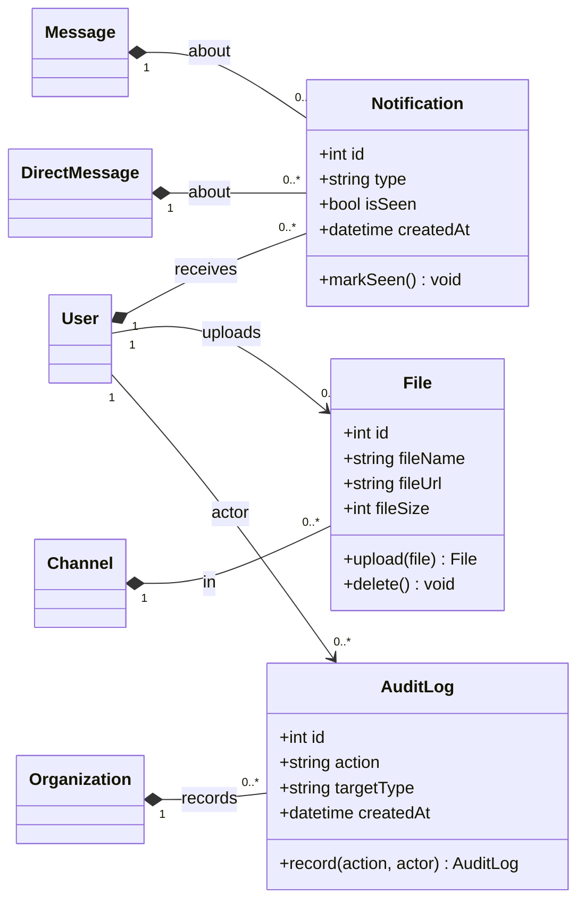

# TeamNest — UML Class Diagram

Backend / domain-level class diagram of the TeamNest collaboration platform.
Frontend, transport, and service-layer code are excluded — only the
persistent domain model is shown.

Diagrams use **Mermaid** classDiagram syntax. Strong ownership uses
**composition** (`*--`); weaker references use **association** (`-->`).
Multiplicities follow standard UML.

---

## 1. Identity & Access

---

## 2. Organizations, Membership & Billing

---

## 3. Teams & Roles

---

## 4. Channels & Messaging

---

## 5. Direct Messages & Group Chat

---

## 6. Tasks

---

## 7. Social Graph

---

## 8. Cross-Cutting (Notifications, Files, Audit Logs)

---

## Legend

| Notation | Meaning |
|---|---|
| `A "1" *-- "0..*" B` | **Composition** — B is owned by A and cannot exist without it. |
| `A "1" --> "0..*" B` | **Association** — A references B with given multiplicity. |
| `A <\|-- B` | **Inheritance** — B is a kind of A. |
| `<<abstract>>` | Abstract / conceptual class (not directly persisted). |
| `+` | Public member. |

Classes referenced across sections (`User`, `Team`, `Organization`,
`Channel`, `Message`, `DirectMessage`) are defined in their primary
section and reused by relationship arrows in the others.
