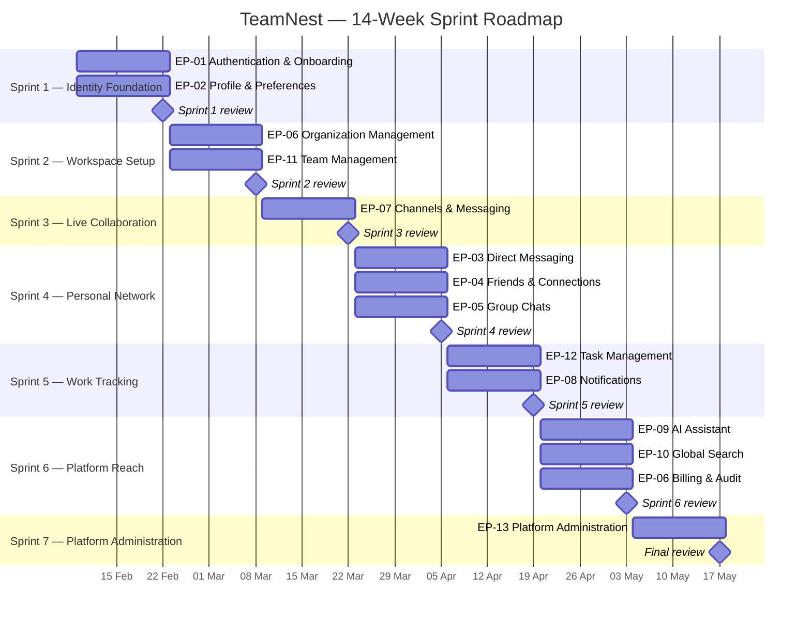

# TeamNest — 14-Week Sprint Roadmap

Seven two-week sprints deliver the full TeamNest backlog (70 stories • 240 story points) end-to-end. Each sprint closes with a review milestone; Sprint 7 ends the release with the platform-administration console.

## Gantt overview

## Sprint summary

| Sprint   | Title                       | Dates                | Epics covered                                | Stories | Story points |
| -------- | --------------------------- | -------------------- | -------------------------------------------- | :-----: | :----------: |
| Sprint 1 | Identity Foundation         | 2026-02-09 → 02-22   | EP-01, EP-02                                  | 12      | 37           |
| Sprint 2 | Workspace Setup             | 2026-02-23 → 03-08   | EP-06 (core), EP-11                           | 14      | 41           |
| Sprint 3 | Live Collaboration          | 2026-03-09 → 03-22   | EP-07                                         | 12      | 45           |
| Sprint 4 | Personal Network            | 2026-03-23 → 04-05   | EP-03, EP-04, EP-05                           | 11      | 35           |
| Sprint 5 | Work Tracking               | 2026-04-06 → 04-19   | EP-12, EP-08                                  | 9       | 30           |
| Sprint 6 | Platform Reach              | 2026-04-20 → 05-03   | EP-09, EP-10, EP-06 (billing & audit)         | 8       | 39           |
| Sprint 7 | Platform Administration     | 2026-05-04 → 05-17   | EP-13                                         | 4       | 13           |
| **Total** |                            |                      |                                              | **70**  | **240**      |

## Sprint goals at a glance

- **Sprint 1 — Identity Foundation:** Anyone can create a verified account and manage their profile.
- **Sprint 2 — Workspace Setup:** An admin can create an organization, onboard members and structure them into teams.
- **Sprint 3 — Live Collaboration:** Members hold live conversations in channels with pinning, search and file sharing.
- **Sprint 4 — Personal Network:** Users have 1:1 and small-group conversations and manage their personal network.
- **Sprint 5 — Work Tracking:** Teams plan and track work and stay informed via real-time notifications.
- **Sprint 6 — Platform Reach:** Add cross-cutting capabilities — AI help, global search, audit trail and paid plans.
- **Sprint 7 — Platform Administration:** A site admin can monitor platform health and moderate users and organizations from a single console.

## Cumulative delivery

| After sprint | Cumulative stories | Cumulative points | % of backlog |
| ------------ | :----------------: | :---------------: | :----------: |
| Sprint 1     | 12                 | 37                | 15%          |
| Sprint 2     | 26                 | 78                | 33%          |
| Sprint 3     | 38                 | 123               | 51%          |
| Sprint 4     | 49                 | 158               | 66%          |
| Sprint 5     | 58                 | 188               | 78%          |
| Sprint 6     | 66                 | 227               | 95%          |
| Sprint 7     | 70                 | 240               | 100%         |

_Full backlog and per-story breakdown: [backlog_revisited.md](backlog_revisited.md)._
