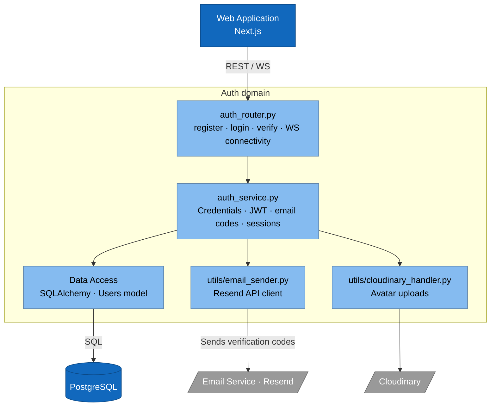
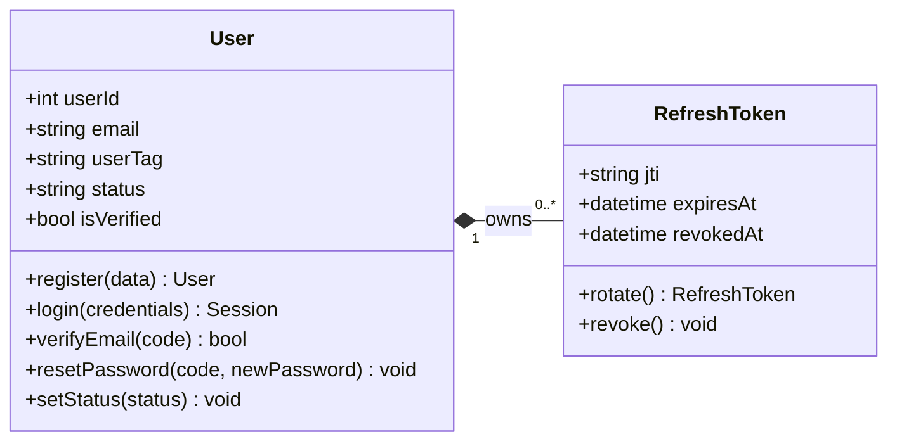
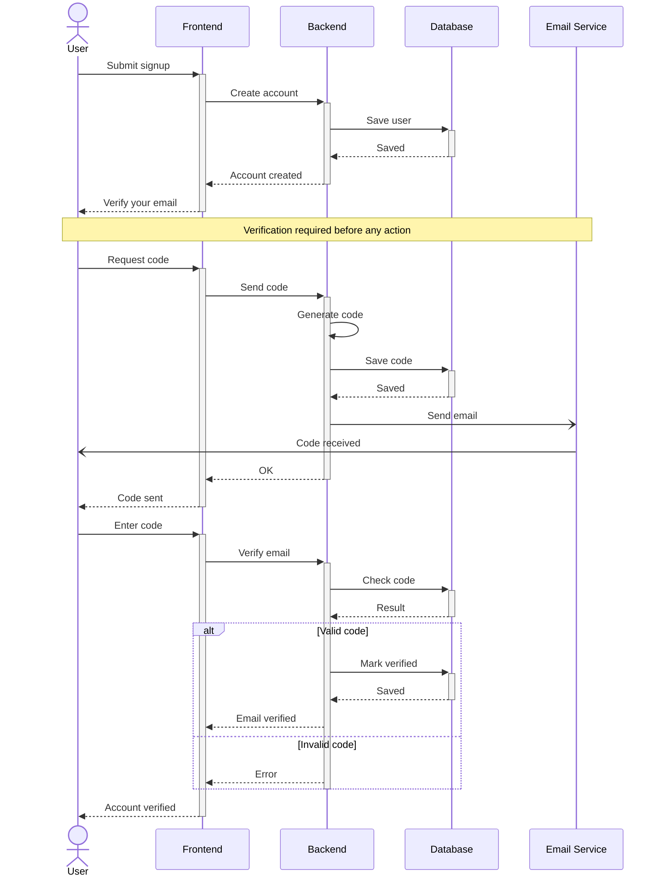
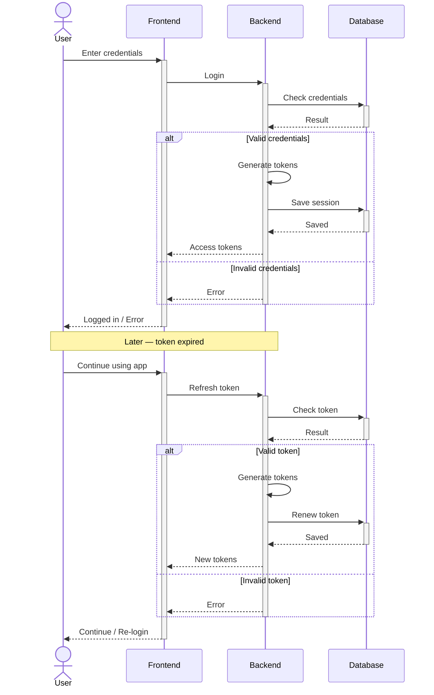
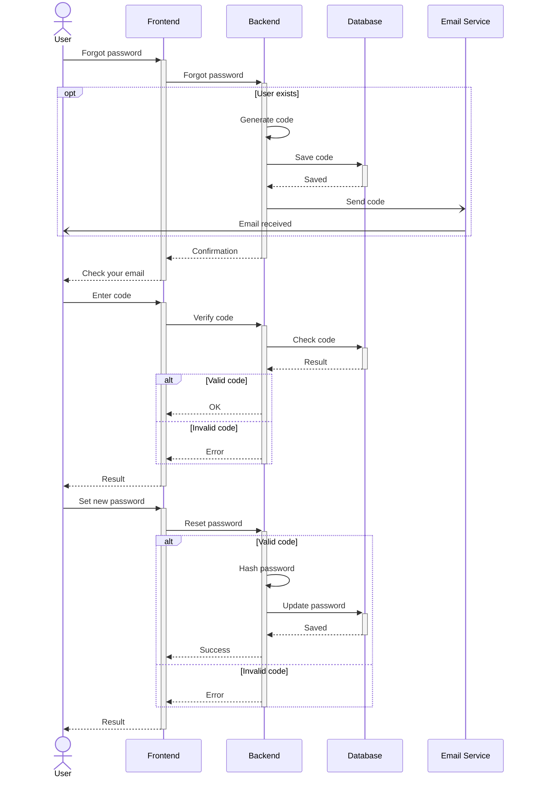

# Sprint 1 — Authentication & Profile

**Weeks 1–2**

---

## Introduction

Sprint 1 lays the foundation of TeamNest: every later sprint assumes a verified, authenticated user with a usable profile. Before any organization, channel, or task can be touched, the platform must be able to register a visitor, prove they own their email, sign them in across devices, and let them recover or rotate their password. This sprint therefore delivers the full identity surface — landing page, registration, email verification, session management with refresh-token rotation, password reset, password change, profile editing, presence, theme, and a guided tour — as well as the cross-cutting concerns (avatar uploads via Cloudinary, transactional emails via Resend, JWT-based auth) that the rest of the application will reuse.

---

## Sprint Goal

> **Anyone can create a verified account and manage their profile.**

By the end of Sprint 1, a brand-new visitor can land on the marketing page, sign up, receive a verification code by email, activate their account, log in, stay logged in across reloads, recover access if they forget their password, and personalize their profile (avatar, name, country, phone, presence, theme).

---

## User Stories

### Visitor

| ID     | Priority | Story                                                                                          | Subtasks                                                                                                          |
| ------ | -------- | ---------------------------------------------------------------------------------------------- | ----------------------------------------------------------------------------------------------------------------- |
| US-1.1 | High     | As a **visitor**, I want to browse the landing page, so that I can learn what TeamNest offers. | 1. Design landing layout (hero, features, footer) 2. Implement responsive Next.js components 3. Wire CTAs to signup / login |
| US-1.2 | High     | As a **visitor**, I want to register, so that I can create an account.                         | 1. Build registration form UI 2. `POST /auth/register` endpoint 3. Hash password (bcrypt) and persist user                |

### User

| ID      | Priority | Story                                                                                                | Subtasks                                                                                                                  |
| ------- | -------- | ---------------------------------------------------------------------------------------------------- | ------------------------------------------------------------------------------------------------------------------------- |
| US-2.1  | High     | As a **user**, I want to verify my email, so that my account is activated.                           | 1. Generate and store 6-digit code 2. `POST /auth/verify-email` endpoint 3. Flip `is_verified` on success           |
| US-2.2  | High     | As a **user**, I want to resend the verification code, so that I'm not blocked.                      | 1. `POST /auth/resend-code` with rate-limit 2. Wire "Resend" button on verification screen                             |
| US-2.3  | High     | As a **user**, I want to stay signed in, so that I don't log in every visit.                         | 1. Issue JWT access + refresh tokens 2. Refresh-token rotation endpoint 3. Persist sessions table                   |
| US-2.4  | High     | As a **user**, I want to log out from one or all devices, so that I can secure my account.           | 1. `POST /auth/logout` (current) 2. `POST /auth/logout-all` 3. Revoke matching refresh tokens                       |
| US-2.5  | High     | As a **user**, I want to reset my password by email, so that I can recover access.                   | 1. `POST /auth/forgot-password` sends code via Resend 2. `POST /auth/reset-password` verifies + updates 3. Reset UI flow |
| US-2.6  | Medium   | As a **user**, I want to change my password, so that I can rotate it.                                | 1. `POST /auth/change-password` with old-password check 2. Re-hash and persist new password                            |
| US-2.7  | Medium   | As a **user**, I want to edit my profile (avatar, name, country, phone), so that it stays current.   | 1. `PATCH /users/me` 2. Avatar upload via Cloudinary 3. Profile-edit form UI                                        |
| US-2.8  | Low      | As a **user**, I want to set my presence, so that others know my availability.                       | 1. Add `presence` enum field on user 2. WebSocket broadcast on change                                                  |
| US-2.9  | Low      | As a **user**, I want light/dark theme, so that the look matches my preference.                      | 1. Add theme toggle component 2. Persist preference (localStorage + user setting)                                      |
| US-2.10 | Low      | As a **user**, I want a guided tour, so that I learn the basics quickly.                             | 1. Integrate tour library (Driver.js / Shepherd) 2. Define onboarding step list                                        |

---

## Related Diagrams

### C4 — Auth domain (component view)

### Class Diagram — Identity & Access

> Source: section 1 of [class diagram.md](../class%20diagram.md).

### Sequence — Signup & Email Verification (US-1.2, US-2.1, US-2.2)

### Sequence — Login & Refresh Token Rotation (US-2.3, US-2.4)

### Sequence — Password Reset (US-2.5, US-2.6)

---

## Conclusion

Sprint 1 closes with a complete, self-contained identity foundation. Any visitor can sign up, prove ownership of their email, log in across devices with rotating refresh tokens, recover access, and personalise their profile — all backed by JWT auth, Cloudinary avatars, and transactional emails via Resend. The `User` and `RefreshToken` domain objects established here are referenced by every subsequent sprint, so the rest of the platform can now safely assume "an authenticated, verified user" as its starting point. Sprint 2 builds directly on top by introducing the organisation as the unit those users will collaborate inside.
