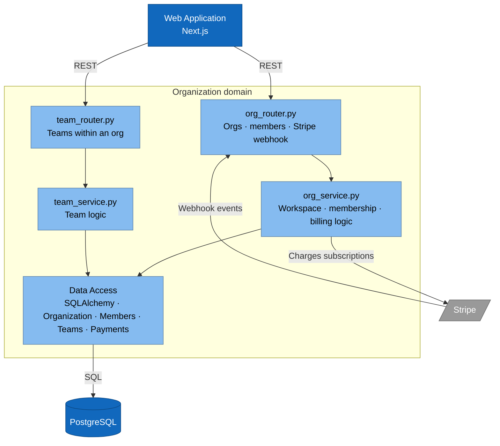
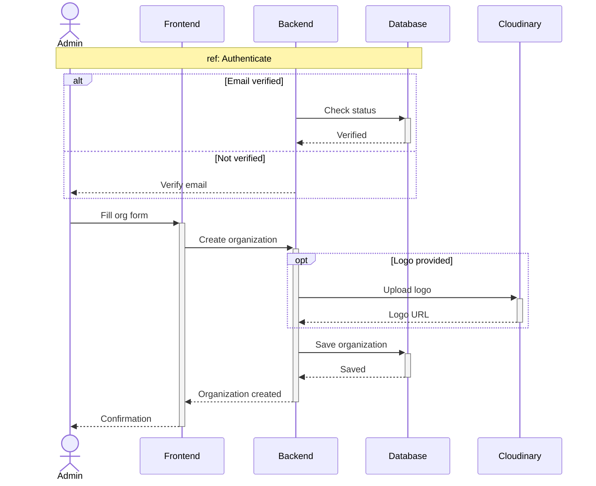
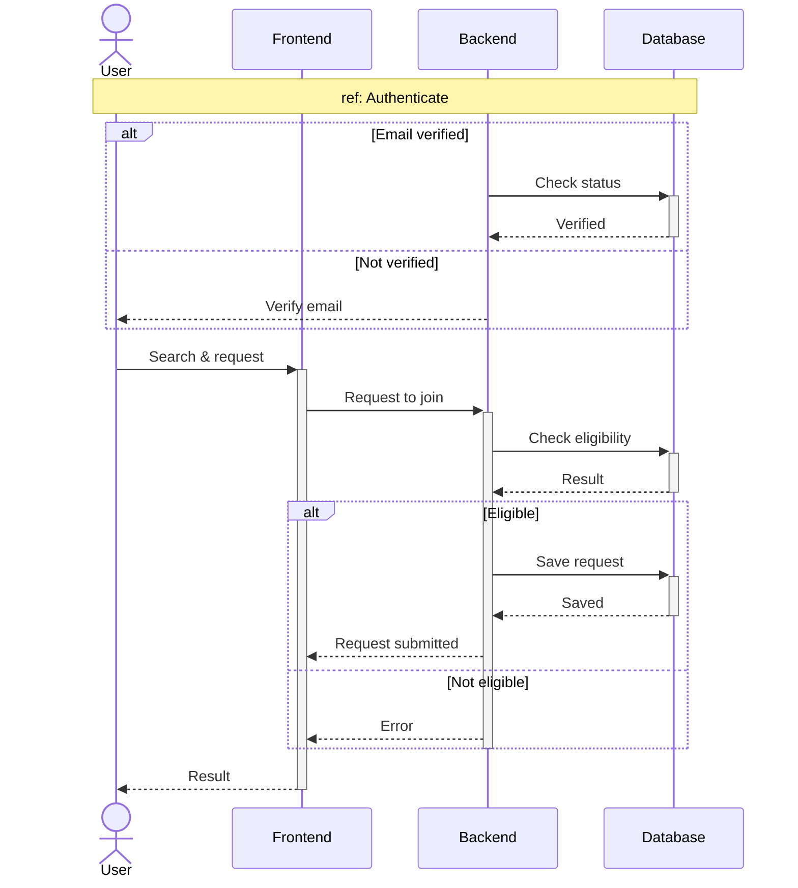
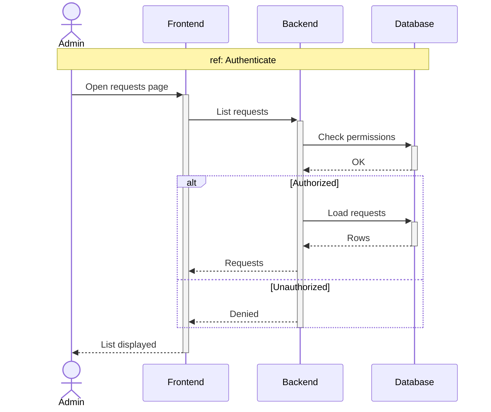
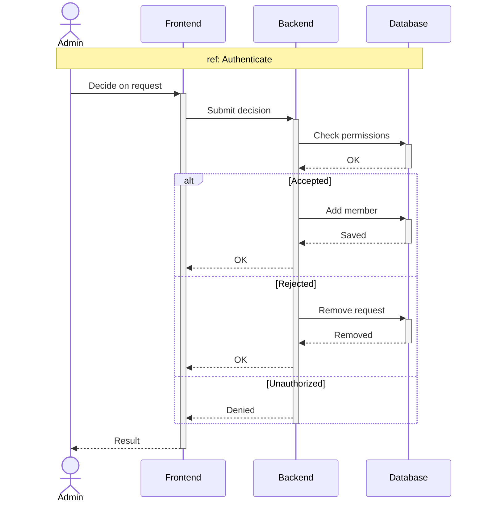
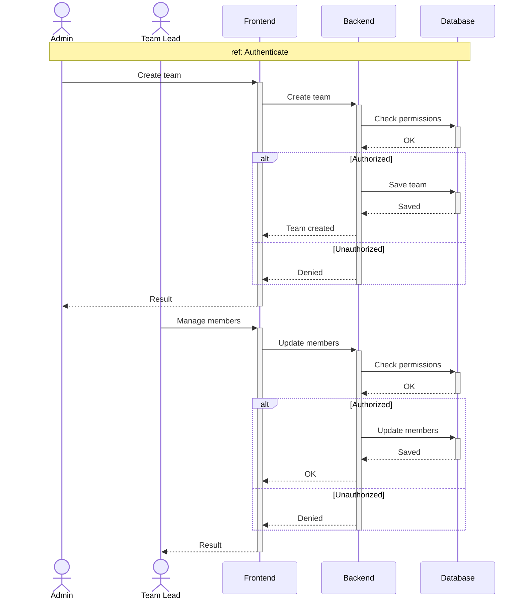

# Sprint 2 — Organizations & Teams

**Weeks 3–4**

---

## Introduction

With identity in place from Sprint 1, Sprint 2 introduces the **workspace** — the unit that everything else (channels, tasks, AI, billing) is scoped to. A verified user becomes a **member** by either creating their own organization or being invited / accepted into someone else's. Inside an organization, **admins** invite people, accept join requests, and structure members into **teams**, where **team leads** manage roles and membership. This sprint also stands up the organization itself: editing org metadata, deleting an org as its owner, and the lightweight directory views (members list, teams list, teammate profile) that the rest of the product navigates from.

---

## Sprint Goal

> **An admin can create an organization, onboard members and structure them into teams.**

By the end of Sprint 2, an authenticated user can spin up a workspace, invite people in (or process incoming requests), carve the org into teams, assign team leads, manage team membership and permissions, and — as the owner — decommission the whole organization when needed.

---

## User Stories

### Member

| ID       | Priority | Story                                                                                                              |
| -------- | -------- | ------------------------------------------------------------------------------------------------------------------ |
| US-6.1   | High     | As a **member**, I want to create an organization, so that I can host my workspace.                                |
| US-6.2   | High     | As a **member**, I want to join an org with an invite, so that I can collaborate.                                  |
| US-6.3   | High     | As a **member**, I want to see all org members, so that I have an overview.                                        |
| US-6.4   | High     | As a **member**, I want to see the teams in my org, so that I can navigate to one.                                 |

### Org Admin

| ID        | Priority | Story                                                                                                              |
| --------- | -------- | ------------------------------------------------------------------------------------------------------------------ |
| US-11.1   | High     | As an **org admin**, I want to invite members by email, so that they can join.                                     |
| US-11.2   | High     | As an **org admin**, I want to accept or reject join requests, so that I control who gets in.                      |
| US-11.3   | Medium   | As an **org admin**, I want to update the organization, so that I can keep it accurate.                            |
| US-11.4   | High     | As an **org admin**, I want to create teams, so that I can group members by project.                               |

### Org Owner

| ID        | Priority | Story                                                                                                              |
| --------- | -------- | ------------------------------------------------------------------------------------------------------------------ |
| US-12.1   | Medium   | As an **org owner**, I want to delete my organization, so that I can decommission it.                              |

### Team Lead

| ID        | Priority | Story                                                                                                              |
| --------- | -------- | ------------------------------------------------------------------------------------------------------------------ |
| US-13.1   | Medium   | As a **team lead**, I want to update or delete my team, so that I can keep it accurate or wind it down.            |
| US-13.2   | High     | As a **team lead**, I want to add members to my team, so that they get access.                                     |
| US-13.3   | Medium   | As a **team lead**, I want to grant or revoke a member's permissions, so that responsibilities are clear.          |
| US-13.4   | Medium   | As a **team lead**, I want to kick a member, so that I can remove unwanted people.                                 |

### Team Member

| ID        | Priority | Story                                                                                                              |
| --------- | -------- | ------------------------------------------------------------------------------------------------------------------ |
| US-15.1   | Low      | As a **team member**, I want to view a teammate's profile, so that I know their role.                              |

---

## Related Diagrams

### C4 — Organization domain (component view)

> Stripe-related arrows belong to Sprint 6 (Billing). They appear here only because they live in the same domain component; the create-org part of the next sequence is what's in scope for Sprint 2.

### Sequence — Create Organization (US-6.1, US-11.3)

### Sequence — Join Organization: request → review → decide (US-6.2, US-11.1, US-11.2)

**5a. User sends join request**

**5b. Admin lists pending requests**

**5c. Admin accepts or rejects**

### Sequence — Team + Member Management (US-11.4, US-13.1, US-13.2, US-13.3, US-13.4)

