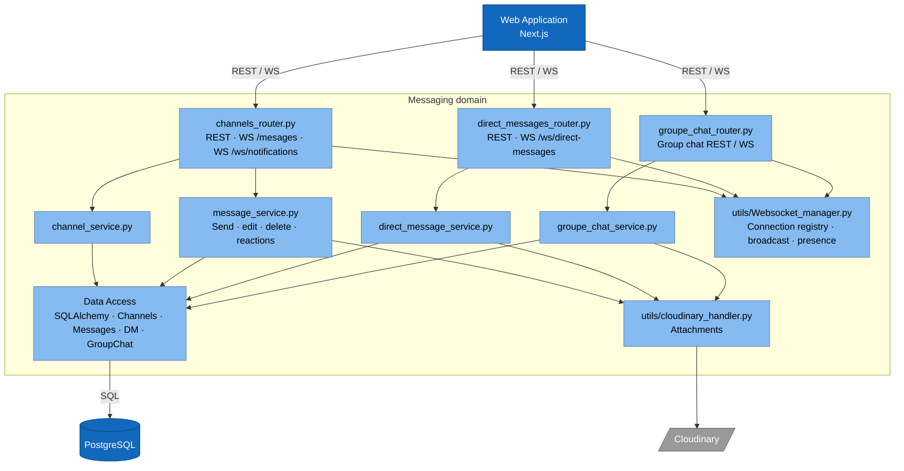
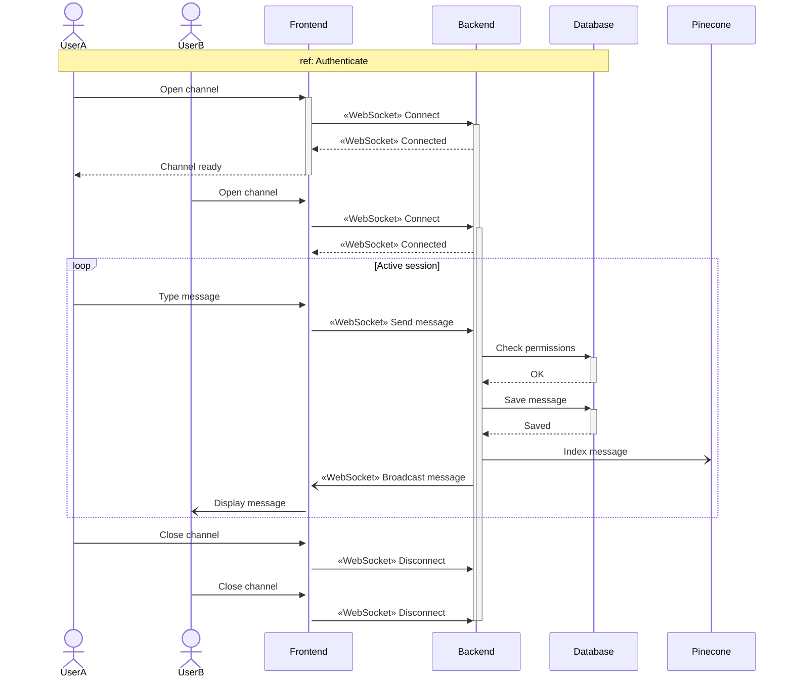
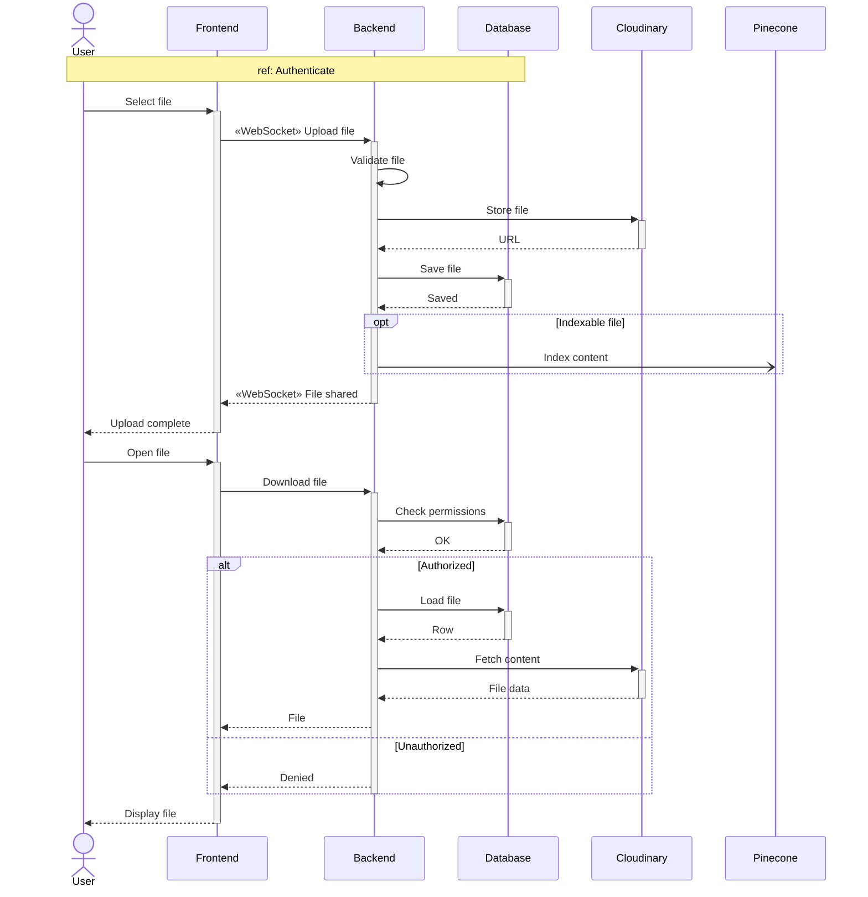

# Sprint 3 — Channels & Real-time Messaging

**Weeks 5–6**

---

## Introduction

Sprint 3 turns TeamNest from a static workspace into a **live collaboration tool**. Organizations and teams created in Sprint 2 now host **channels** — persistent, topic-scoped conversations that span the organization or are scoped to a single team. Messages travel over **WebSockets** so they appear instantly for every connected member, with edit, delete, pin, search, file attachment, mention, and infinite-scroll history. Files shared in channels are stored on Cloudinary and indexed in Pinecone so they can be retrieved later by the AI assistant (Sprint 6). This is the first sprint where the WebSocket manager, the broadcast pattern, and the file-upload pipeline come online — and every later real-time feature (DMs, group chats, notifications) reuses them.

---

## Sprint Goal

> **Members hold live conversations in channels with pinning, search and file sharing.**

By the end of Sprint 3, members can create channels (general or announcement) inside an organization or a team, exchange messages in real time, edit and delete their own messages, load older history on scroll, reply to messages, pin important ones, search through past discussions, share files, and mention teammates with `@tag`.

---

## User Stories

### Member

| ID       | Priority | Story                                                                                                              |
| -------- | -------- | ------------------------------------------------------------------------------------------------------------------ |
| US-7.1   | High     | As a **member**, I want to create org channels (general or announcement), so that topics stay organized.           |
| US-7.2   | High     | As a **member**, I want to chat in channels in real time, so that conversations feel instant.                      |
| US-7.3   | High     | As a **member**, I want to edit or delete my own messages, so that I can fix mistakes.                             |
| US-7.4   | High     | As a **member**, I want to load older messages on scroll, so that history loads smoothly.                          |
| US-7.5   | Medium   | As a **member**, I want to reply to a message, so that threads stay readable.                                      |
| US-7.6   | Medium   | As a **member**, I want to pin and unpin messages, so that important info is easy to find.                         |
| US-7.7   | Medium   | As a **member**, I want to search messages in a channel, so that I can find past discussions.                      |
| US-7.8   | Medium   | As a **member**, I want to share files in channels, so that documents stay with the conversation.                  |
| US-7.9   | Medium   | As a **member**, I want to mention teammates with `@tag`, so that they get notified.                               |

### Team Lead

| ID        | Priority | Story                                                                                                              |
| --------- | -------- | ------------------------------------------------------------------------------------------------------------------ |
| US-13.5   | Medium   | As a **team lead**, I want to create channels in my team, so that the team has its own spaces.                     |

### Team Member

| ID        | Priority | Story                                                                                                              |
| --------- | -------- | ------------------------------------------------------------------------------------------------------------------ |
| US-15.2   | High     | As a **team member**, I want to chat in my team's channels, so that I can collaborate with my team.                |
| US-15.3   | Low      | As a **team member**, I want a file list per team channel with inline PDF viewing, so that I can find and read attachments easily. |

---

## Subtasks

**US-7.1 — Create org channels (general / announcement)**
- [ ] `POST /channels` with channel-type enum
- [ ] Channel-creation modal in UI

**US-7.2 — Real-time chat in channels**
- [ ] WebSocket `/ws/messages` connection lifecycle
- [ ] Broadcast send → all channel subscribers
- [ ] Persist messages to DB on send

**US-7.3 — Edit or delete own messages**
- [ ] `PATCH /messages/{id}` and `DELETE /messages/{id}` with owner check
- [ ] Inline edit + delete-confirm UI

**US-7.4 — Load older messages on scroll**
- [ ] Cursor-paginated history endpoint
- [ ] Infinite-scroll handler in chat view

**US-7.5 — Reply to a message**
- [ ] `parent_message_id` field on messages
- [ ] Reply / thread UI rendering

**US-7.6 — Pin and unpin messages**
- [ ] `POST /messages/{id}/pin` and unpin endpoint
- [ ] Pinned-messages panel in channel UI

**US-7.7 — Search messages in a channel**
- [ ] Full-text search endpoint (Postgres FTS)
- [ ] Channel search bar with result list

**US-7.8 — Share files in channels**
- [ ] Upload pipeline via Cloudinary handler
- [ ] Attachment chip rendering in messages
- [ ] Index file contents in Pinecone

**US-7.9 — Mention teammates with @tag**
- [ ] Mention parser on message send
- [ ] Notification fan-out to mentioned users

**US-13.5 — Create channels in my team**
- [ ] Team-scoped `POST /channels` with lead-only check
- [ ] Team channel list in team page

**US-15.2 — Chat in team channels**
- [ ] Reuse WS messaging for team-scoped channels
- [ ] Access-control check on team membership

**US-15.3 — File list + inline PDF viewing**
- [ ] `GET /channels/{id}/files` endpoint
- [ ] Inline PDF viewer component (react-pdf)

---

## Related Diagrams

### C4 — Messaging domain (component view)

> Covers channels, direct messages, and group chat — all share the WebSocket manager. Channel-specific components for this sprint: `channels_router.py`, `channel_service.py`, `message_service.py`.

### Sequence — Channel Messaging over WebSocket (US-7.2, US-7.3, US-7.4, US-7.9, US-15.2)

### Sequence — File Upload & Indexing (US-7.8, US-15.3)

