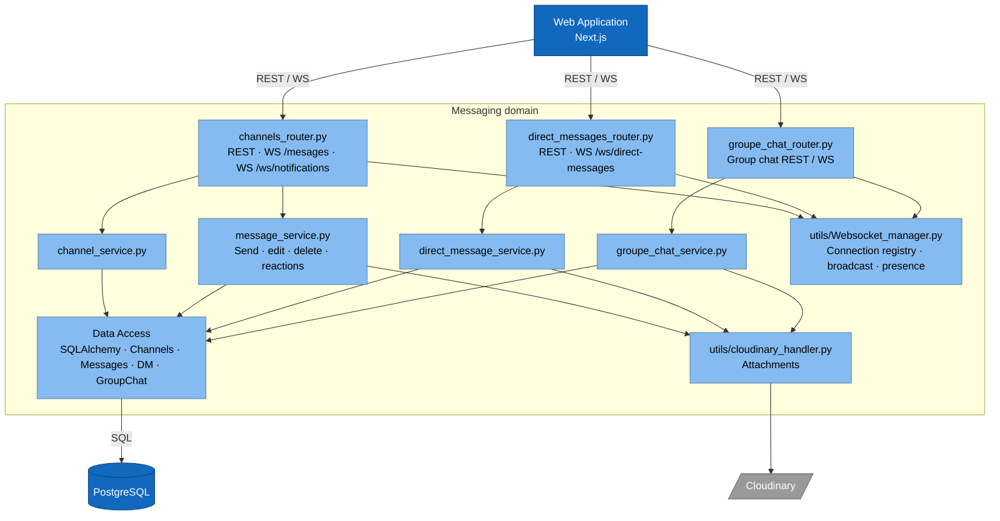
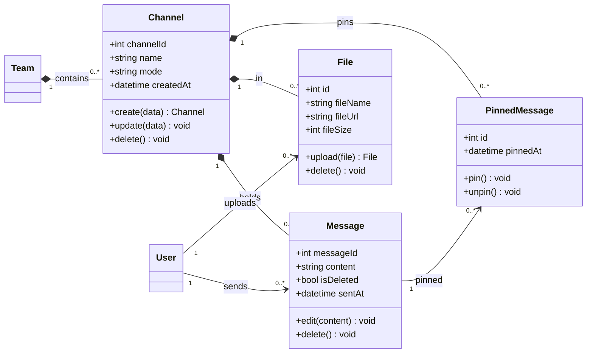
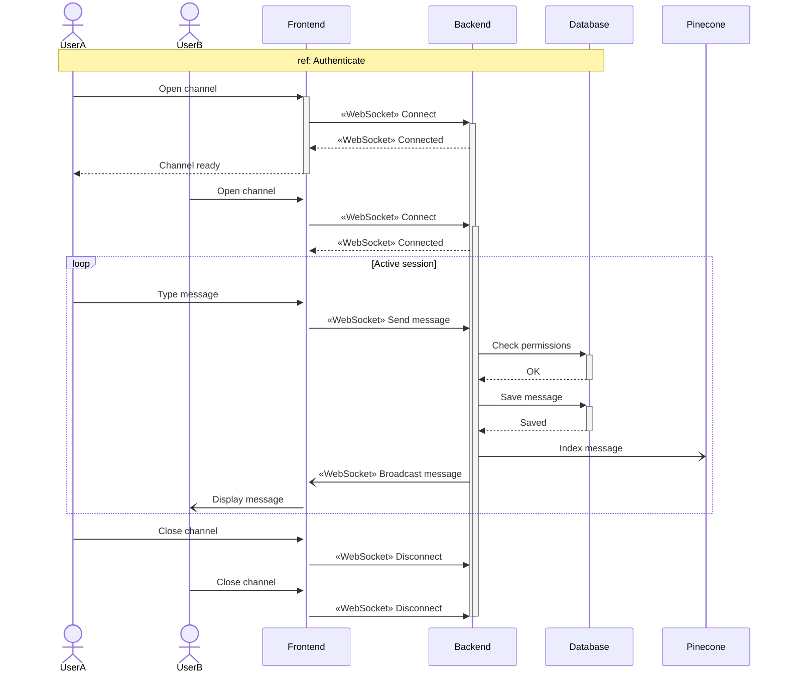
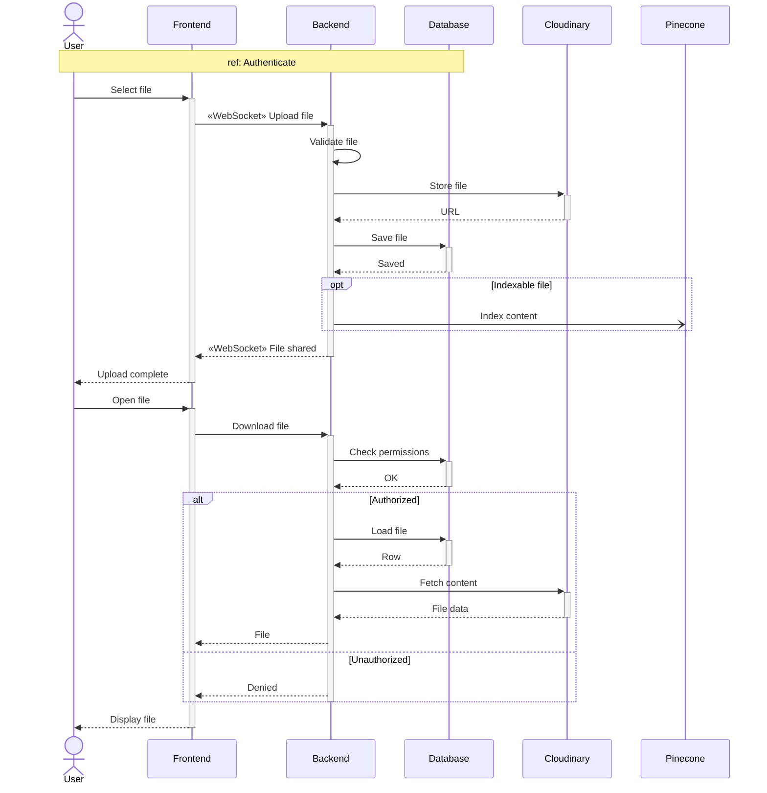

# Sprint 3 — Channels & Real-time Messaging

**Weeks 5–6**

---

## Introduction

Sprint 3 turns TeamNest from a static workspace into a **live collaboration tool**. Organizations and teams created in Sprint 2 now host **channels** — persistent, topic-scoped conversations that span the organization or are scoped to a single team. Messages travel over **WebSockets** so they appear instantly for every connected member, with edit, delete, pin, search, file attachment, mention, and infinite-scroll history. Files shared in channels are stored on Cloudinary and indexed in Pinecone so they can be retrieved later by the AI assistant (Sprint 6). This is the first sprint where the WebSocket manager, the broadcast pattern, and the file-upload pipeline come online — and every later real-time feature (DMs, group chats, notifications) reuses them.

---

## Sprint Goal

> **Members hold live conversations in channels with pinning, search and file sharing.**

By the end of Sprint 3, members can create channels (general or announcement) inside an organization or a team, exchange messages in real time, edit and delete their own messages, load older history on scroll, reply to messages, pin important ones, search through past discussions, share files, and mention teammates with `@tag`.

---

## User Stories

### Member

| Epic                 | ID     | Priority | Story                                                                                                    | Subtasks                                                                                                                       |
| -------------------- | ------ | -------- | -------------------------------------------------------------------------------------------------------- | ------------------------------------------------------------------------------------------------------------------------------ |
| Channel Management   | US-7.1 | High     | As a **member**, I want to create org channels (general or announcement), so that topics stay organized. | **T-7.1.1** `POST /channels` with channel-type enum **T-7.1.2** Channel-creation modal in UI                                                                 |
| Real-time Messaging  | US-7.2 | High     | As a **member**, I want to chat in channels in real time, so that conversations feel instant.            | **T-7.2.1** WebSocket `/ws/messages` connection lifecycle **T-7.2.2** Broadcast send → channel subscribers **T-7.2.3** Persist messages on send           |
|                      | US-7.3 | High     | As a **member**, I want to edit or delete my own messages, so that I can fix mistakes.                   | **T-7.3.1** `PATCH` / `DELETE /messages/{id}` with owner check **T-7.3.2** Inline edit + delete-confirm UI                                                   |
|                      | US-7.4 | High     | As a **member**, I want to load older messages on scroll, so that history loads smoothly.                | **T-7.4.1** Cursor-paginated history endpoint **T-7.4.2** Infinite-scroll handler in chat view                                                               |
| Threads              | US-7.5 | Medium   | As a **member**, I want to reply to a message, so that threads stay readable.                            | **T-7.5.1** `parent_message_id` field on messages **T-7.5.2** Reply / thread UI rendering                                                                    |
| Message Pinning      | US-7.6 | Medium   | As a **member**, I want to pin and unpin messages, so that important info is easy to find.               | **T-7.6.1** `POST /messages/{id}/pin` and unpin endpoint **T-7.6.2** Pinned-messages panel in channel UI                                                     |
| Search               | US-7.7 | Medium   | As a **member**, I want to search messages in a channel, so that I can find past discussions.            | **T-7.7.1** Full-text search endpoint (Postgres FTS) **T-7.7.2** Channel search bar with result list                                                         |
| File Sharing         | US-7.8 | Medium   | As a **member**, I want to share files in channels, so that documents stay with the conversation.        | **T-7.8.1** Upload pipeline via Cloudinary **T-7.8.2** Attachment chip rendering in messages **T-7.8.3** Index file contents in Pinecone                  |
| Mentions             | US-7.9 | Medium   | As a **member**, I want to mention teammates with `@tag`, so that they get notified.                     | **T-7.9.1** Mention parser on message send **T-7.9.2** Notification fan-out to mentioned users                                                               |

### Team Lead

| Epic                 | ID      | Priority | Story                                                                                          | Subtasks                                                                                          |
| -------------------- | ------- | -------- | ---------------------------------------------------------------------------------------------- | ------------------------------------------------------------------------------------------------- |
| Channel Management   | US-13.5 | Medium   | As a **team lead**, I want to create channels in my team, so that the team has its own spaces. | **T-13.5.1** Team-scoped `POST /channels` with lead-only check **T-13.5.2** Team channel list in team page |

### Team Member

| Epic                 | ID      | Priority | Story                                                                                                                              | Subtasks                                                                                          |
| -------------------- | ------- | -------- | ---------------------------------------------------------------------------------------------------------------------------------- | ------------------------------------------------------------------------------------------------- |
| Real-time Messaging  | US-15.2 | High     | As a **team member**, I want to chat in my team's channels, so that I can collaborate with my team.                                | **T-15.2.1** Reuse WS messaging for team-scoped channels **T-15.2.2** Access-control check on team membership |
| File Sharing         | US-15.3 | Low      | As a **team member**, I want a file list per team channel with inline PDF viewing, so that I can find and read attachments easily. | **T-15.3.1** `GET /channels/{id}/files` endpoint **T-15.3.2** Inline PDF viewer component (react-pdf)         |

---

## Related Diagrams

### C4 — Messaging domain (component view)

> Covers channels, direct messages, and group chat — all share the WebSocket manager. Channel-specific components for this sprint: `channels_router.py`, `channel_service.py`, `message_service.py`.

### Class Diagram — Channels & Messaging

> Source: section 4 of [class diagram.md](../class%20diagram.md). `File` is reproduced from the cross-cutting section because attachments land in this sprint.

### Sequence — Channel Messaging over WebSocket (US-7.2, US-7.3, US-7.4, US-7.9, US-15.2)

### Sequence — File Upload & Indexing (US-7.8, US-15.3)

---

## Conclusion

Sprint 3 turns the workspace into a live collaboration tool. Members exchange messages instantly inside org or team channels, edit and pin them, scroll back through history, search past discussions, attach files, and mention each other with `@tag`. The big infrastructural wins are the WebSocket manager, the Cloudinary upload pipeline, and the Pinecone indexing of channel content — all three are reused by every later real-time or AI-driven feature (DMs in Sprint 4, notifications in Sprint 5, the assistant and global search in Sprint 6). After this sprint TeamNest is no longer a static workspace but a real-time platform.
