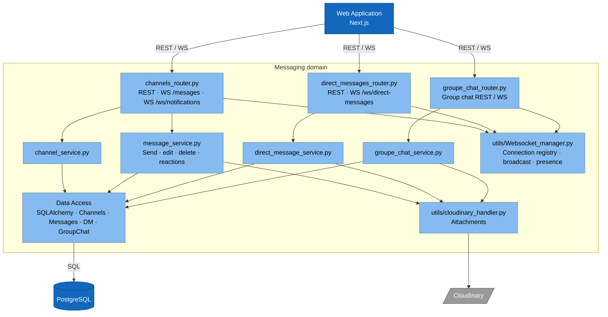
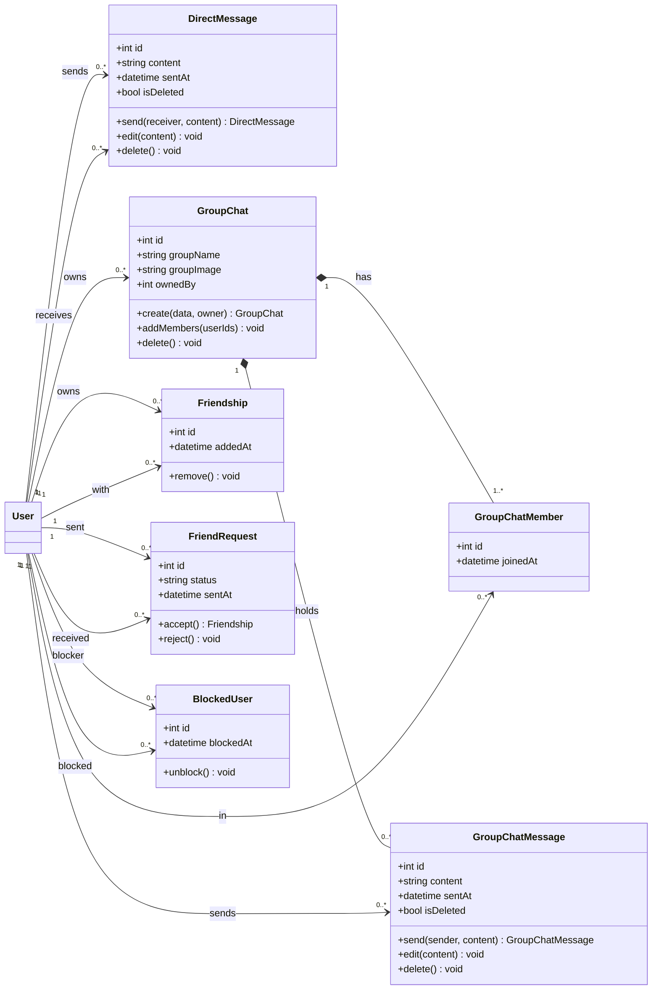
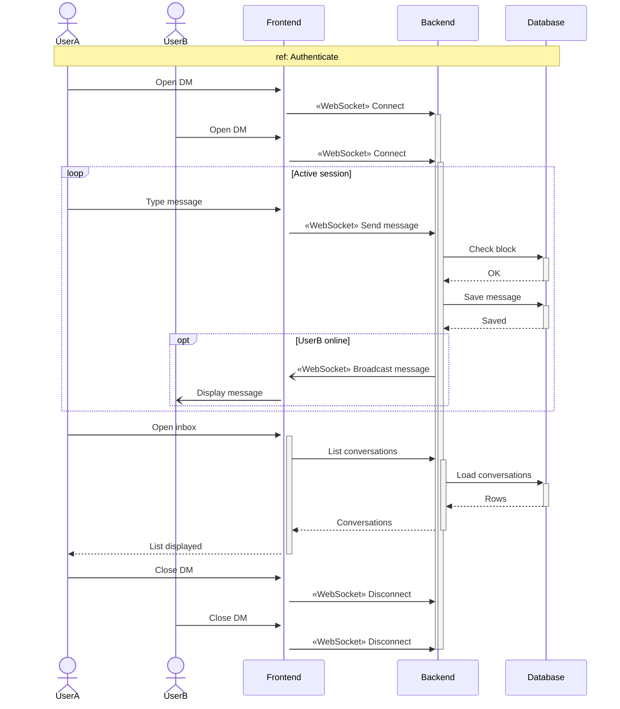
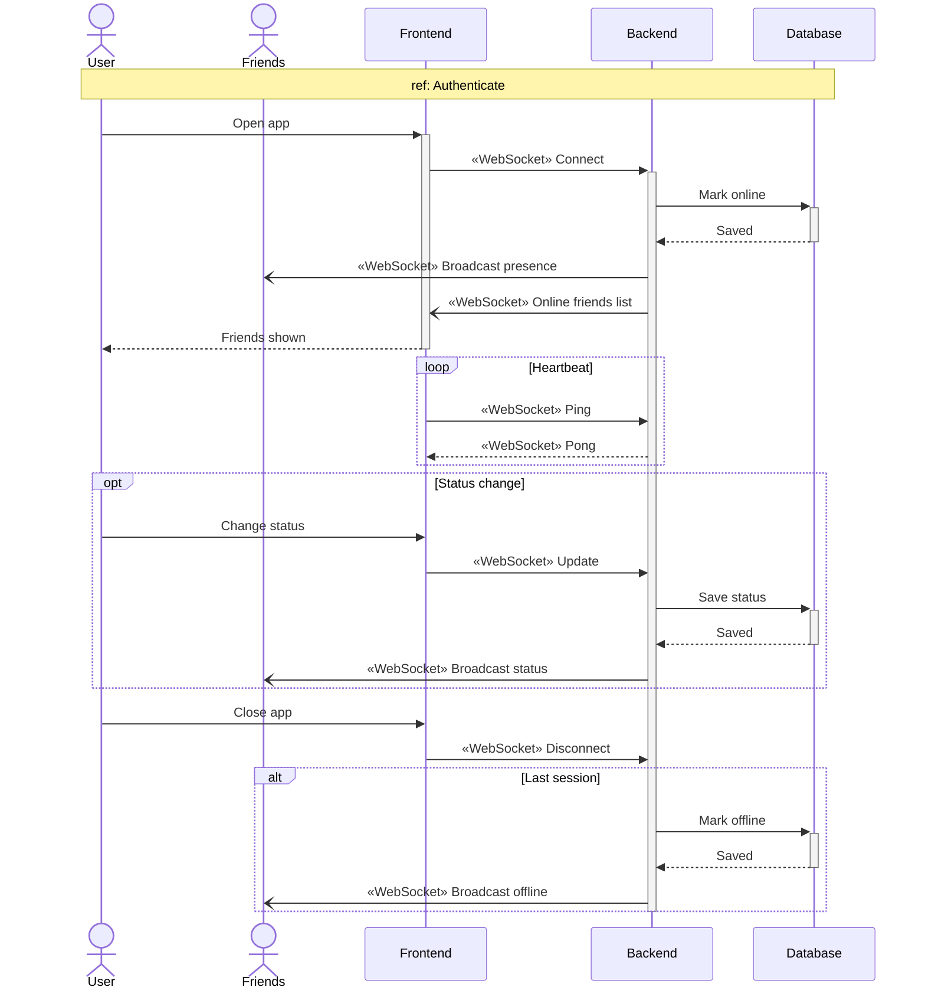

# Sprint 4 — DMs, Group Chats & Friends

**Weeks 7–8**

---

## Introduction

Sprints 1–3 covered the **organizational** side of communication: identity, workspace, and channels. Sprint 4 covers the **personal** side. Two users who don't share an organization — or who just want to step out of a public channel — need a way to talk one-to-one or in small groups. This sprint adds **direct messages** (1:1), **group chats** (multi-user, ad-hoc), and a **friends graph** (request, accept, reject, remove, block). It reuses the WebSocket manager built in Sprint 3 to deliver messages in real time, adds **typing indicators** and **presence** for friends, and exposes a DM inbox so conversations are easy to resume. Block/unblock guarantees a private kill-switch for unwanted contact.

---

## Sprint Goal

> **Users have 1:1 and small-group conversations and manage their personal network.**

By the end of Sprint 4, any signed-in user — with or without an organization — can find a contact, send a friend request, accept/reject/remove friends, block someone, start a DM, attach files, search a thread, see typing indicators, list their conversations, create a group chat, and send/edit/delete group messages in real time.

---

## User Stories

### User — Direct Messages

| Epic             | ID     | Priority | Story                                                                                         | Subtasks                                                                                                            |
| ---------------- | ------ | -------- | --------------------------------------------------------------------------------------------- | ------------------------------------------------------------------------------------------------------------------- |
| Direct Messages  | US-3.1 | High     | As a **user**, I want to send a direct message, so that we can talk privately.                | **T-3.1.1** `POST /direct-messages` endpoint **T-3.1.2** WS `/ws/direct-messages` broadcast **T-3.1.3** DM thread UI            |
|                  | US-3.2 | Medium   | As a **user**, I want to edit, delete and attach files in my DMs, so that I control my chats. | **T-3.2.1** `PATCH` / `DELETE /direct-messages/{id}` with owner check **T-3.2.2** File attach via Cloudinary                       |
| Search           | US-3.3 | Medium   | As a **user**, I want to search a DM thread, so that I can find a past message.               | **T-3.3.1** Thread-scoped search endpoint **T-3.3.2** Search input + result highlighting                                           |
| Presence         | US-3.4 | Medium   | As a **user**, I want typing indicators in DMs, so that I know when someone's typing.         | **T-3.4.1** WS `typing` event (start / stop) **T-3.4.2** Typing-dots indicator component                                           |
| Inbox            | US-3.5 | Medium   | As a **user**, I want a list of my DM conversations, so that I can resume them.               | **T-3.5.1** `GET /direct-messages/conversations` with last-message preview **T-3.5.2** DM inbox UI with unread badges              |

### User — Friends

| Epic           | ID     | Priority | Story                                                                                    | Subtasks                                                                                              |
| -------------- | ------ | -------- | ---------------------------------------------------------------------------------------- | ----------------------------------------------------------------------------------------------------- |
| Social Graph   | US-4.1 | Medium   | As a **user**, I want to send a friend request, so that I can connect with someone.      | **T-4.1.1** `POST /friend-requests` endpoint **T-4.1.2** Friend search + request UI                  |
|                | US-4.2 | Medium   | As a **user**, I want to accept, reject or remove friends, so that I curate my contacts. | **T-4.2.1** Accept / reject / remove endpoints **T-4.2.2** Friends list UI with status filters       |
|                | US-4.3 | Low      | As a **user**, I want to block or unblock users, so that I can stop unwanted contact.    | **T-4.3.1** `POST /blocks` and `DELETE /blocks/{id}` **T-4.3.2** Block check enforced on DM send     |

### User — Group Chats

| Epic         | ID     | Priority | Story                                                                                                  | Subtasks                                                                                                  |
| ------------ | ------ | -------- | ------------------------------------------------------------------------------------------------------ | --------------------------------------------------------------------------------------------------------- |
| Group Chats  | US-5.1 | High     | As a **user**, I want to create a group chat, so that small groups can talk.                           | **T-5.1.1** `POST /group-chats` with member list **T-5.1.2** Group-creation modal with member picker                                |
|              | US-5.2 | Medium   | As a **user**, I want to add, edit or delete a group chat, so that I can manage it.                    | **T-5.2.1** `PATCH` / `DELETE /group-chats/{id}` + member endpoints **T-5.2.2** Group settings UI                                   |
|              | US-5.3 | High     | As a **user**, I want to send, edit and delete group messages in real time, so that we can collaborate. | **T-5.3.1** WS `/ws/group-chats` broadcast **T-5.3.2** Edit / delete endpoints with owner check **T-5.3.3** Reuse message renderer |

---

## Related Diagrams

### C4 — Messaging domain (component view)

> DM-specific components for this sprint: `direct_messages_router.py`, `direct_message_service.py`. Group-chat: `groupe_chat_router.py`, `groupe_chat_service.py`. Both reuse `utils/Websocket_manager.py` from Sprint 3.

### Class Diagram — Direct Messages, Group Chat & Social Graph

> Source: sections 5 and 7 of [class diagram.md](../class%20diagram.md).

### Sequence — Direct Messages (US-3.1 → US-3.5, US-4.3, US-5.3)

### Sequence — Presence WebSocket (US-3.4 typing/presence, US-4.1, US-4.2)

> The same presence channel also powers the "online friends" indicator and real-time delivery of friend-request events.

---

## Conclusion

Sprint 4 rounds out the conversational side of TeamNest by covering everything that lives outside a channel: 1:1 direct messages with edit/delete/search/typing/attachments, multi-user group chats with full lifecycle management, and a friends graph backed by requests, acceptance, removal and blocking. Every piece reuses the WebSocket manager and Cloudinary pipeline built in Sprint 3 — no new transport, just new domain. The `DirectMessage`, `GroupChat`, `Friendship`, and `BlockedUser` entities also give later sprints the hooks they need: notifications in Sprint 5 fan out over the same channels, and the assistant in Sprint 6 can mine DMs for context. Users can now communicate both inside and outside an organisation.
