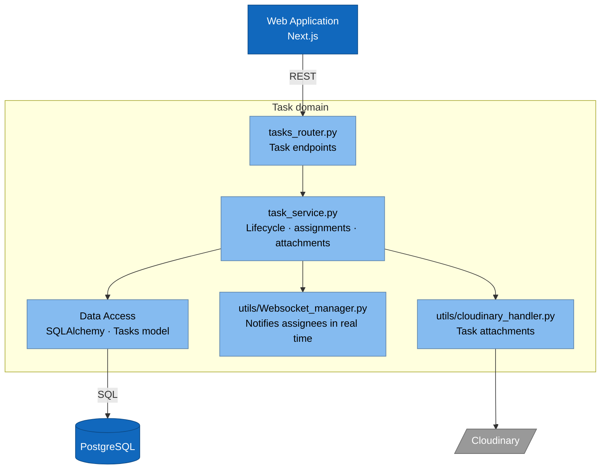
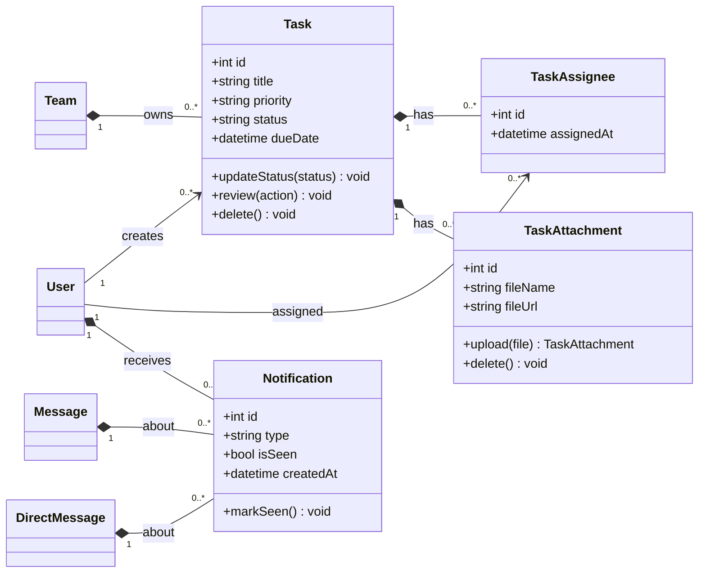
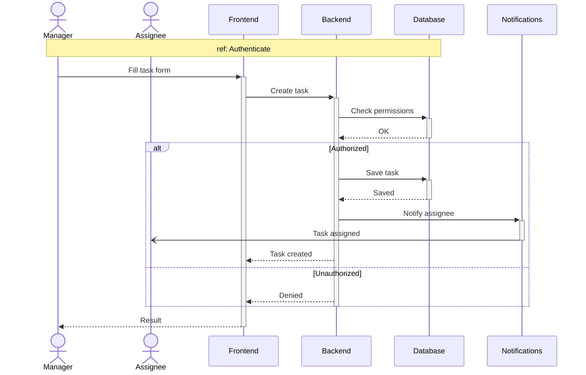
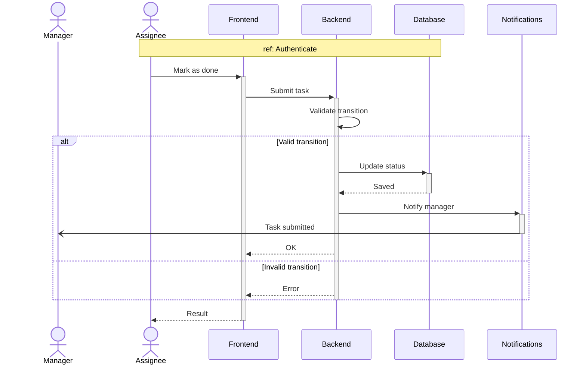
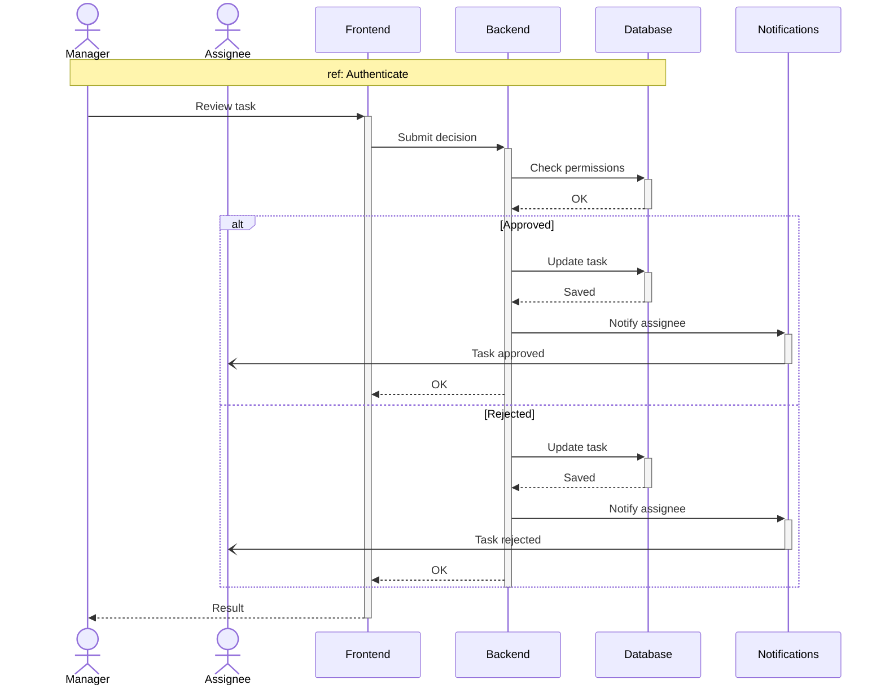

# Sprint 5 — Tasks & Notifications

**Weeks 9–10**

---

## Introduction

Conversations alone don't ship work — teams need a way to **track** it. Sprint 5 adds the **task management** half of TeamNest: team leads create tasks scoped to a team with assignees, due dates, attachments, and a subtask breakdown; assignees update status and submit for review; team leads approve or reject. Every status transition raises a **notification** delivered in real time over the existing WebSocket infrastructure (built in Sprint 3 for messaging, extended in Sprint 4 for presence). This sprint also formalizes the broader notifications surface — mentions from Sprint 3, DMs and friend events from Sprint 4, and task events from this sprint all flow through one notifications inbox.

---

## Sprint Goal

> **Teams plan and track work and stay informed via real-time notifications.**

By the end of Sprint 5, a team lead can create a task with assignees and a due date, edit or delete it, split it into subtasks, and approve or reject submissions. Assignees see their own task list, update status, submit for review, and add or remove attachments. Members receive real-time notifications for mentions, DMs, friend events and task events, and can mark them as seen.

---

## User Stories

### Team Lead

| ID      | Epic              | Priority | Story                                                                                              | Subtasks                                                                                                  |
| ------- | ----------------- | -------- | -------------------------------------------------------------------------------------------------- | --------------------------------------------------------------------------------------------------------- |
| US-14.1 | Task Management   | High     | As a **team lead**, I want to create tasks with assignees and a due date, so that work is tracked. | **T-14.1.1** `POST /tasks` endpoint (team-scoped) **T-14.1.2** Task-creation form with assignee picker + date |
| US-14.2 |                   | High     | As a **team lead**, I want to edit or delete a task, so that I can adjust scope.                   | **T-14.2.1** `PATCH /tasks/{id}` and `DELETE /tasks/{id}` **T-14.2.2** Task-edit modal with confirm-delete    |
| US-14.3 |                   | Medium   | As a **team lead**, I want to break a task into subtasks, so that I can split large work.          | **T-14.3.1** Subtask model + `POST /tasks/{id}/subtasks` **T-14.3.2** Subtask list UI under parent task       |
| US-14.4 | Task Review       | Medium   | As a **team lead**, I want to approve or reject a submitted task, so that quality is checked.      | **T-14.4.1** `POST /tasks/{id}/approve` and `/reject` **T-14.4.2** Review UI with comment field               |

### Team Member

| ID      | Epic              | Priority | Story                                                                                               | Subtasks                                                                                                |
| ------- | ----------------- | -------- | --------------------------------------------------------------------------------------------------- | ------------------------------------------------------------------------------------------------------- |
| US-15.4 | Task Attachments  | Medium   | As a **team member**, I want to add or remove task attachments, so that files travel with the work. | **T-15.4.1** `POST` / `DELETE /tasks/{id}/attachments` via Cloudinary **T-15.4.2** Drag-drop attachment UI on task detail |

### Assignee

| ID      | Epic             | Priority | Story                                                                                                        | Subtasks                                                                                              |
| ------- | ---------------- | -------- | ------------------------------------------------------------------------------------------------------------ | ----------------------------------------------------------------------------------------------------- |
| US-16.1 | Task Execution   | High     | As an **assignee**, I want to see my tasks, so that I know what's on my plate.                               | **T-16.1.1** `GET /tasks?assignee=me` with status filters **T-16.1.2** "My tasks" dashboard view                |
| US-16.2 |                  | High     | As an **assignee**, I want to update my task status (and submit for review), so that the team sees progress. | **T-16.2.1** `PATCH /tasks/{id}/status` with state-machine validation **T-16.2.2** Status selector + submit-for-review |

### Member — Notifications

| ID     | Epic           | Priority | Story                                                                                                                | Subtasks                                                                                                                |
| ------ | -------------- | -------- | -------------------------------------------------------------------------------------------------------------------- | ----------------------------------------------------------------------------------------------------------------------- |
| US-8.1 | Notifications  | High     | As a **member**, I want real-time notifications for mentions, DMs, friends and tasks, so that I don't miss anything. | **T-8.1.1** WebSocket `/ws/notifications` channel **T-8.1.2** Fan-out on mention / DM / friend / task events **T-8.1.3** Notification toast |
| US-8.2 |                | Medium   | As a **member**, I want to view notifications and mark them as seen, so that I stay organized.                       | **T-8.2.1** `GET /notifications` paginated endpoint **T-8.2.2** `PATCH /notifications/{id}/seen` and mark-all-seen                              |

---

## Related Diagrams

### C4 — Task domain (component view)

### Class Diagram — Tasks & Notifications

> Source: section 6 of [class diagram.md](../class%20diagram.md), plus `Notification` from the cross-cutting section.

### Sequence — Task Lifecycle (US-14.x, US-15.4, US-16.x, US-8.1, US-8.2)

**9a. Manager creates a task → assignee is notified (US-14.1, US-8.1)**

**9b. Assignee submits for review (US-16.1, US-16.2)**

**9c. Manager approves or rejects (US-14.4)**

---

## Conclusion

Sprint 5 adds the second half of "ship work": teams now have a real task tracker on top of their chat. Leads create tasks with assignees and due dates, split them into subtasks, attach files, and approve or reject submissions; assignees own their queue and report progress through a state machine. The notifications surface — mentions, DMs, friend events, and now task events — converges into a single real-time inbox over the existing WebSocket manager. With `Task`, `TaskAssignee`, `TaskAttachment`, and `Notification` in place, every meaningful action a member takes is now both trackable and broadcastable, which sets up the activity log and AI grounding work in Sprint 6.
