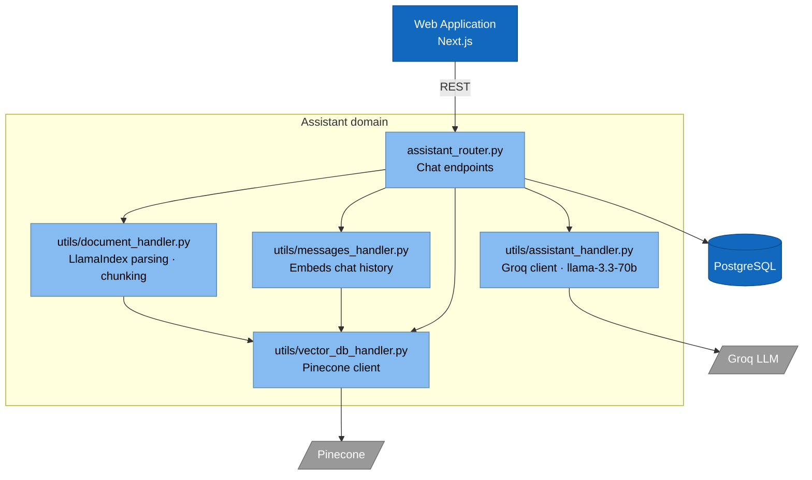
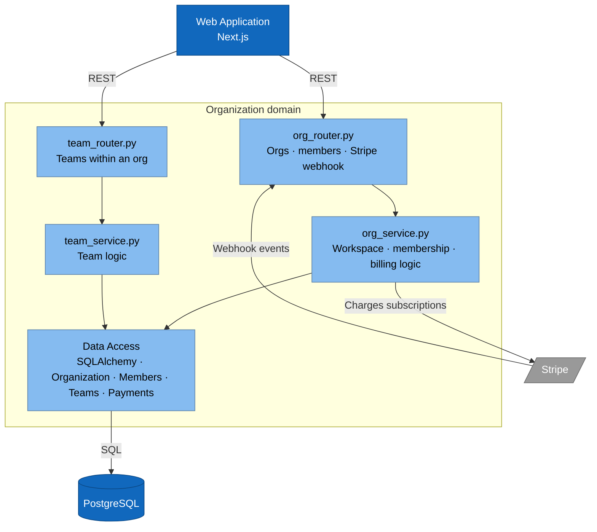
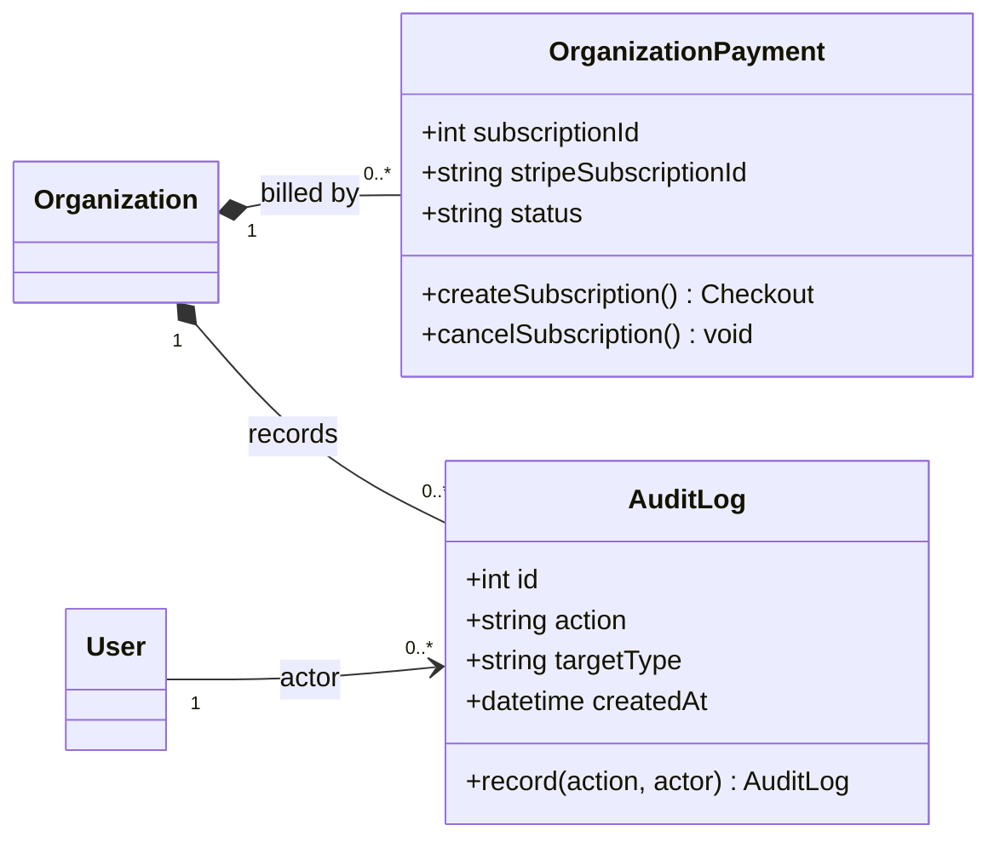
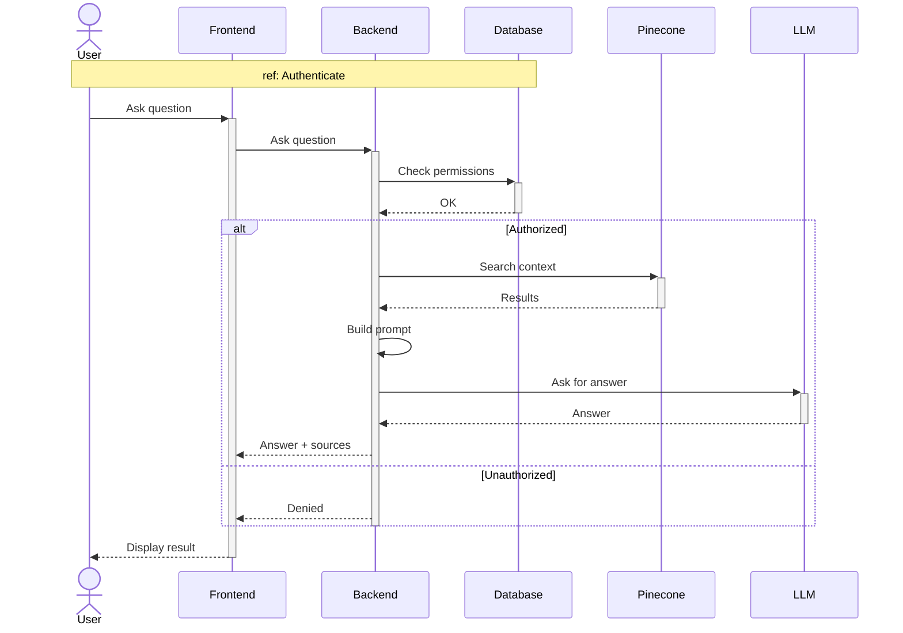
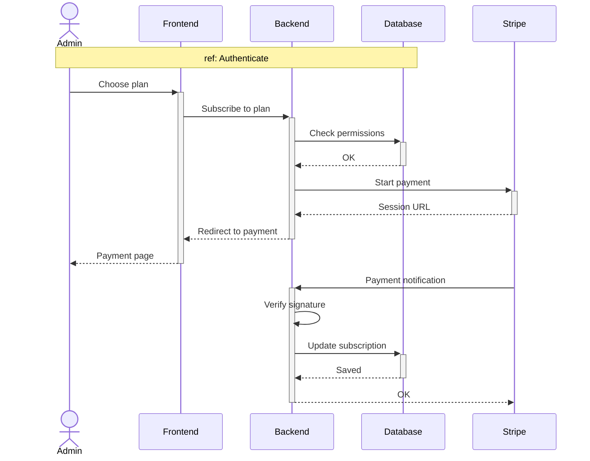
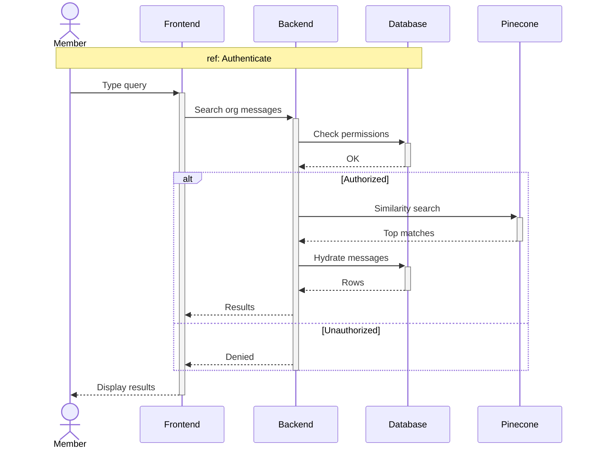

# Sprint 6 — AI Assistant, Search, Logs & Billing

**Weeks 11–12**

---

## Introduction

Sprint 6 layers the **cross-cutting** capabilities on top of the platform built in Sprints 1–5. The application is already fully usable at this point — accounts, orgs, teams, channels, DMs, group chats, friends, tasks, and notifications all work. What's missing is the high-leverage surface that turns TeamNest from "a workspace" into a **competitive product**: an in-app **AI assistant** that answers questions grounded in the organization's own documents and chat history (RAG over Pinecone + Groq); **global search** across org messages; an **activity log** with an undo path for reversible actions, giving owners an audit trail; and **Stripe-backed subscriptions** so an org owner can upgrade to a paid plan and unlock higher limits. Each of these can be developed independently of the others, which makes Sprint 6 the natural place for them.

---

## Sprint Goal

> **Add cross-cutting capabilities — AI help, global search, audit trail and paid plans.**

By the end of Sprint 6, a member can ask the AI assistant about their organization, point it at uploaded documents (including inline PDFs) and search across org messages. An owner or admin can review the full activity log; an owner can undo a reversible logged action, subscribe to the Pro plan via Stripe, and cancel that subscription to downgrade.

---

## User Stories

### Member — AI & Search

| ID       | Priority | Story                                                                                                              |
| -------- | -------- | ------------------------------------------------------------------------------------------------------------------ |
| US-9.1   | Medium   | As a **member**, I want to ask the AI about my org, so that I get quick answers.                                   |
| US-9.2   | Low      | As a **member**, I want the AI to use our uploaded documents, so that answers come from our files.                 |
| US-9.3   | Low      | As a **member**, I want to open a PDF inline and ask the AI about it, so that I can extract answers from long files. |
| US-10.1  | High     | As a **member**, I want to search across org messages, so that I find info fast.                                   |

### Org Owner — Billing, Logs & Undo

| ID        | Priority | Story                                                                                                              |
| --------- | -------- | ------------------------------------------------------------------------------------------------------------------ |
| US-12.2   | High     | As an **org owner**, I want to subscribe to the Pro plan, so that I can unlock plan limits.                        |
| US-12.3   | High     | As an **org owner**, I want to cancel the Pro subscription, so that I can downgrade.                               |
| US-12.4   | Medium   | As an **owner or admin**, I want to view the activity log, so that I have an audit trail.                          |
| US-12.5   | Low      | As an **org owner**, I want to undo a reversible logged action, so that I can recover from a mistake.              |

---

## Subtasks

**US-9.1 — Ask the AI about my org**
- [ ] `POST /assistant/ask` endpoint
- [ ] Retrieve context from Pinecone (messages + files)
- [ ] Build prompt and call Groq LLM (llama-3.3-70b)

**US-9.2 — AI uses uploaded documents**
- [ ] Document chunking via LlamaIndex
- [ ] Embed chunks and store in Pinecone with org namespace

**US-9.3 — Open PDF inline and ask the AI about it**
- [ ] Inline PDF viewer with selectable page range
- [ ] Pass active document scope into RAG context

**US-10.1 — Search across org messages**
- [ ] Vector similarity search endpoint over Pinecone
- [ ] Global search bar UI in app header
- [ ] Hydrate result rows from DB with channel context

**US-12.2 — Subscribe to the Pro plan**
- [ ] Stripe Checkout session endpoint
- [ ] Stripe webhook handler updates org subscription
- [ ] Plan-selection UI on billing page

**US-12.3 — Cancel the Pro subscription**
- [ ] Call Stripe `subscriptions.cancel`
- [ ] Webhook downgrade flow resets plan limits

**US-12.4 — View the activity log**
- [ ] `activity_log` table + `GET /activity-log` endpoint
- [ ] Filterable log UI (actor, action type, date range)

**US-12.5 — Undo a reversible logged action**
- [ ] Per-action reversal handlers (with safety guard)
- [ ] Undo button on eligible log entries

---

## Related Diagrams

### C4 — Assistant domain (RAG component view)

### C4 — Organization domain (billing slice)

> Reproduced here because Stripe billing is owned by the org domain; this sprint exercises the Stripe arrows that were dormant in Sprint 2.

### Class Diagram — Billing & Audit Log

> Source: `OrganizationPayment` from section 2 and `AuditLog` from section 8 of [class diagram.md](../class%20diagram.md). The AI assistant and global search operate on existing `Message`, `File`, and `DirectMessage` classes already defined in earlier sprints — they introduce no new persisted domain entities.

### Sequence — AI Assistant (RAG) (US-9.1, US-9.2, US-9.3)

### Sequence — Stripe Upgrade (US-12.2, US-12.3)

### Sequence — Global Message Search (US-10.1)

> Search reuses the Pinecone vector index that channel messages and files were written into during Sprints 3–4.

---

## Conclusion

Sprint 6 closes the project by layering the four cross-cutting capabilities that turn TeamNest from a usable workspace into a competitive product: a Groq + Pinecone RAG assistant that answers grounded in the org's own messages and files (including inline-viewed PDFs), global semantic search across the whole organisation, a complete activity log with an undo path for reversible actions, and Stripe-backed Pro subscriptions for owners. Each feature is built on infrastructure that already exists — Pinecone was populated by Sprints 3–4, Stripe webhooks were stubbed in Sprint 2, and the audit log records the actions defined throughout — so this sprint is more about composition than greenfield work. At its close TeamNest is feature-complete: identity, workspace, real-time messaging, social graph, task management, notifications, AI, search, audit, and billing all ship as one product.
